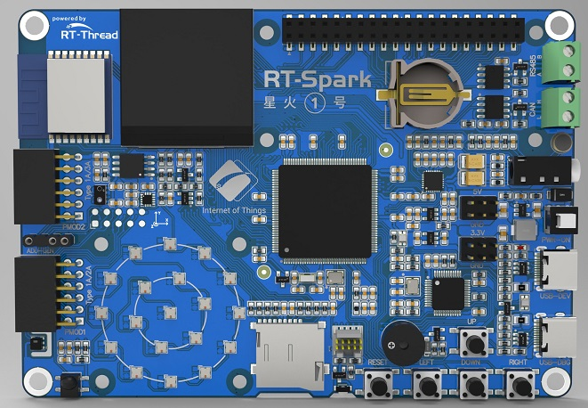

## 简介

“星火 1 号”，一款专为工程师和高校学生设计的嵌入式 RTOS 开发学习板。在这个科技飞速发展的时代，嵌入式系统已经成为了现代工业、交通、通信等众多领域的核心驱动力。而 RTOS 实时操作系统作为嵌入式领域的基石，更是工程师们必须熟练掌握的核心技术。作为业界主流的 RTOS 实时操作系统 RT-Thread，我们有义务帮助更多开发者掌握这项技术。为此，我们精心打造了一款专为工程师和高校学生设计的嵌入式开发学习板。

星火 1 号主控选用了目前行业中比较常用且学习门槛较低的 STM32F407，性能强劲、功能丰富，完全能够满足嵌入式入门的需求。此开发板不仅具有众多的板载资源（Flash 存储、WIFI 通信、多个传感器），还支持丰富的扩展接口，让您轻松实现各种复杂的应用场景。通过使用这款开发学习板，您将能够深入了解 RTOS/RT-Thread 的工作原理，提升自己的技能水平，为当前以及未来的职业生涯做好充分准备。



## 目录结构

```
|-- README.md
|-- docs
|   |-- SCH_LearnBoard_IoT_V0_0.pdf
|   `-- images
|-- libraries
|   |-- Board_Drivers
|   |-- HAL_Drivers
|   `-- STM32F4xx_HAL
|-- projects
|   |-- 01_basic_led_blink
|   |-- 02_basic_rgb_led
|   |-- 03_basic_key
|   |-- 04_basic_beep_led
|   |-- 05_basic_ir
|   |-- 06_driver_lcd
|   |-- 07_driver_temp_humi
|   |-- 08_driver_als_ps
|   |-- 09_driver_axis
|   |-- 10_component_usb_mouse
|   `-- README.md
|-- rt-thread
`-- sdk-bsp-rt-spark.yaml
```

- sdk-bsp-rt-spark.yaml：描述 星火 1 号 的硬件信息
- libraries：板级移植文件、通用外接驱动程序、STM32F4 固件库
- projects：示例项目文件夹，包括各种示例代码
- rt-thread：rt-thread 源代码

## 使用

sdk-bsp-stm32f407-spark 支持 RT-Thread Studio 和 MDK 开发。

### RT-Thread Studio 开发

1. 打开 RT-Thread Studio 的包管理器，安装 ` 星火 1 号开发板 ` 资源包
2. 安装完成后，选择基于 BSP 创建工程即可

### MDK 开发

为了避免 SDK 在持续更新中，每一个 `projects` 都创建一份 `rt-thread` 文件夹 和 `libraries` 文件夹导致的 SDK 越来越臃肿，所以这些通用文件夹被单独提取了出来。这样就会导致直接打开 `MDK` 的工程编译会提示缺少上述两个文件夹的文件，我们使用如下步骤解决这个问题：

1. 双击某个 `project` 目录下的 `mklinks.bat` 文件，或者使用 [Env](https://club.rt-thread.org/ask/question/5699.html) 工具执行 mklink 命令，分别为 `rt-thread` 及 `libraries` 文件创建符号链接。
2. 查看目录下是否有 `rt-thread` 和 `libraries` 的文件夹图标。
3. 使用 [Env](https://club.rt-thread.org/ask/question/5699.html) 工具执行 scons --target=mdk5 更新 MDK5 工程文件。

## 交流平台

对 星火 1 号 感兴趣的小伙伴可以加入 QQ 群 - RT-Thread 星火学习板 群号: 839583041、852752783。

