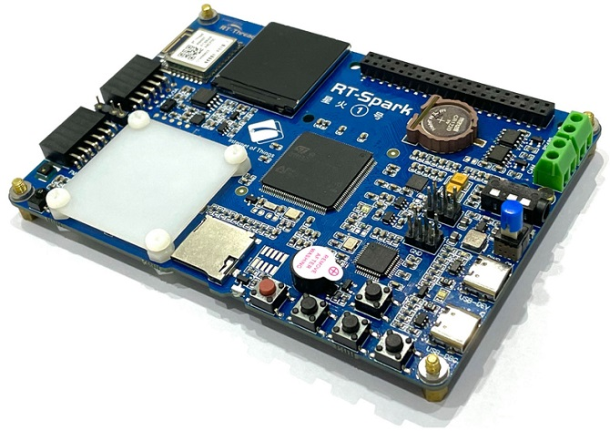
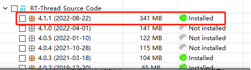
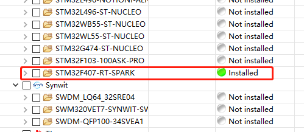
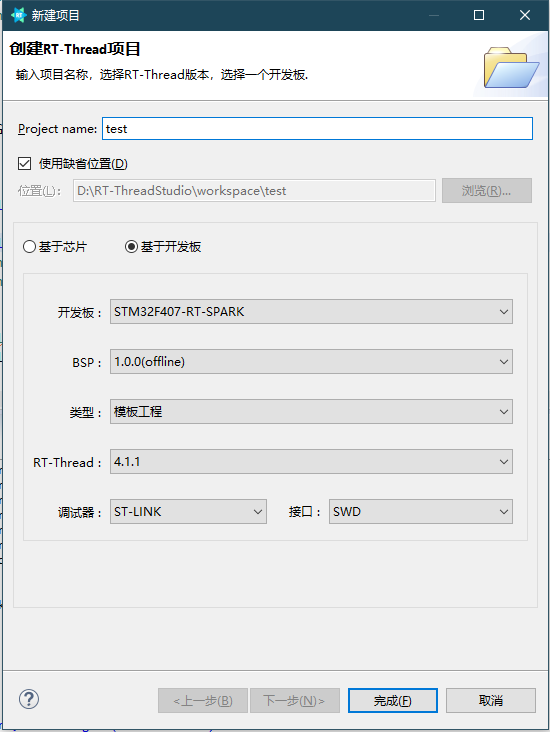

# 内核入门

在准备工作之前，需要了解一些内核的基础知识，详见 [《RT-Thread 内核基础.pdf》](../../docs/RT-Thread 内核基础.pdf)

## 准备工作

准备工作的目的是让初学者了解 RT-Thread 运行环境，将以 RT-Thread Studio 为例，搭建 RT-Thread 运行环境。我们使用的硬件是星火 1 号开发板。



### RT-Thread Studio 环境搭建

1. [点击链接安装 RT-Thread Studio](https://www.rt-thread.org/document/site/#/development-tools/rtthread-studio/um/studio-user-begin)

2. 在 RT-Thread Studio 的 SDK 管理器中下载资开发板源包





3. 新建工程（新建工程可以基于模板工程，也可以基于示例工程），内核部分基于示例 01_kernel 完成工程的创建，



4. 创建成功之后编译

5. 编译无误，连接开发板，下载代码

### 工程目录介绍

在 RT-Thread Studio 中新建好工程后，可以看到工程中存在以下目录，分别是：

- rt-thread Settings：配置文件
- applications: 应用代码，内核部分是一些用于学习的示例代码
- board：板级相关的代码
- libraries：STM32F4 固件库、通用外接驱动程序
- rt-thread：rt-thread 源码

初学者可以将应用代码放在 applications 目录下。

### FinSH 命令行中启动线程

RT-Thread 提供 FinSH 功能，用于调试或查看系统信息，msh 表示 FinSH 处于一种传统命令行模式，此模式下可以使用类似于 dos/bash 等传统的 shell 命令。

比如，我们可以通过输入 “help + 回车” 或者直接按下 Tab 键，输出当前系统所支持的所有命令，如下：

```shell
msh >help
RT-Thread shell commands:
clear            - clear the terminal screen
version          - show RT-Thread version information
list_thread      - list thread
list_sem         - list semaphore in system
list_event       - list event in system
list_mutex       - list mutex in system
list_mailbox     - list mail box in system
list_msgqueue    - list message queue in system
list_mempool     - list memory pool in system
list_timer       - list timer in system
list_device      - list device in system
list             - list objects
help             - RT-Thread shell help.
ps               - List threads in the system.
free             - Show the memory usage in the system.
pin              - pin [option]
dynmem_sample    - dynmem sample
event_sample     - event sample
idle_hook_sample - idle hook sample
interrupt_sample - interrupt sample
mailbox_sample   - mailbox sample
mempool_sample   - mempool sample
msgq_sample      - msgq sample
mutex_sample     - mutex sample
pri_inversion    - pri_inversion sample
producer_consume - producer_consumer sample
scheduler_hook   - scheduler_hook sample
semaphore_sample - semaphore sample
thread_sample    - thread sample
timer_sample     - timer sample
timeslice_sample - timeslice sample
reboot           - Reboot System
msh >
```

此时可以输入列表中的命令，如输入 list_thread 命令显示系统当前正在运行的线程，结果显示为 tshell（shell 线程）线程与 tidle（空闲线程）线程：

```shell
msh >
msh >list_thread
thread   pri  status      sp     stack size max used left tick  error
-------- ---  ------- ---------- ----------  ------  ---------- ---
tshell    20  running 0x000000c8 0x00001000    14%   0x00000004 OK
tidle0    31  ready   0x0000005c 0x00000400    16%   0x0000001c OK
msh >

```

FinSH 具有命令自动补全功能，输入命令的部分字符（前几个字母，注意区分大小写），按下 Tab 键，则系统会根据当前已输入的字符，从系统中查找已经注册好的相关命令，如果找到与输入相关的命令，则会将完整的命令显示在终端上。

如：要使用 version 命令，可以先输入 “v”，再按下 Tab 键，可以发现系统会在下方补全了有关 “v” 开头的命令：version，此时只需要回车，即可查看该命令的执行结果。

## 内核入门实践例程

有了以上的基础后，开始学习内核，以下是内核入门的实践教程，详见文件夹 kernel_docs，内核学习的内容如下：

1. [认识 RT-Thread main()](kernel_docs/main/main.md)
2. [导出一个 shell 命令](kernel_docs/shell_cmd_sample/shell_cmd_sample.md)
3. [自动初始化体验](kernel_docs/auto_init_sample/auto_init_sample.md)
4. [创建一个线程（静态、动态）](kernel_docs/thread_sample/thread_sample.md)
5. [线程时间片的轮转调度](kernel_docs/timeslice_sample/timeslice_sample.md)
6. [调度器钩子](kernel_docs/scheduler_hook_sample/scheduler_hook_sample.md)
7. [空闲线程钩子](kernel_docs/idle_hook_sample/idle_hook_sample.md)
8. [临界区](kernel_docs/critical_sample/critical_sample.md)
9. [认识系统定时器](kernel_docs/timer_sample/timer_sample.md)
10. [认识信号量：生产者消费者问题](kernel_docs/producer_consumer_sample/producer_consumer_sample.md)
11. [认识互斥量：优先级继承](kernel_docs/pri_inversion_sample/pri_inversion_sample.md)
12. [认识事件集](kernel_docs/event_sample/event_sample.md)
13. [认识邮箱](kernel_docs/mailbox_sample/mailbox_sample.md)
14. [认识消息队列](kernel_docs/msgq_sample/msgq_sample.md)
15. [使用动态内存堆](kernel_docs/dynmem_sample/dynmem_sample.md)
16. [使用动态内存池](kernel_docs/mempool_sample/mempool_sample.md)


