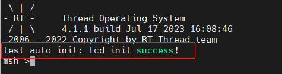

# RT-Thread 自动初始化机制

自动初始化机制是指初始化函数不需要被显式调用，只需要在函数定义处通过宏定义的方式进行申明，就会在系统启动过程中被执行。

例如在串口驱动中调用一个宏定义告知系统初始化需要调用的函数，代码如下：

```c
int rt_hw_usart_init(void)  /* 串口初始化函数 */
{
     ... ...
     /* 注册串口 1 设备 */
     rt_hw_serial_register(&serial1, "uart1",
                        RT_DEVICE_FLAG_RDWR | RT_DEVICE_FLAG_INT_RX,
                        uart);
     return 0;
}
INIT_BOARD_EXPORT(rt_hw_usart_init);    /* 使用组件自动初始化机制 */
```

示例代码最后的 INIT_BOARD_EXPORT(rt_hw_usart_init) 表示使用自动初始化功能，按照这种方式，rt_hw_usart_init() 函数就会被系统自动调用，那么它是在哪里被调用的呢？

在系统启动流程图中，有两个函数：rt_components_board_init() 与 rt_components_init()，其后的带底色方框内部的函数表示被自动初始化的函数，其中：

1. “board init functions” 为所有通过 INIT_BOARD_EXPORT(fn) 申明的初始化函数。
2. “pre-initialization functions” 为所有通过 INIT_PREV_EXPORT(fn) 申明的初始化函数。
3. “device init functions” 为所有通过 INIT_DEVICE_EXPORT(fn) 申明的初始化函数。
4. “components init functions” 为所有通过 INIT_COMPONENT_EXPORT(fn) 申明的初始化函数。
5. “enviroment init functions” 为所有通过 INIT_ENV_EXPORT(fn) 申明的初始化函数。
6. “application init functions” 为所有通过 INIT_APP_EXPORT(fn) 申明的初始化函数。

rt_components_board_init() 函数执行的比较早，主要初始化相关硬件环境，执行这个函数时将会遍历通过 INIT_BOARD_EXPORT(fn) 申明的初始化函数表，并调用各个函数。

rt_components_init() 函数会在操作系统运行起来之后创建的 main 线程里被调用执行，这个时候硬件环境和操作系统已经初始化完成，可以执行应用相关代码。rt_components_init() 函数会遍历通过剩下的其他几个宏申明的初始化函数表。

RT-Thread 的自动初始化机制使用了自定义 RTI 符号段，将需要在启动时进行初始化的函数指针放到了该段中，形成一张初始化函数表，在系统启动过程中会遍历该表，并调用表中的函数，达到自动初始化的目的。

用来实现自动初始化功能的宏接口定义详细描述如下表所示：

| 初始化顺 | 宏接口                | 描述                                         |
| -------------- | ------------------------- | -------------------------------------------- |
| 1              | INIT_BOARD_EXPORT(fn)     | 非常早期的初始化，此时调度器还未启动         |
| 2              | INIT_PREV_EXPORT(fn)      | 主要是用于纯软件的初始化、没有太多依赖的函数 |
| 3              | INIT_DEVICE_EXPORT(fn)    | 外设驱动初始化相关，比如网卡设备             |
| 4              | INIT_COMPONENT_EXPORT(fn) | 组件初始化，比如文件系统或者 LWIP            |
| 5              | INIT_ENV_EXPORT(fn)       | 系统环境初始化，比如挂载文件系统             |
| 6              | INIT_APP_EXPORT(fn)       | 应用初始化，比如 GUI 应用                    |

初始化函数主动通过这些宏接口进行申明，如 INIT_BOARD_EXPORT(rt_hw_usart_init)，链接器会自动收集所有被申明的初始化函数，放到 RTI 符号段中，该符号段位于内存分布的 RO 段中，该 RTI 符号段中的所有函数在系统初始化时会被自动调用。

## 自动初始化示例

代码详见：auto_init_sample.c

使用自动初始化功能，初始化 lcd (伪代码)：

```c
int lcd_init(void)  /* 串口初始化函数 */
{
    // 此处将初始化的代码放入，如初始化 lcd
    rt_kprintf("test auto init: lcd init success!\n");
    return 0;
}
INIT_APP_EXPORT(lcd_init);    /* 使用自动初始化机制 */
```

## 编译运行

编译工程，然后下载运行。使用终端工具打开相应的 COM 口（波特率 115200），可以看到系统的启动日志，复位后，直接自动调用了 lcd_init() 函数，并打印了相应的 Log 信息。



