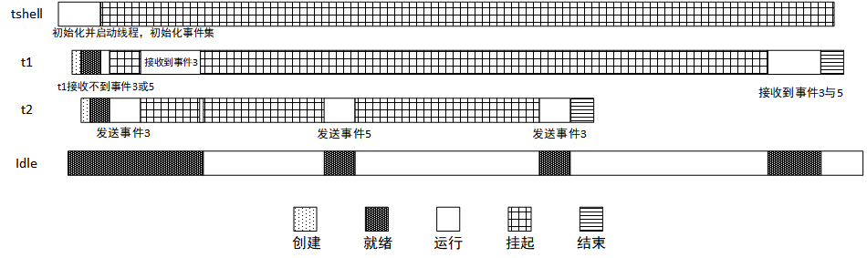

# 事件集的使用

事件集主要用于线程间的同步，与信号量不同，它的特点是可以实现一对多，多对多的同步。即一个线程与多个事件的关系可设置为：其中任意一个事件唤醒线程，或几个事件都到达后才唤醒线程进行后续的处理；同样，事件也可以是多个线程同步多个事件。

参考：[文档中心——IPC 管理之事件集](https://www.rt-thread.org/document/site/#/rt-thread-version/rt-thread-standard/programming-manual/ipc1/ipc1?id=%e4%ba%8b%e4%bb%b6%e9%9b%86)

## 代码设计

本例程源码为：event_sample.c

为了体现使用事件集来达到线程间的同步，本例程设计了 thread1、thread2 两个线程，优先级分别为 8、9，设计了一个事件集 event。

线程 thread1 进入后接收事件组合 “事件 3 或事件 5”，接收到事件时候进行 100ms 延时，然后接收事件组合 “事件 3 与事件 5”，接收完成后结束线程。

线程 thread2 进入后发送事件 3，延时 200ms；发送事件 5，延时 200ms；发送事件 3，完成后结束线程。

整体情况：thread1 首先等待 “事件 3 或事件 5” 的到来，thread2 发送事件 3，唤醒 thread1 接收事件，之后 thread1 等待“事件 3 与事件 5”；thread2 再发送事件 5，进行延时，thread2 发送事件 3，等 thread1 延时结束就能接收事件组合“事件 3 与事件 5”。

通过本例程，用户可以清晰地了解到，线程在同时接收多个事件和接收多个事件中的一个时的运行情况。

整个运行过程如下图所示，过程描述如下：



1. 在 tshell 线程中初始化一个事件集 event，初始化为先进先出型；并分别初始化、启动线程 thread1、thread2，优先级分别为 8、9；
2. 在操作系统的调度下，thread1 优先级高，首先被投入运行；thread1 开始运行后接收事件集 3 或 5，由于未接收到事件集 3 或 5，线程 thread1 挂起；
3. 随后操作系统调度 thread2 投入运行，thread2 发送事件 3，然后执行延时将自己挂起 200ms；
4. thread1 接收到事件 3，打印相关信息，并开始等待 “事件 3 与事件 5”；
5. thread2 的延时时间到，发送事件 5；延时，发送事件 3；
6. 等待 thread1 的延时结束后，可以马上接收到 “事件 3 与事件 5”，打印信息，结束运行；

## 事件集使用示例

示例代码通过 MSH_CMD_EXPORT 将示例初始函数导出到 msh 命令，可以在系统运行过程中，通过在控制台输入命令来启动。

例子中初始化一个事件集，初始化两个静态线程。一个线程等待自己关心的事件的发生，另外一个线程发生事件。

以下定义了待创建线程需要用到的优先级，栈空间，时间片的宏，事件控制块。

```c
# include <rtthread.h>
# define THREAD_PRIORITY      9
# define THREAD_TIMESLICE     5
# define EVENT_FLAG3 (1 << 3)
# define EVENT_FLAG5 (1 << 5)

/* 事件控制块 */
static struct rt_event event;
```

线程 thread1 的栈空间、线程控制块以及线程 thread1 的入口函数，共接收两次事件，第一次永久等待 “事件 3 或事件 5”，第二次永久等待 “事件 3 与事件 5”

```c
ALIGN(RT_ALIGN_SIZE)
static char thread1_stack[1024];
static struct rt_thread thread1;

/* 线程 1 入口函数 */
static void thread1_recv_event(void *param)
{
    rt_uint32_t e;

    /* 第一次接收事件，事件 3 或事件 5 任意一个可以触发线程 1，接收完后清除事件标志 */
    if (rt_event_recv(&event, (EVENT_FLAG3 | EVENT_FLAG5),
                      RT_EVENT_FLAG_OR | RT_EVENT_FLAG_CLEAR,
                      RT_WAITING_FOREVER, &e) == RT_EOK)
    {
        rt_kprintf("thread1: OR recv event 0x%x\n", e);
    }

    rt_kprintf("thread1: delay 1s to prepare the second event\n");
    rt_thread_mdelay(1000);

    /* 第二次接收事件，事件 3 和事件 5 均发生时才可以触发线程 1，接收完后清除事件标志 */
    if (rt_event_recv(&event, (EVENT_FLAG3 | EVENT_FLAG5),
                      RT_EVENT_FLAG_AND | RT_EVENT_FLAG_CLEAR,
                      RT_WAITING_FOREVER, &e) == RT_EOK)
    {
        rt_kprintf("thread1: AND recv event 0x%x\n", e);
    }
    rt_kprintf("thread1 leave.\n");
}
```

线程 thread2 的栈空间、线程控制块以及线程 thread1 的入口函数，发送 3 次事件，发送事件 3，延时 200ms；发送事件 5，延时 200ms；发送事件 3，结束。

```c
ALIGN(RT_ALIGN_SIZE)
static char thread2_stack[1024];
static struct rt_thread thread2;

/* 线程 2 入口 */
static void thread2_send_event(void *param)
{
    rt_kprintf("thread2: send event3\n");
    rt_event_send(&event, EVENT_FLAG3);
    rt_thread_mdelay(200);

    rt_kprintf("thread2: send event5\n");
    rt_event_send(&event, EVENT_FLAG5);
    rt_thread_mdelay(200);

    rt_kprintf("thread2: send event3\n");
    rt_event_send(&event, EVENT_FLAG3);
    rt_kprintf("thread2 leave.\n");
}
```

事件的示例代码，初始化一个事件对象，初始化并启动线程 thread1、thread2，并将函数使用 MSH_CMD_EXPORT 导出命令。

```c
int event_sample(void)
{
    rt_err_t result;

    /* 初始化事件对象 */
    result = rt_event_init(&event, "event", RT_IPC_FLAG_FIFO);
    if (result != RT_EOK)
    {
        rt_kprintf("init event failed.\n");
        return -1;
    }

    rt_thread_init(&thread1,
                   "thread1",
                   thread1_recv_event,
                   RT_NULL,
                   &thread1_stack[0],
                   sizeof(thread1_stack),
                   THREAD_PRIORITY - 1, THREAD_TIMESLICE);
    rt_thread_startup(&thread1);

    rt_thread_init(&thread2,
                   "thread2",
                   thread2_send_event,
                   RT_NULL,
                   &thread2_stack[0],
                   sizeof(thread2_stack),
                   THREAD_PRIORITY, THREAD_TIMESLICE);
    rt_thread_startup(&thread2);

    return 0;
}

/* 导出到 msh 命令列表中 */
MSH_CMD_EXPORT(event_sample, event sample);
```

## 编译运行

编译工程，然后下载运行。使用终端工具打开相应的 COM 口（波特率 115200），可以看到系统的启动日志，输入 event_sample 命令启动示例应用，示例输出结果如下：

```shell
msh >
msh >event_sample
thread2: send eventhread3
thread1: OR recv event 0x8
thread1: delay 1s to prepare the second event
msh >thread2: send event5
thread2: send eventhread3
thread2 leave.
thread1: AND recv event 0x28
thread1 leave.
```

例程演示了事件集的使用方法。thread1 前后两次接收事件，分别使用了 “逻辑或” 与“逻辑与” 的方法。
