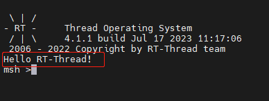

# 认识 RT-Thread main()

main() 函数在 RT-Thread 中是 main 线程调用的函数，一般也称为 main 线程。

## 启动入口 rtthread_startup()

main 线程是在 rt-thread 启动时创建的，rt-thread 启动入口 rtthread_startup() 函数如下所示：

```c
int rtthread_startup(void)
{
    rt_hw_interrupt_disable();

    /* 板级初始化 */
    rt_hw_board_init();

    /* 显示 RT-Thread 版本号 */
    rt_show_version();

    /* 调度器初始化 */
    rt_system_scheduler_init();

#ifdef RT_USING_SIGNALS
    /* 信号初始化 */
    rt_system_signal_init();
#endif /* RT_USING_SIGNALS */

    /* main 线程初始化（即创建 main 线程） */
    rt_application_init();

    /* timer 定时器线程初始化 */
    rt_system_timer_thread_init();

    /* idle 空闲线程初始化 */
    rt_thread_idle_init();

#ifdef RT_USING_SMP
    rt_hw_spin_lock(&_cpus_lock);
#endif /* RT_USING_SMP */

    /* 启动调度器 */
    rt_system_scheduler_start();

    /* never reach here */
    return 0;
}
```

这部分启动代码，大致可以分为四个部分：

1. 初始化与系统相关的硬件；
2. 初始化系统内核对象，例如定时器、调度器、信号；
3. 创建 main 线程，在 main 线程中对各类模块依次进行初始化；
4. 初始化定时器线程、空闲线程，并启动调度器。

启动调度器之前，系统所创建的线程在执行 rt_thread_startup() 后并不会立马运行，它们会处于就绪状态等待系统调度；待启动调度器之后，系统才转入第一个线程开始运行，根据调度规则，选择的是就绪队列中优先级最高的线程。

rt_hw_board_init() 中完成系统时钟设置，为系统提供心跳、串口初始化，将系统输入输出终端绑定到这个串口，后续系统运行信息就会从串口打印出来。

## 创建 main 线程 rt_application_init()

我们将启动入口中调用的 rt_application_init() 函数展开，可以看到 main 线程到 main() 函数：

```c
void rt_application_init(void)
{
    rt_thread_t tid;

/* 动态或静态创建 main 线程，入口函数是 main_thread_entry */
#ifdef RT_USING_HEAP
    tid = rt_thread_create("main", main_thread_entry, RT_NULL,
                           RT_MAIN_THREAD_STACK_SIZE, RT_MAIN_THREAD_PRIORITY, 20);
    RT_ASSERT(tid != RT_NULL);
#else
    rt_err_t result;

    tid = &main_thread;
    result = rt_thread_init(tid, "main", main_thread_entry, RT_NULL,
                            main_stack, sizeof(main_stack), RT_MAIN_THREAD_PRIORITY, 20);
    RT_ASSERT(result == RT_EOK);

    /* if not define RT_USING_HEAP, using to eliminate the warning */
    (void)result;
#endif /* RT_USING_HEAP */

    /* 启动 main 线程 */
    rt_thread_startup(tid);
}

/* main 线程入口函数: main_thread_entry */
void main_thread_entry(void *parameter)
{
    extern int main(void);

#ifdef RT_USING_COMPONENTS_INIT
    rt_components_init();
#endif /* RT_USING_COMPONENTS_INIT */

/* main 线程在不同平台下调用 main 函数 */
#ifdef __ARMCC_VERSION
    {
        extern int $Super$$main(void);
        $Super$$main(); /* for ARMCC. */
    }
#elif defined(__ICCARM__) || defined(__GNUC__) || defined(__TASKING__)
    main();
#endif
}
```

这样就调用到了 main.c 文件中的 main() 函数了，

## 用户代码入口 main()

main() 函数是 RT-Thread 的用户代码入口，用户可以在 main() 函数里添加自己的应用。打开基于 01_kernel 新建的工程，双击 applications 文件夹下的 main.c 文件，添加简单应用，如使用 rt_kprintf 进行打印。

```c
int main(void)
{
    rt_kprintf("Hello RT-Thread!\n"); /* 新增本行打印 */
    return 0;
}
```
编译工程，然后下载运行。使用终端工具打开相应的 COM 口（波特率 115200），可以看到系统的启动日志以及新增的打印 “Hello RT-Thread!” :


