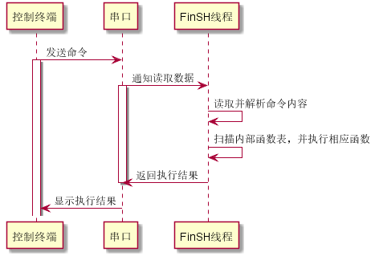
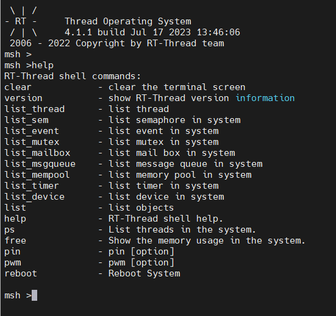
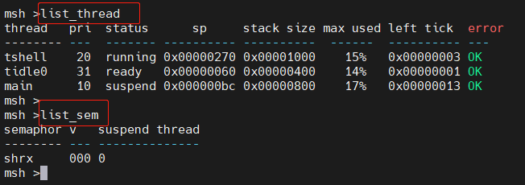
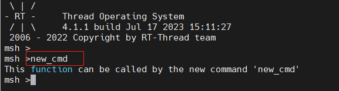

# 导出一个 shell 命令

## 背景

在计算机发展的早期，图形系统出现之前，没有鼠标，甚至没有键盘。那时候人们如何与计算机交互呢？最早期的计算机使用打孔的纸条向计算机输入命令，编写程序。后来随着计算机的不断发展，显示器、键盘成为计算机的标准配置，但此时的操作系统还不支持图形界面，计算机先驱们开发了一种软件，它接受用户输入的命令，解释之后，传递给操作系统，并将操作系统执行的结果返回给用户。这个程序像一层外壳包裹在操作系统的外面，所以它被称为 shell。

嵌入式设备通常需要将开发板与 PC 机连接起来通讯，常见连接方式包括：串口、USB、以太网、Wi-Fi 等。一个灵活的 shell 也应该支持在多种连接方式上工作。有了 shell，就像在开发者和计算机之间架起了一座沟通的桥梁，开发者能很方便的获取系统的运行情况，并通过命令控制系统的运行。特别是在调试阶段，有了 shell，开发者除了能更快的定位到问题之外，也能利用 shell 调用测试函数，改变测试函数的参数，减少代码的烧录次数，缩短项目的开发时间。

FinSH 是 RT-Thread 的命令行组件（shell），正是基于上面这些考虑而诞生的，FinSH 的发音为 [ˈfɪnʃ]。读完本章，我们会对 FinSH 的工作方式以及如何导出自己的命令到 FinSH 有更加深入的了解。

### FinSH 简介

FinSH 是 RT-Thread 的命令行组件，提供一套供用户在命令行调用的操作接口，主要用于调试或查看系统信息。它可以使用串口 / 以太网 / USB 等与 PC 机进行通信，硬件拓扑结构如下图所示：


用户在控制终端输入命令，控制终端通过串口、USB、网络等方式将命令传给设备里的 FinSH，FinSH 会读取设备输入命令，解析并自动扫描内部函数表，寻找对应函数名，执行函数后输出回应，回应通过原路返回，将结果显示在控制终端上。

当使用串口连接设备与控制终端时，FinSH 命令的执行流程，如下图所示：



FinSH 支持权限验证功能，系统在启动后会进行权限验证，只有权限验证通过，才会开启 FinSH 功能，提升系统输入的安全性。

FinSH 支持自动补全、查看历史命令等功能，通过键盘上的按键可以很方便的使用这些功能，FinSH 支持的按键如下表所示：

| 按键 | 功能描述                                                 |
| -------- | ------------------------------------------------------------ |
| Tab 键   | 当没有输入任何字符时按下 Tab 键将会打印当前系统支持的所有命令。若已经输入部分字符时按下 Tab 键，将会查找匹配的命令，也会按照文件系统的当前目录下的文件名进行补全，并可以继续输入，多次补全 |
| ↑↓键     | 上下翻阅最近输入的历史命令                                   |
| 退格键   | 删除符                                                       |
| ←→键     | 向左或向右移动标                                             |

FinSH 支持命令行模式，此模式又称为 msh(module shell)，msh 模式下，FinSH 与传统 shell（dos/bash）执行方式一致，例如，可以通过 `cd /` 命令将目录切换至根目录。

msh 通过解析，将输入字符分解成以空格区分开的命令和参数。其命令执行格式如下所示：

```
command [arg1] [arg2] [...]
```

其中 command 既可以是 RT-Thread 内置的命令，也可以是可执行的文件。

### 内置命令

当下载好代码之后，我们在终端键入 help 并回车，可以查询系统中的命令，如下



以上命令可以输入至终端中查看相应的信息，如：



list_thread 返回字段的描述:

| 字段   | 描述                   |
| ---------- | -------------------------- |
| thread     | 线程的名称                 |
| pri        | 线程的优先级               |
| status     | 线程当前的状态             |
| sp         | 线程当前的栈位置           |
| stack size | 线程的栈大小               |
| max used   | 线程历史中使用的最大栈位置 |
| left tick  | 线程剩余的运行节拍数       |
| error      | 线程的错误码               |

list_sem 返回字段的描述:

| 字段       | 描述                 |
| -------------- | ------------------------ |
| semaphore      | 信号量的名称             |
| v              | 信号量当前的值           |
| suspend thread | 等待这个信号量的线程数目 |

## MSH_CMD_EXPORT()

RT-Thread 使用 MSH_CMD_EXPORT() 将命令导出到 msh 命令列表中：

```c
MSH_CMD_EXPORT(name, desc);
```

| 参数 | 描述       |
| -------- | -------------- |
| name     | 要导出的命令   |
| desc     | 导出命令的描述 |

这个命令可以导出有参数的命令，也可以导出无参数的命令。

导出无参数命令时，函数的入参为 void，示例如下：

```c
void hello(void)
{
    rt_kprintf("hello RT-Thread!\n");
}

MSH_CMD_EXPORT(hello , say hello to RT-Thread);
```

导出有参数的命令时，函数的入参为 `int argc` 和 `char**argv`。argc 表示参数的个数，argv 表示命令行参数字符串指针数组指针。导出有参数命令示例如下：

```c
static void atcmd(int argc, char**argv)
{
    ……
}

MSH_CMD_EXPORT(atcmd, atcmd sample: atcmd <server|client>);
```

例如：我们新增一个命令 new_cmd

```c
int new_cmd(void)
{
    rt_kprintf("This function can be called by the new system command'new_cmd'\n");
    return 0;
}

/* 导出到 msh 命令列表中 */
MSH_CMD_EXPORT(new_cmd, new cmd sample);
```

并在终端中执行该命令



## 导出命令应用示例

以下代码示例可自行体验，代码详见 shell_cmd_sample.c。

### 不带参数的命令

这里将演示如何将一个自定义的命令导出，示例代码如下所示，代码中创建了 hello 函数，然后通过 MSH_CMD_EXPORT 命令即可将 hello 函数导出到 FinSH 命令列表中。

```c
#include <rtthread.h>

void hello(void)
{
    rt_kprintf("hello RT-Thread!\n");
}

MSH_CMD_EXPORT(hello , say hello to RT-Thread);
```

系统运行起来后，在 FinSH 控制台按 tab 键可以看到导出的命令：

```shell
msh />
RT-Thread shell commands:
hello             - say hello to RT-Thread
version           - show RT-Thread version information
……
```

运行 hello 命令，运行结果如下所示：

```shell
msh />hello
hello RT_Thread!
msh />
```

### 带参数的命令

这里将演示如何将一个带参数的自定义的命令导出到 FinSH 中, 示例代码如下所示，代码中创建了 `atcmd()` 函数，然后通过 MSH_CMD_EXPORT 命令即可将 `atcmd()` 函数导出到命令列表中。

```c
#include <rtthread.h>

static void atcmd(int argc, char**argv)
{
    if (argc < 2)
    {
        rt_kprintf("Please input'atcmd <server|client>'\n");
        return;
    }

    if (!rt_strcmp(argv[1], "server"))
    {
        rt_kprintf("AT server!\n");
    }
    else if (!rt_strcmp(argv[1], "client"))
    {
        rt_kprintf("AT client!\n");
    }
    else
    {
        rt_kprintf("Please input'atcmd <server|client>'\n");
    }
}

MSH_CMD_EXPORT(atcmd, atcmd sample: atcmd <server|client>);
```

系统运行起来后，在 FinSH 控制台按 tab 键可以看到导出的命令：

```shell
msh />
RT-Thread shell commands:
hello             - say hello to RT-Thread
atcmd             - atcmd sample: atcmd <server|client>
version           - show RT-Thread version information
……
```

运行 atcmd 命令，运行结果如下所示：

```shell
msh />atcmd
Please input 'atcmd <server|client>'
msh />
```

运行 atcmd server 命令，运行结果如下所示：

```shell
msh />atcmd server
AT server!
msh />
```

运行 atcmd client 命令，运行结果如下所示：

```shell
msh />atcmd client
AT client!
msh />
```

## 参考资料

FinSH 组件：[FinSH 控制台](https://www.rt-thread.org/document/site/#/rt-thread-version/rt-thread-standard/programming-manual/finsh/finsh)
