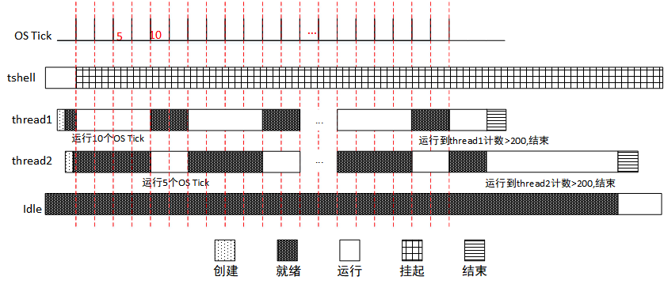

# 线程的时间片轮转调度

线程的时间片轮转调度，可以了解到：

- 多线程时间片轮转的基本原理；
- 同优先级线程间的时间片轮转机制；

## 代码设计

使用的例程为：timeslice_sample.c

为了体现时间片轮转，本例程设计了 thread1、thread2 两个相同优先级的线程，thread1 时间片为 10，thread2 时间片为 5，如果就绪列表中该优先级最高，则这两个线程会按照时间片长短被轮番调度。两个线程采用同一个入口函数，分别打印一条带有累加计数的信息（每个线程进入一次入口函数会将计数 count++，count>200 时线程退出）遵循时间片轮转调度机制。

通过本例程，用户可以清晰地了解到，同优先级线程在时间片轮转调度时刻的状态变迁。

整个运行过程如下图所示，OS Tick 为系统滴答时钟（精度 10ms），下面以例程开始后第一个到来的 OS Tick 为第 1 个 OS Tick，过程描述如下：



（1）在 tshell 线程中创建线程 thread1 和 thread2，优先级相同为 20，thread1 时间片为 10，thread2 时间片为 5；

（2）启动线程 thread1 和 thread2，使 thread1 和 thread2 处于就绪状态；

（3）在操作系统的调度下，thread1 首先被投入运行；

（4）thread1 循环打印带有累计计数的信息，当 thread1 运行到第 10 个时间片时，操作系统调度 thread2 投入运行，thread1 进入就绪状态；

（5）thread2 开始运行后，循环打印带有累计计数的信息，直到第 15 个 OS Tick 到来，thread2 已经运行了 5 个时间片，操作系统调度 thread1 投入运行，thread2 进入就绪状态；

（6）thread1 运行直到计数值 count>200，线程 thread1 退出，接着调度 thread2 运行直到计数值 count>200，thread2 线程退出；之后操作统调度空闲线程投入运行；

注意：时间片轮转机制，在 OS Tick 到来时，正在运行的线程时间片减 1。

## 时间片示例

示例代码通过 MSH_CMD_EXPORT 将示例初始函数导出到 msh 命令，可以在系统运行过程中，通过在控制台输入命令来启动。

例程定义了待创建线程需要用到的优先级，栈空间，时间片的宏：

```c
#include <rtthread.h>

#define THREAD_STACK_SIZE    1024
#define THREAD_PRIORITY      20
#define THREAD_TIMESLICE     10
```

两个线程公共的入口函数，线程 thread1 和 thread2 采用同一个入口函数，但是变量分别存在不同的堆空间

```c
/* 线程入口 */
static void thread_entry(void* parameter)
{
    rt_uint32_t value;
    rt_uint32_t count = 0;

    value = (rt_uint32_t)parameter;
    while (1)
    {
        if(0 == (count % 5))
        {
            rt_kprintf("thread %d is running ,thread %d count = %d\n", value , value , count);

            if(count> 200)
                return;
        }
         count++;
     }
}
```

线程时间片的示例函数，示例函数首先创建并启动了线程 thread1，然后创建并启动了线程 thread2。并将函数使用 MSH_CMD_EXPORT 导出命令。

```c
int timeslice_sample(void)
{
    rt_thread_t tid = RT_NULL;
    /* 创建线程 1 */
    tid = rt_thread_create("thread1",
                            thread_entry, (void*)1,
                            THREAD_STACK_SIZE,
                            THREAD_PRIORITY, THREAD_TIMESLICE);
    if (tid != RT_NULL)
        rt_thread_startup(tid);

    /* 创建线程 2 */
    tid = rt_thread_create("thread2",
                            thread_entry, (void*)2,
                            THREAD_STACK_SIZE,
                            THREAD_PRIORITY, THREAD_TIMESLICE-5);
    if (tid != RT_NULL)
        rt_thread_startup(tid);

    return 0;
}

/* 导出到 msh 命令列表中 */
MSH_CMD_EXPORT(timeslice_sample, timeslice sample);
```

## 编译运行

编译工程，然后下载运行。使用终端工具打开相应的 COM 口（波特率 115200），可以看到系统的启动日志，输入 timeslice_sample 命令启动示例应用，示例输出结果如下：

```shell
msh >
msh >timeslice_sample
msh >thread 1 is running ,thread 1 count = 0
thread 1 is running ,thread 1 count = 5
thread 1 is running ,thread 1 count = 10
thread 1 is running ,thread 1 count = 15
thread 1 is running ,thread 1 count = 20
…
thread 1 is running ,thread 1 count = 125
thread 1 is running ,thread 1 count = 1thread 2 is running ,thread 2 count = 0
thread 2 is running ,thread 2 count = 5
thread 2 is running ,thread 2 count = 10
…
thread 2 is running ,thread 2 count = 60
thread 2 is running ,thread 2 co30
thread 1 is running ,thread 1 count = 135
thread 1 is running ,thread 1 count = 140
thread 1 is running ,thread 1 count = 145
…
thread 1 is running ,thread 1 count = 205
unt = 205thread 2 is running ,thread 2 count = 70
thread 2 is running ,thread 2 count = 75
thread 2 is running ,thread 2 count = 80
…
thread 2 is running ,thread 2 count = 200
thread 2 is running ,thread 2 count = 205
```

线程 thread1 在 10 个 OS Tick 中，可计数约 125 左右，计数 > 200 会退出，所以下一次执行不了 10 个 OS Tick 就会退出了。由于 “计数 > 200 会退出”，Thread1 与 thread2 只会轮番调度一次就会先后退出了。

