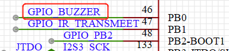
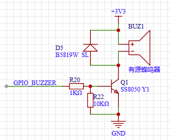
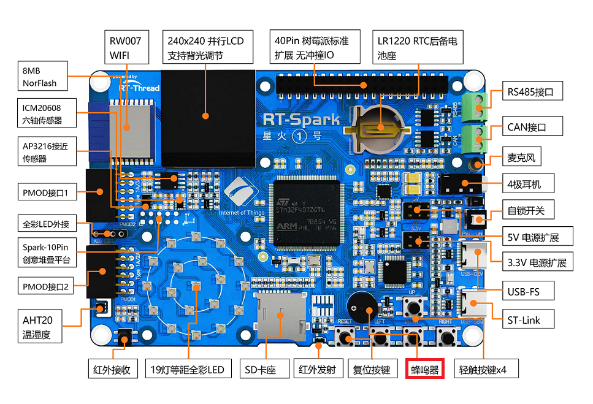

# 外部中断控制蜂鸣器例程

## 简介

本例程主要功能为使用外部中断控制蜂鸣器，当按下 WK_UP 蜂鸣器响起，松开 WK_UP 后蜂鸣器关闭。

中断是计算机系统中的一个重要概念，用于处理来自外部设备或软件的事件或信号。当一个事件发生时，例如用户按下键盘上的一个键或者硬盘传输数据完成，系统会发出一个中断信号，以通知CPU停止当前执行的任务并处理该事件。中断的目的是实现多任务处理和异步事件处理。它允许计算机在执行某个任务时，能够立即响应外部设备的输入或其他需要处理的事件。中断可以被看作是一种特殊的信号，它打断了正常的程序执行流程，使得处理器能够优先处理一些紧急的任务。当一个中断事件发生时，处理器会保存当前的执行状态，包括程序计数器和寄存器的值，并转而执行一个预先定义的中断处理程序（中断服务程序）。中断处理程序会根据不同的中断类型进行相应的处理，例如读取键盘输入、发送数据到打印机等。完成中断处理后，处理器会恢复之前保存的执行状态，继续执行被中断的任务。

## 硬件说明





蜂鸣器在开发板位置如下图所示：



## 软件说明

按键控制蜂鸣器的源代码位于 `/projects/02_basic_irq_beep下的 applications/main.c 中。

1. 查对应原理图可知，  WK_UP、KEY1 按下为低电平，松开为高电平。所以在 main 函数中， WK_UP 和 KEY1 按键设置为上拉输入模式，PIN_BEEP 引脚设置为输出模式。
2. 然后使用 rt_pin_attach_irq 函数分别设置 KEY1 和 WK_UP 按键中断为下降沿触发中断并且绑定回调函数、设置回调函数相应的入参, 使用 rt_pin_irq_enable 函数使能这两个按键中断。

```c
int main(void)
{
    /* 设置按键引脚为输入模式 */
    rt_pin_mode(PIN_KEY1, PIN_MODE_INPUT_PULLUP);
    rt_pin_mode(PIN_WK_UP, PIN_MODE_INPUT_PULLUP);

    /* 设置蜂鸣器引脚为输出模式 */
    rt_pin_mode(PIN_BEEP, PIN_MODE_OUTPUT);

    /* 设置按键中断模式与中断回调函数 */
    rt_pin_attach_irq(PIN_KEY1, PIN_IRQ_MODE_FALLING, irq_callback, (void *) PIN_KEY1);
    rt_pin_attach_irq(PIN_WK_UP, PIN_IRQ_MODE_FALLING, irq_callback, (void *) PIN_WK_UP);

    /* 使能中断 */
    rt_pin_irq_enable(PIN_KEY1, PIN_IRQ_ENABLE);
    rt_pin_irq_enable(PIN_WK_UP, PIN_IRQ_ENABLE);

    while (1)
    {

    }
    return 0;
}
```

在中断回调函数中判断入参，根据不同入参进行相应的操作。

```c
/* 中断回调 */
void irq_callback(void *args)
{
    rt_uint32_t sign = (rt_uint32_t) args;
    switch (sign)
    {
    case PIN_WK_UP :
        rt_pin_write(PIN_BEEP,PIN_HIGH);
        LOG_D("WK_UP interrupt. beep on.");
        break;
    case PIN_KEY1 :
        rt_pin_write(PIN_BEEP,PIN_LOW);
        LOG_D("KEY1 interrupt. beep off.");
        break;
    default:
        LOG_E("error sign= %d !", sign);
        break;
    }
}
```

## 运行

### 编译 & 下载

- RT-Thread Studio：在 RT-Thread Studio 的包管理器中下载 `STM32F407-RT-SPARK` 资源包，然后创建新工程，执行编译。
- MDK：首先双击 mklinks.bat，生成 rt-thread 与 libraries 文件夹链接；再使用 Env 生成 MDK5 工程；最后双击 project.uvprojx 打开 MDK5 工程，执行编译。

编译完成后，将开发板的 ST-Link USB 口与 PC 机连接，然后将固件下载至开发板。

### 运行效果

```shell
 \ | /
- RT -     Thread Operating System
 / | \     4.1.1 build Jul 13 2023 17:46:59
 2006 - 2022 Copyright by RT-Thread team
[D/main] WK_UP interrupt. beep on.
[D/main] KEY1 interrupt. beep off.
[D/main] WK_UP interrupt. beep on.
[D/main] KEY1 interrupt. beep off.
[D/main] WK_UP interrupt. beep on.
[D/main] WK_UP interrupt. beep on.
[D/main] KEY1 interrupt. beep off.
[D/main] WK_UP interrupt. beep on.
[D/main] KEY1 interrupt. beep off.
[D/main] WK_UP interrupt. beep on.
[D/main] KEY1 interrupt. beep off.
[D/main] WK_UP interrupt. beep on.
[D/main] WK_UP interrupt. beep on.
[D/main] WK_UP interrupt. beep on.
[D/main] WK_UP interrupt. beep on.
[D/main] WK_UP interrupt. beep on.
[D/main] WK_UP interrupt. beep on.
[D/main] KEY1 interrupt. beep off.
```

## 注意事项

暂无

## 引用参考

- 设备与驱动：[PIN 设备](https://www.rt-thread.org/document/site/#/rt-thread-version/rt-thread-standard/programming-manual/device/pin/pin)

