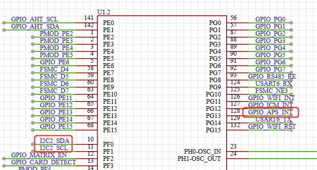
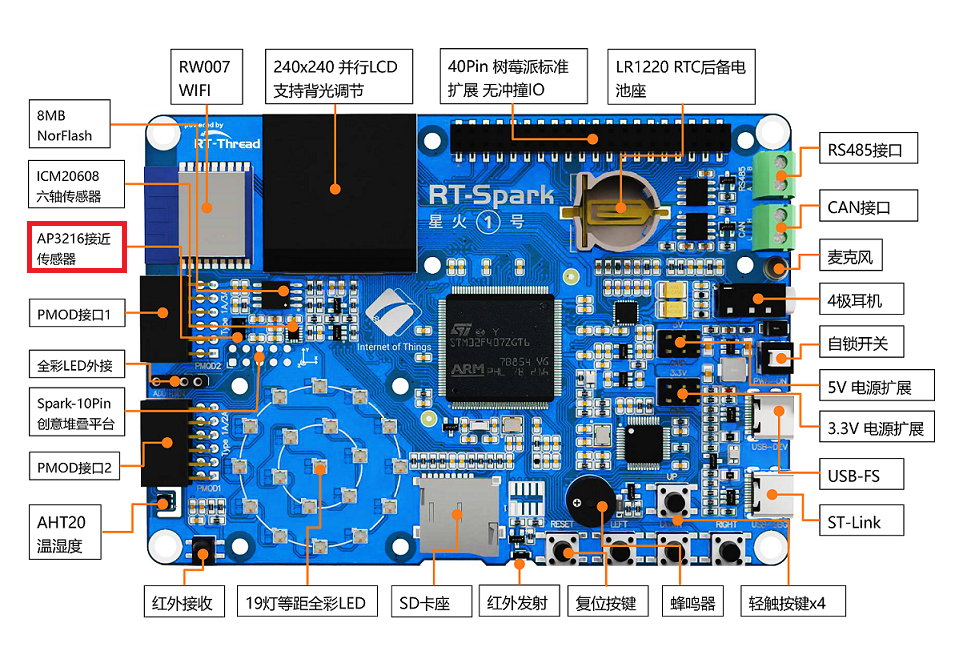
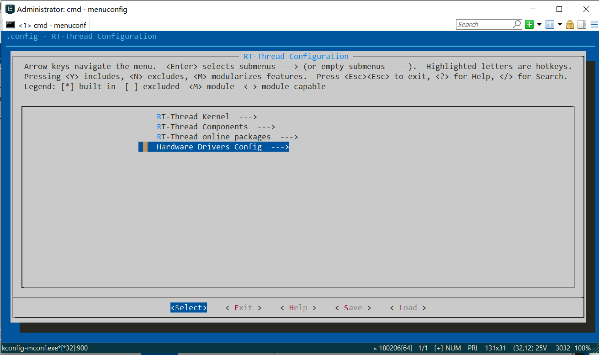
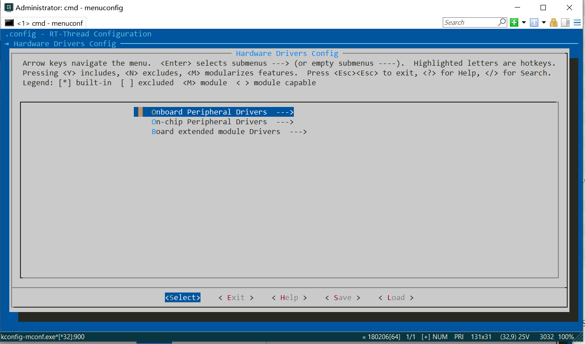
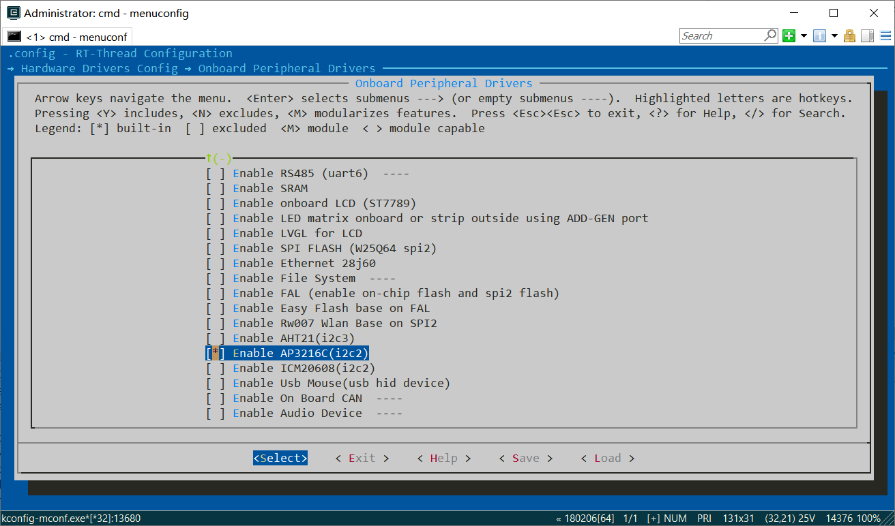
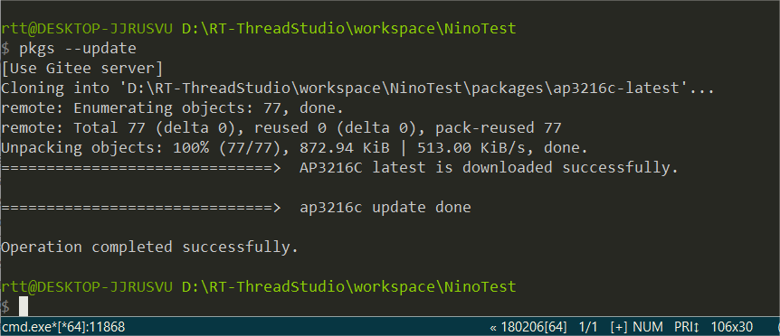

# AP3216C 接近与光强传感器例程

## 简介

本例程主要功能是利用 RT-Thread 的 AP3216C 软件包读取传感器 ap3216c 测量的接近感应（ps，proximity sensor）与光照强度（als， ambient light sensor）。

## AP3216C 软件包简介

AP3216C 软件包提供了使用接近感应（ps）与光照强度（als）传感器 ap3216c 基本功能，并且提供了硬件中断的可选功能，如需详细了解该软件包，请参考 AP3216C 软件包中的 README（路径位于`./package/ap3216-vxx`)。

## 硬件说明

ap3216c 硬件原理图如下所示：




如上图所示，单片机通过 I2C2(soft) scl(PF1)、 I2C2(soft) sda(PF0) 对传感器 ap3216c 发送命令、读取数据等， AP_INT(PG13) 为硬件中断引脚。

接近感应与光照强度传感器在开发板中的位置如下图所示：



该传感器能够实现如下功能：

* 光照强度：支持 4 个量程
* 接近感应：支持 4 种增益
* 中断触发：光照强度及接近感应同时支持 高于阈值 或 低于阈值 的两种硬件中断触发方式

## 软件说明

本例程的源码位于 `/projects/03_driver_als_ps`。

接近感应与光照强度传感器 ap3216c 的示例代码位于 applications/main.c 中。
主要流程：
1. 初始化传感器 ap3216c，传入参数 i2c1 为该传感器挂载的 i2c 总线的名称；初始化若失败，则返回空，程序不会被执行，若成功，则返回传感器设备对象；
2. 将返回设备对象分别传入获取 als 与 ps 函数，获取测量的 als 与 ps 值（详细的 API 介绍参考 ap3216c 软件包读取接近感应与光照强度章节，源码参考 ap3216c.c ）。

示例代码如下：

```c
int main(void)
{
    ap3216c_device_t dev;
    const char *i2c_bus_name = "i2c2";
    int count = 0;

    /* 初始化 ap3216c */
    dev = ap3216c_init(i2c_bus_name);
    if (dev == RT_NULL)
    {
        LOG_E("The sensor initializes failure.");
        return 0;
    }

    while (count++ < 100)
    {
        rt_uint16_t ps_data;
        float brightness;

        /* 读接近感应值 */
        ps_data = ap3216c_read_ps_data(dev);
        if (ps_data == 0)
        {
            LOG_D("object is not proximity of sensor.");
        }
        else
        {
            LOG_D("current ps data   : %d.", ps_data);
        }

        /* 读光照强度值 */
        brightness = ap3216c_read_ambient_light(dev);
        LOG_D("current brightness: %d.%d(lux).", (int)brightness, ((int)(10 * brightness) % 10));

        rt_thread_mdelay(1000);
    }
    return 0;
}
```

### 使用BSP来自行构建AP3216工程

- RT-ENV：
	1. 在空白工程模板文件夹中，右键空白处打开选项菜单，打开ENV工具；或者在RT-Thread Studio中右键工程文件夹，打开ENV终端。打开后输入`menuconfig`，进行终端可视化菜单配置。
	2. 打开menuconfig可视化菜单后，依次进入`Hardware Dirvers Config --> Onboard Peripheral Drivers --> Enable AP3216C(I2C2)`，选中`Enable AP3216C`后，点击键盘`Y`键选中对应外设，然后用方向键选中底部菜单的`SAVE`后，回车键保存，然后退出。



	3. 在ENV终端中使用`pkgs --update`命令，将自动下载刚刚选中的软件包（上游服务器为gitee），此操作将会下载AP3216C的驱动软件包，路径位于工程目录下的`packages`文件夹中。


至此，我们便可以在空白工程模板的基础上，获取到完整的项目依赖库。接下来我们便可以基于软件包进行进一步的工程开发。

示例代码如下:
```C
/*
 * Copyright (c) 2006-2021, RT-Thread Development Team
 *
 * SPDX-License-Identifier: Apache-2.0
 *
 * Change Logs:
 * Date           Author       Notes
 * 2023-5-10      ShiHao       first version
 */

#include <rtthread.h>
#include <rtdevice.h>
#include <board.h>

#include <ap3216c.h>

#define DBG_TAG "main"
#define DBG_LVL         DBG_LOG
#include <rtdbg.h>

int main(void)
{
    ap3216c_device_t dev;
    const char* i2c_bus_name = "i2c2";

    unsigned int count = 1;

    dev = ap3216c_init(i2c_bus_name);

    while (count > 0)
    {
        rt_uint16_t ps_data;
        float brightness;

        ps_data = ap3216c_read_ps_data(dev);

        LOG_D("current ps data: %d.", ps_data);

        brightness = ap3216c_read_ambient_light(dev);
        LOG_D("current brightness: %d.%d(lux).", (int)brightness, ((int)(10 * brightness) % 10));

        count++;
    }

    return 0;
}

```
### 编译 & 下载

- RT-Thread Studio：在 RT-Thread Studio 的包管理器中下载 `STM32F407-RT-SPARK` 资源包，然后创建新工程，执行编译。
- MDK：首先双击 mklinks.bat，生成 rt-thread 与 libraries 文件夹链接；再使用 Env 生成 MDK5 工程；最后双击 project.uvprojx 打开 MDK5 工程，执行编译。

编译完成后，将开发板的 ST-Link USB 口与 PC 机连接，然后将固件下载至开发板。

### 运行效果

烧录完成后，此时可以在 PC 端使用终端工具打开开发板的 ST-Link 提供的虚拟串口，设置串口波特率为 115200，数据位 8 位，停止位 1 位，无流控，开发板的运行日志信息即可实时输出出来，显示如下所示：

```shell
 \ | /
- RT -     Thread Operating System
 / | \     4.1.1 build Jun  9 2023 13:18:36
 2006 - 2022 Copyright by RT-Thread team
msh >[D/main] object is not proximity of sensor.
[D/main] current brightness: 32.9(lux).
[D/main] object is not proximity of sensor.
[D/main] current brightness: 33.6(lux).
[D/main] current ps data   : 7.
[D/main] current brightness: 33.9(lux).
[D/main] object is not proximity of sensor.
[D/main] current brightness: 33.9(lux).
[D/main] current ps data   : 7.
[D/main] current brightness: 33.9(lux).
[D/main] current ps data   : 11.
[D/main] current brightness: 33.9(lux).
[D/main] current ps data   : 1.
[D/main] current brightness: 33.9(lux).
[D/main] object is not proximity of sensor.
[D/main] current brightness: 33.9(lux).
[D/main] object is not proximity of sensor.
[D/main] current brightness: 33.9(lux).
[D/main] current ps data   : 1023.
[D/main] current brightness: 0.0(lux).
[D/main] current ps data   : 1023.
[D/main] current brightness: 0.0(lux).
[D/main] object is not proximity of sensor.
[D/main] current brightness: 32.9(lux).
[D/main] object is not proximity of sensor.
[D/main] current brightness: 33.6(lux).
[D/main] current ps data   : 1.
[D/main] current brightness: 33.6(lux).
[D/main] current ps data   : 8.
[D/main] current brightness: 33.6(lux).
[D/main] object is not proximity of sensor.
[D/main] current brightness: 33.6(lux).

```

## RT-Thread模块化编程示例

在RT-Thread系统架构中，为了实现高效的模块解耦，我们使用了“自动初始化”机制，模块的初始化代码不再需要显式调用，仅需在函数定义处通过宏定义的方式进行申明，就会在系统启动过程中被执行。这样的代码架构有助于我们简化初始化流程，便于实现动态配置的效果。

在这里举例使用这一功能进行开发，我们创建两个.c文件，分别为`main.c`和`app_ap3216c.c`文件，在main.C中，只进行点灯操作，在app_ap3216c.c中，进行ap3216c模块的初始化及相应的控制操作。

main.c文件代码:
```c
/*
 * Copyright (c) 2006-2021, RT-Thread Development Team
 *
 * SPDX-License-Identifier: Apache-2.0
 *
 * Change Logs:
 * Date           Author       Notes
 * 2023-5-10      ShiHao       first version
 */

#include <rtthread.h>
#include <rtdevice.h>
#include <board.h>

#define DBG_TAG "main"
#define DBG_LVL         DBG_LOG
#include <rtdbg.h>

/* 配置 LED 灯引脚 */
#define PIN_LED_B              GET_PIN(F, 11)      // PF11 :  LED_B        --> LED
#define PIN_LED_R              GET_PIN(F, 12)      // PF12 :  LED_R        --> LED

int main(void)
{
    unsigned int count = 1;

    rt_pin_mode(PIN_LED_R, OUTPUT_OD);

    for(;;)
    {
        /* LED 灯亮 */
        rt_pin_write(PIN_LED_R, PIN_LOW);
        LOG_D("led on, count: %d", count);
        rt_thread_mdelay(500);

        /* LED 灯灭 */
        rt_pin_write(PIN_LED_R, PIN_HIGH);
        LOG_D("led off");
        rt_thread_mdelay(500);

        count++;
    }

    return 0;
}

```

app_ap3216c.c文件代码:
```c
#include <rtthread.h>
#include <rtdevice.h>
#include <board.h>
#include <ap3216c.h>

#define DBG_TAG "app_ap3216c_entry"
#define DBG_LVL         DBG_LOG
#include <rtdbg.h>

ap3216c_device_t dev;

void app_ap3216c_entry(void* argument){
    rt_uint16_t ps_data;
    float brightness;

    for(;;)
    {
        ps_data = ap3216c_read_ps_data(dev);

        LOG_D("current ps data: %d.", ps_data);

        brightness = ap3216c_read_ambient_light(dev);
        LOG_D("current brightness: %d.%d(lux).", (int)brightness, ((int)(10 * brightness) % 10));

        rt_thread_delay(1000);
    }
}

int app_ap3216c_init(void){
    const char* i2c_bus_name = "i2c2";
    rt_thread_t tid;

    dev = ap3216c_init(i2c_bus_name);

    tid = rt_thread_create("AP3216C", app_ap3216c_entry, NULL, 1024, 20, 1);
    if(tid != RT_NULL) rt_thread_startup(tid);

    return 0;
}

INIT_DEVICE_EXPORT(app_ap3216c_init);
```

可以看到，在main.c的代码中并未调用ap3216c相关的代码程序，甚至也没有创建相应线程。而与ap3216c相关的代码操作被放在了app_ap3216c.c中，由init初始化函数与entry线程入口函数组成。

其中，init函数通过INIT_DEVICE_EXPORT宏函数注册进入rt-thread内核系统之中，在内核启动时自动执行，初始化相关外设后，在内部创建了app线程，然后在线程中执行传感器数据采集的功能。

## 注意事项

暂无。

## 引用参考

- 设备与驱动：[I2C 设备](https://www.rt-thread.org/document/site/#/rt-thread-version/rt-thread-standard/programming-manual/device/i2c/i2c)
- ap3216c 软件包：[https://github.com/RT-Thread-packages/ap3216c](https://github.com/RT-Thread-packages/ap3216c)
- 自动初始化参考资料： [自动初始化](https://www.rt-thread.org/document/site/#/rt-thread-version/rt-thread-standard/programming-manual/basic/basic)

