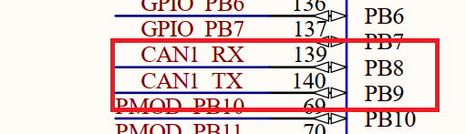
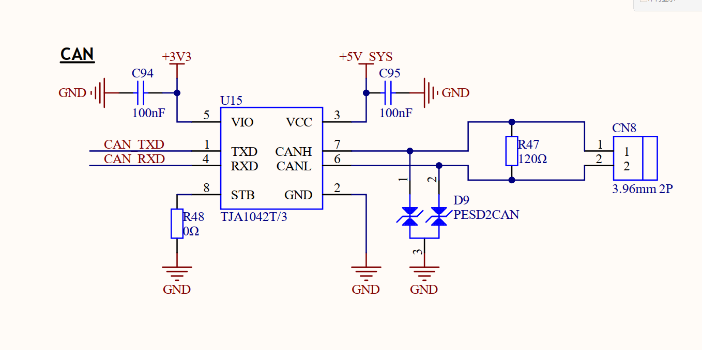
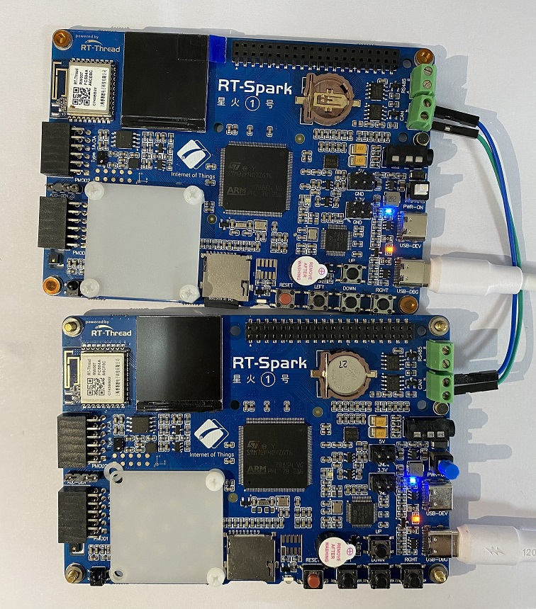

# CAN 通信例程

## 简介

本例程主要完成的工作是完成 CAN 总线的接收和发送功能。

CAN 是控制器局域网络 (Controller Area Network, CAN) 的简称，是由以研发和生产汽车电子产品著称的德国 BOSCH 公司开发的，并最终成为国际标准（ISO 11898），是国际上应用最广泛的现场总线之一。

## 硬件说明





如上图所示，CAN_RX 连接单片机的 PB8 引脚，CAN_TX 连接单片机的 PB9 引脚。

此例程需要两张星火 1 号开发板来完成 CAN 的接收和发送功能，连接示意图如下：



## 软件说明

本例程的源码位于 `/projects/03_driver_can`。

CAN 通信的源代码位于 applications/main.c 中。

```c
int can_sample_send(int argc, char *argv[])
{
    rt_err_t res;
    rt_thread_t thread;
    char can_name[RT_NAME_MAX];

    if (argc == 2)
    {
        rt_strncpy(can_name, argv[1], RT_NAME_MAX);
    }
    else
    {
        rt_strncpy(can_name, CAN_DEV_NAME, RT_NAME_MAX);
    }
    /* 查找 CAN 设备 */
    can_dev = rt_device_find(can_name);
    if (!can_dev)
    {
        rt_kprintf("find %s failed!\n", can_name);
        return RT_ERROR;
    }

    /* 以中断接收及发送方式打开 CAN 设备 */
    res = rt_device_open(can_dev, RT_DEVICE_FLAG_INT_TX | RT_DEVICE_FLAG_INT_RX);
    RT_ASSERT(res == RT_EOK);
    /* 创建数据接收线程 */
    thread = rt_thread_create("can_tx", can_tx_thread, RT_NULL, 1024, 25, 10);
    if (thread != RT_NULL)
    {
        rt_thread_startup(thread);
    }
    else
    {
        rt_kprintf("create can_rx thread failed!\n");
    }

    return res;
}
/* 导出到 msh 命令列表中 */
MSH_CMD_EXPORT(can_sample_send, can device sample);
```

上述代码打开了一个 CAN 设备 `can1`, 随后创建了一个 CAN 发送线程。最后将测试函数导入到 MSH 命令列表中。

```c
static void can_tx_thread(void *parameter)
{
    struct rt_can_msg msg = {0};
    rt_size_t  size;
    msg.id = 0x78;              /* ID 为 0x78 */
    msg.ide = RT_CAN_STDID;     /* 标准格式 */
    msg.rtr = RT_CAN_DTR;       /* 数据帧 */
    msg.len = 8;                /* 数据长度为 8 */
    /* 待发送的 8 字节数据 */
    rt_memset(msg.data,0,sizeof(msg.data));
    int number = 0;
    while(1)
    {
        /* 发送一帧 CAN 数据 */
        rt_sprintf((char *)msg.data,"rtt:%d",number++);
        size = rt_device_write(can_dev, 0, &msg, sizeof(msg));
        if (size == 0)
        {
            rt_kprintf("can dev write data failed!\n");
        }
        rt_thread_delay(1000);
    }
}
```

在发送线程中，首先设置 CAN 发送参数， `id=0x78` 使用标准帧，帧类型为数据帧，数据长度为 8。 随后每隔 1s 调用一次发送函数，将 `number` 通过 CAN 总线发送出去。

```c
int can_sample_receive(int argc, char *argv[])
{
    rt_err_t res;
    rt_thread_t thread;
    char can_name[RT_NAME_MAX];

    if (argc == 2)
    {
        rt_strncpy(can_name, argv[1], RT_NAME_MAX);
    }
    else
    {
        rt_strncpy(can_name, CAN_DEV_NAME, RT_NAME_MAX);
    }
    /* 查找 CAN 设备 */
    can_dev = rt_device_find(can_name);
    if (!can_dev)
    {
        rt_kprintf("find %s failed!\n", can_name);
        return RT_ERROR;
    }

    /* 初始化 CAN 接收信号量 */
    rt_sem_init(&rx_sem, "rx_sem", 0, RT_IPC_FLAG_FIFO);

    /* 以中断接收及发送方式打开 CAN 设备 */
    res = rt_device_open(can_dev, RT_DEVICE_FLAG_INT_TX | RT_DEVICE_FLAG_INT_RX);
    RT_ASSERT(res == RT_EOK);
    /* 创建数据接收线程 */
    thread = rt_thread_create("can_rx", can_rx_thread, RT_NULL, 1024, 25, 10);
    if (thread != RT_NULL)
    {
        rt_thread_startup(thread);
    }
    else
    {
        rt_kprintf("create can_rx thread failed!\n");
    }
    return res;
}
/* 导出到 msh 命令列表中 */
MSH_CMD_EXPORT(can_sample_receive, can device sample);
```

上述函数为 CAN 接收的实现，首先初始化接收信号量，随后打开了 CAN 设备 `can1`，然后创建了一个接收线程。

```c
static rt_err_t can_rx_call(rt_device_t dev, rt_size_t size)
{
    /* CAN 接收到数据后产生中断，调用此回调函数，然后发送接收信号量 */
    rt_sem_release(&rx_sem);

    return RT_EOK;
}

static void can_rx_thread(void *parameter)
{
    struct rt_can_msg rxmsg = {0};

    /* 设置接收回调函数 */
    rt_device_set_rx_indicate(can_dev, can_rx_call);

    while (1)
    {
        /* hdr 值为 - 1，表示直接从 uselist 链表读取数据 */
        rxmsg.hdr = -1;
        /* 阻塞等待接收信号量 */
        rt_sem_take(&rx_sem, RT_WAITING_FOREVER);
        /* 从 CAN 读取一帧数据 */
        rt_device_read(can_dev, 0, &rxmsg, sizeof(rxmsg));
        /* 打印数据 ID 及内容 */
        rt_kprintf("ID:%x\tmessege:%s\n", rxmsg.id, rxmsg.data);
    }
}
```

在接收线程中首先绑定接收回调函数，在回调函数中释放信号量。随后接收线程阻塞，直到获得到了信号量。最后获得信号量之后将读取到的信息打印出来。

##  运行

### 编译 & 下载

- RT-Thread Studio：在 RT-Thread Studio 的包管理器中下载 `STM32F407-RT-SPARK` 资源包，然后创建新工程，执行编译。
- MDK：首先双击 mklinks.bat，生成 rt-thread 与 libraries 文件夹链接；再使用 Env 生成 MDK5 工程；最后双击 project.uvprojx 打开 MDK5 工程，执行编译。

### 运行效果

按下复位按键重启开发板，分别在两个板子上启动发送例程和接收例程。

```sheel
 \ | /
- RT -     Thread Operating System
 / | \     4.1.1 build Jul 10 2023 15:13:34
 2006 - 2022 Copyright by RT-Thread team
msh >can_sample_send
msh >
```

```sheel
 \ | /
- RT -     Thread Operating System
 / | \     4.1.1 build Jul 10 2023 15:13:34
 2006 - 2022 Copyright by RT-Thread team
msh >can_sample_receive
msh >ID:78      messege:rtt:0
ID:78   messege:rtt:1
ID:78   messege:rtt:2
ID:78   messege:rtt:3
ID:78   messege:rtt:4
ID:78   messege:rtt:5
ID:78   messege:rtt:6
ID:78   messege:rtt:7
ID:78   messege:rtt:8
ID:78   messege:rtt:9
ID:78   messege:rtt:10
ID:78   messege:rtt:11
ID:78   messege:rtt:12
ID:78   messege:rtt:13
ID:78   messege:rtt:14
ID:78   messege:rtt:15
```

如上所示，在启动发送例程后，发送例程每隔 1s 发送一次数据。而接收例程，收到了 ID 为 78 的设备发送过来的消息并且打印了出来。
## 注意事项

在连接 CAN 总线的时候，请将 CAN L 连接到 CAN L,CAN H 连接到 CAN H。

## 引用参考

- 设备与驱动：[CAN 设备](https://www.rt-thread.org/document/site/#/rt-thread-version/rt-thread-standard/programming-manual/device/can/can)
