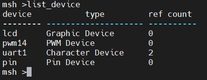

# LCD 显示例程

## 简介

本例程主要介绍了如何在 LCD 上显示文字和图片。

## 硬件说明

星火 1 号开发板板载的是一块 1.3 寸，分辨率为 240x240 的 LCD 显示屏，显示效果十分细腻。显示屏的驱动芯片是 ST7789 v3, 通信接口使用的是 8080 并口，通过 fsmc 模拟出驱动时序和单片机进行通讯。使用了 8 根数据线传输数据，一根地址选择线作为芯片的使能信号。


## 软件说明

本例程的源码位于 `/projects/03_driver_lcd`。

显示图片和文字的源代码位于 libraries/Board_Drivers/lcd/drv_lcd.c 中。

在 main 函数中，通过调用已经封装好的 LCD API 函数，首先执行的是清屏操作，将 LCD 全部刷成白色。然后设置画笔的颜色为黑色，背景色为白色。接着显示 RT-Thread 的 LOGO。最后会显示一些信息，包括 16x16 像素， 24x24 像素和 32x32 像素的三行英文字符，一条横线和一个同心圆。

```c
int main(void)
{
    lcd_clear(WHITE);

    /* show RT-Thread logo */
    lcd_show_image(0, 0, 240, 69, image_rttlogo);

    /* set the background color and foreground color */
    lcd_set_color(WHITE, BLACK);

    /* show some string on lcd */
    lcd_show_string(10, 69, 16, "Hello, RT-Thread!");
    lcd_show_string(10, 69 + 16, 24, "RT-Thread");
    lcd_show_string(10, 69 + 16 + 24, 32, "RT-Thread");

    /* draw a line on lcd */
    lcd_draw_line(0, 69 + 16 + 24 + 32, 240, 69 + 16 + 24 + 32);

    /* draw a concentric circles */
    lcd_draw_point(120, 194);
    for (int i = 0; i < 46; i += 4)
    {
        lcd_draw_circle(120, 194, i);
    }
    return 0;
}
```

### 例程代码分析 -- LCD驱动库 drv_lcd

创建新工程时，选中基于RT-Spark开发板构建模板工程。模板工程建立成功后，工程目录下的`libraries`目录中出现`lcd`依赖库。

在`lcd`目录下的`drv_lcd.c`文件中存放着LCD驱动的关键代码。

1. LCD硬件初始化：在LCD外设的配置中，大致可分为两大部分
   1. LCD硬件初始化--配置ST7789V3芯片寄存器
```c
rt_err_t drv_lcd_init(struct rt_device *device)
{

    SRAM_HandleTypeDef hsram1 = {0};
    FSMC_NORSRAM_TimingTypeDef read_timing = {0};
    FSMC_NORSRAM_TimingTypeDef write_timing = {0};

#ifndef BSP_USING_ONBOARD_LCD_PWM_BL
    rt_pin_mode(LCD_BL, PIN_MODE_OUTPUT);
#endif /* BSP_USING_ONBOARD_LCD_PWM_BL */

#ifdef BSP_USING_ONBOARD_LCD_TEAREFFECT
    rt_pin_mode(LCD_TE_PIN, PIN_MODE_INPUT_PULLUP);
    rt_pin_attach_irq(LCD_TE_PIN, PIN_IRQ_MODE_RISING, lcd_teareffect_isr, RT_NULL);
#endif /* BSP_USING_ONBOARD_LCD_TEAREFFECT */
    rt_pin_mode(LCD_RST, PIN_MODE_OUTPUT);

    rt_pin_write(LCD_RST, PIN_LOW);
    rt_thread_mdelay(100);
    rt_pin_write(LCD_RST, PIN_HIGH);
    rt_thread_mdelay(100);
    // FSMC_NORSRAM_TimingTypeDef Timing = {0};

    /** Perform the SRAM1 memory initialization sequence
     */
    hsram1.Instance = FSMC_NORSRAM_DEVICE;
    hsram1.Extended = FSMC_NORSRAM_EXTENDED_DEVICE;
    /* hsram1.Init */
    hsram1.Init.NSBank = FSMC_NORSRAM_BANK3;
    
    /*
        省略部分代码
    */

    return RT_EOK;
}
INIT_COMPONENT_EXPORT(drv_lcd_init);
```
可以看到，init初始化函数被导入到了RT-Thread内核启动流程之中，位于启动过程中的component部分。

   2. LCD软件初始化--注册进入RT-Thread Kernel
```c
struct drv_lcd_device
{
    struct rt_device parent;

    struct rt_device_graphic_info lcd_info;
};

static struct drv_lcd_device _lcd;

int drv_lcd_hw_init(void)
{
    rt_err_t result = RT_EOK;
    struct rt_device *device = &_lcd.parent;
    /* memset _lcd to zero */
    memset(&_lcd, 0x00, sizeof(_lcd));

    _lcd.lcd_info.bits_per_pixel = 16;
    _lcd.lcd_info.pixel_format = RTGRAPHIC_PIXEL_FORMAT_RGB565;

    device->type = RT_Device_Class_Graphic;
#ifdef RT_USING_DEVICE_OPS
    device->ops = &lcd_ops;
#else
    device->init = drv_lcd_init;
    device->control = drv_lcd_control;
#endif
    device->user_data = &fsmc_lcd_ops;
    /* register lcd device */
    rt_device_register(device, "lcd", RT_DEVICE_FLAG_RDWR | RT_DEVICE_FLAG_STANDALONE);

    return result;
}
INIT_DEVICE_EXPORT(drv_lcd_hw_init);
```
可以看到，init函数进行了RT-Thread内核中的LCD硬件设备的初始化。其中的_lcd便是我们的硬件LCD设备，在经过一系列初始化配置后，将LCD设备通过`rt_device_register`函数，以`Graphic Device`设备的身份注册进入RT-Thread内核之中。

在前面的初始化部分，我们已经对LCD设备指定了各个操作对应的函数，如初始化init、控制设备control。



#### 关键结构体解析
1. rt_device -- RT-Thread内核device类结构体
```c
struct rt_device
{
    struct rt_object          parent;                   /**< inherit from rt_object */

    enum rt_device_class_type type;                     /**< device type */
    rt_uint16_t               flag;                     /**< device flag */
    rt_uint16_t               open_flag;                /**< device open flag */

    rt_uint8_t                ref_count;                /**< reference count */
    rt_uint8_t                device_id;                /**< 0 - 255 */

    /* device call back */
    rt_err_t (*rx_indicate)(rt_device_t dev, rt_size_t size);
    rt_err_t (*tx_complete)(rt_device_t dev, void *buffer);

#ifdef RT_USING_DEVICE_OPS
    const struct rt_device_ops *ops;
#else
    /* common device interface */
    rt_err_t  (*init)   (rt_device_t dev);
    rt_err_t  (*open)   (rt_device_t dev, rt_uint16_t oflag);
    rt_err_t  (*close)  (rt_device_t dev);
    rt_size_t (*read)   (rt_device_t dev, rt_off_t pos, void *buffer, rt_size_t size);
    rt_size_t (*write)  (rt_device_t dev, rt_off_t pos, const void *buffer, rt_size_t size);
    rt_err_t  (*control)(rt_device_t dev, int cmd, void *args);
#endif /* RT_USING_DEVICE_OPS */

#ifdef RT_USING_POSIX_DEVIO
    const struct dfs_file_ops *fops;
    struct rt_wqueue wait_queue;
#endif /* RT_USING_POSIX_DEVIO */

    void                     *user_data;                /**< device private data */
};
```
2. rt_device_graphic_info -- RT-Thread内核图形设备类结构体
```c
/**
 * graphic device information structure
 */
struct rt_device_graphic_info
{
    rt_uint8_t  pixel_format;                           /**< graphic format */
    rt_uint8_t  bits_per_pixel;                         /**< bits per pixel */
    rt_uint16_t pitch;                                  /**< bytes per line */

    rt_uint16_t width;                                  /**< width of graphic device */
    rt_uint16_t height;                                 /**< height of graphic device */

    rt_uint8_t *framebuffer;                            /**< frame buffer */
    rt_uint32_t smem_len;                               /**< allocated frame buffer size */
};
```

在本例程中，LCD设备继承了device类与Graphic Device图形设备类，以实现“以图形设备注册进入RT-Thread内核”的效果。


#### 关键函数解析
1. rt_device_register -- RT-Thread设备注册函数
```c
/**
 * @brief This function registers a device driver with a specified name.
 *
 * @param dev is the pointer of device driver structure.
 *
 * @param name is the device driver's name.
 *
 * @param flags is the capabilities flag of device.
 *
 * @return the error code, RT_EOK on initialization successfully.
 */
rt_err_t rt_device_register(rt_device_t dev,
                            const char *name,
                            rt_uint16_t flags);
```
通过此函数，将设备注册进入RT-Thread内核链表之中。
参数：        
   1. dev：RT-Thread内核设备的指针，指向我们要注册的设备结构体
   2. name：设备的别名，可用于在RT-Thread内核中查找设备
   3. flag：设备的属性标识，可传入`RT_DEVICE_FLAG_RDWR`等属性  

**其余LCD操作API, 如draw_Line, draw_Point与常规LCD驱动类似**
## 运行

### 编译 & 下载

- RT-Thread Studio：在 RT-Thread Studio 的包管理器中下载 `STM32F407-RT-SPARK` 资源包，然后创建新工程，执行编译。
- MDK：首先双击 mklinks.bat，生成 rt-thread 与 libraries 文件夹链接；再使用 Env 生成 MDK5 工程；最后双击 project.uvprojx 打开 MDK5 工程，执行编译。

编译完成后，将开发板的 ST-Link USB 口与 PC 机连接，然后将固件下载至开发板。

### 运行效果

按下复位按键重启开发板，观察开发板上 LCD 的实际效果。正常运行后，LCD 上会显示 RT-Thread LOGO，下面会显示 3 行大小为 16、 24、 32 像素的文字，文字下面是一行直线，直线的下方是一个同心圆。如下图所示：


同时，可以通过命令行指令进行LCD控制，命令内容如下：
1. app_lcd_clean -- 清屏
2. app_lcd_string -- 显示例程字符串部分
3. app_lcd_circle -- 显示例程圆圈部分

## 注意事项

屏幕的分辨率是 240x240，输入位置参数时要注意小于 240，不然会出现无法显示的现象。图像的取模方式为自上而下，自左向右，高位在前， 16 位色（RGB-565）。本例程未添加中文字库，不支持显示中文。

## 引用参考

暂无。
