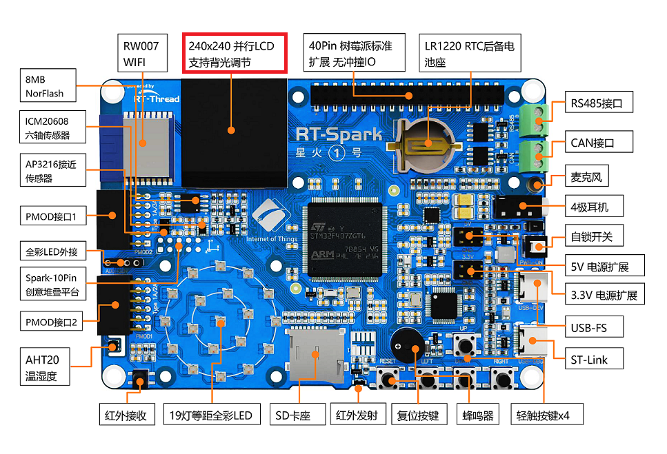
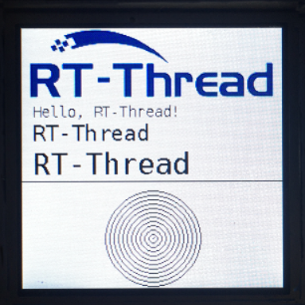

# LCD 显示例程

## 简介

本例程主要介绍了如何在 LCD 上显示文字和图片。

## 硬件说明

星火 1 号开发板板载的是一块 1.3 寸，分辨率为 240x240 的 LCD 显示屏，显示效果十分细腻。显示屏的驱动芯片是 ST7789 v3, 通信接口使用的是 8080 并口，通过 fsmc 模拟出驱动时序和单片机进行通讯。使用了 8 根数据线传输数据，一根地址选择线作为芯片的使能信号。




## 软件说明

本例程的源码位于 `/projects/03_driver_lcd`。

显示图片和文字的源代码位于 libraries/Board_Drivers/lcd/drv_lcd.c 中。

在 main 函数中，通过调用已经封装好的 LCD API 函数，首先执行的是清屏操作，将 LCD 全部刷成白色。然后设置画笔的颜色为黑色，背景色为白色。接着显示 RT-Thread 的 LOGO。最后会显示一些信息，包括 16x16 像素， 24x24 像素和 32x32 像素的三行英文字符，一条横线和一个同心圆。

```c
int main(void)
{
    lcd_clear(WHITE);

    /* show RT-Thread logo */
    lcd_show_image(0, 0, 240, 69, image_rttlogo);

    /* set the background color and foreground color */
    lcd_set_color(WHITE, BLACK);

    /* show some string on lcd */
    lcd_show_string(10, 69, 16, "Hello, RT-Thread!");
    lcd_show_string(10, 69 + 16, 24, "RT-Thread");
    lcd_show_string(10, 69 + 16 + 24, 32, "RT-Thread");

    /* draw a line on lcd */
    lcd_draw_line(0, 69 + 16 + 24 + 32, 240, 69 + 16 + 24 + 32);

    /* draw a concentric circles */
    lcd_draw_point(120, 194);
    for (int i = 0; i < 46; i += 4)
    {
        lcd_draw_circle(120, 194, i);
    }
    return 0;
}
```

## 运行

### 编译 & 下载

- RT-Thread Studio：在 RT-Thread Studio 的包管理器中下载 `STM32F407-RT-SPARK` 资源包，然后创建新工程，执行编译。
- MDK：首先双击 mklinks.bat，生成 rt-thread 与 libraries 文件夹链接；再使用 Env 生成 MDK5 工程；最后双击 project.uvprojx 打开 MDK5 工程，执行编译。

编译完成后，将开发板的 ST-Link USB 口与 PC 机连接，然后将固件下载至开发板。

### 运行效果

按下复位按键重启开发板，观察开发板上 LCD 的实际效果。正常运行后，LCD 上会显示 RT-Thread LOGO，下面会显示 3 行大小为 16、 24、 32 像素的文字，文字下面是一行直线，直线的下方是一个同心圆。如下图所示：



## 注意事项

屏幕的分辨率是 240x240，输入位置参数时要注意小于 240，不然会出现无法显示的现象。图像的取模方式为自上而下，自左向右，高位在前， 16 位色（RGB-565）。本例程未添加中文字库，不支持显示中文。

## 引用参考

暂无。
