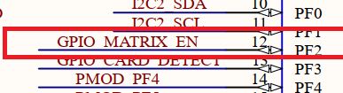
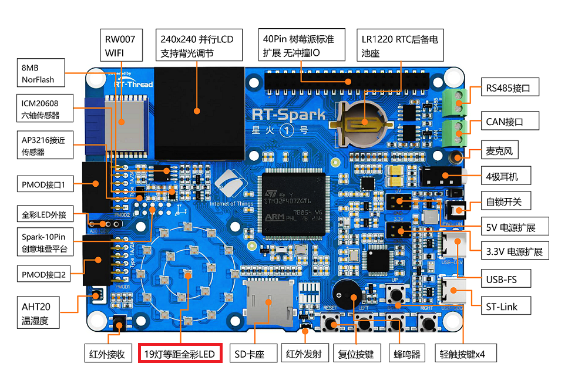
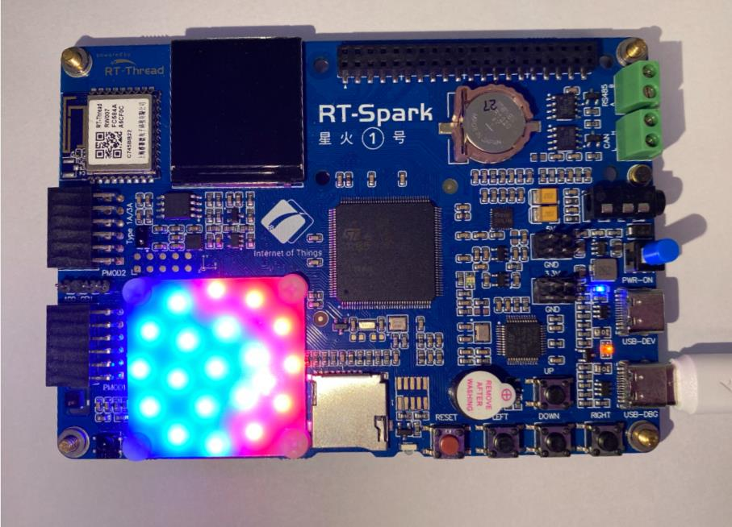

# LED MATRIX 闪烁例程

## 简介

本例程主要介绍了如何驱动板载 LED MATRIX

## 硬件说明




如上图所示，LED MATRIX 使用的是 SK6805 RGB 三色 LED, 驱动时使用串行信号。

LED MATRIX 在开发板中的位置如下图所示：



## 软件说明

本例程的源码位于 `/projects/03_driver_led_matrix`。

在 main 函数中，创建了一个 led matrix demo 线程并且启动该线程。

```c
int main(void)
{
    led_matrix_thread = rt_thread_create("led matrix demo", led_matrix_example_entry, RT_NULL, 1024, 20, 20);
    if(led_matrix_thread == RT_NULL)
    {
        rt_kprintf("led matrix demo thread creat failed!\n");
        return 0;
    }
    rt_thread_startup(led_matrix_thread);

    return 0;
}
```

下面代码先定义了 LED MATRIX 中所有 LED 的序号，然后在  `led_matrix_example_entry()` 中循环的点亮 LED 。

```c
/* define LED  */
enum{
    EXTERN_LED_0,
    EXTERN_LED_1,
    EXTERN_LED_2,
    EXTERN_LED_3,
    EXTERN_LED_4,
    EXTERN_LED_5,
    EXTERN_LED_6,
    EXTERN_LED_7,
    EXTERN_LED_8,
    EXTERN_LED_9,
    EXTERN_LED_10,
    EXTERN_LED_11,
    EXTERN_LED_12,
    EXTERN_LED_13,
    EXTERN_LED_14,
    EXTERN_LED_15,
    EXTERN_LED_16,
    EXTERN_LED_17,
    EXTERN_LED_18,
};

rt_thread_t led_matrix_thread;

static void led_matrix_example_entry()
{
    int count = 0;
    while(1)
    {
        for(int i=EXTERN_LED_0; i<=EXTERN_LED_18; i++)
        {
            switch (count)
            {
            case 0:
                Set_LEDColor(i,RED);
                break;
            case 1:
                Set_LEDColor(i,GREEN);
                break;
            case 2:
                Set_LEDColor(i,BLUE);
                break;
            default:
                return ;
                break;
            }
            RGB_Reflash();
            rt_thread_delay(20);
        }
        count = (count+1) % 3; 
    }
}
```

##  运行

### 编译 & 下载

- RT-Thread Studio：在 RT-Thread Studio 的包管理器中下载 `STM32F407-RT-SPARK` 资源包，然后创建新工程，执行编译。
- MDK：首先双击 mklinks.bat，生成 rt-thread 与 libraries 文件夹链接；再使用 Env 生成 MDK5 工程；最后双击 project.uvprojx 打开 MDK5 工程，执行编译。

### 运行效果

按下复位按键重启开发板，观察开发板上 LED MATRIX 的实际效果。正常运行后，所有 LED 会按照红、绿、蓝的顺序逐个点亮如下图所示：



## 注意事项

暂无。

## 引用参考

暂无
