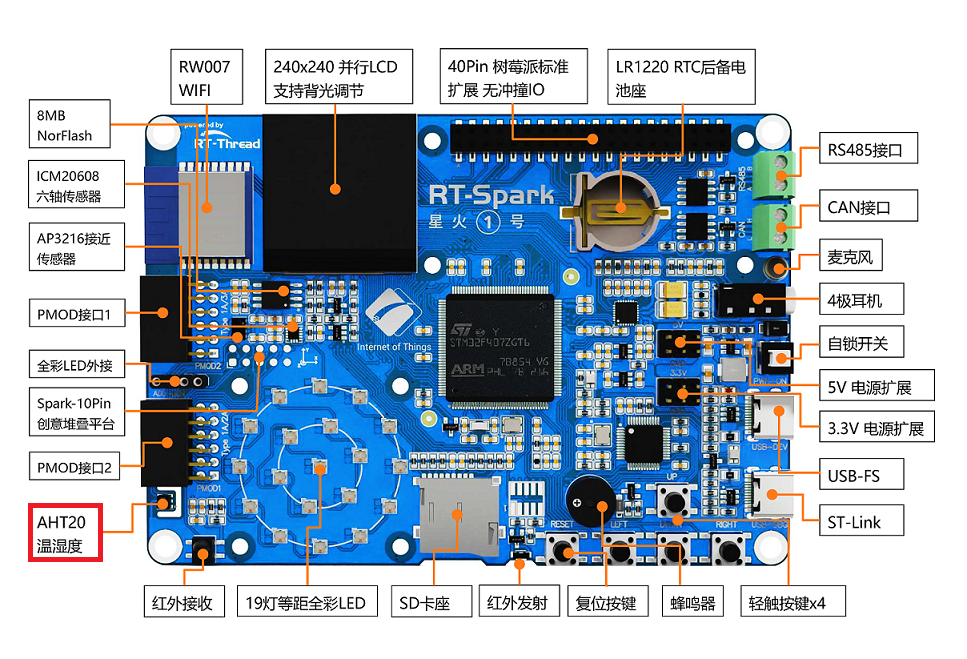

# AHT10 温湿度传感器例程

## 简介

本例程主要功能是利用 RT-Thread 的 AHT10 软件包的读取传感器 aht10(aht21) 所测量的温度（temperature）与湿度（humidity）。因为两款传感器的驱动互相兼容，所以下文所说的 aht10 指的是我们板载的 aht21。

## AHT10 软件包简介

AHT10 软件包提供了使用温度与湿度传感器 aht10 基本功能，并且提供了软件平均数滤波器可选功能，如需详细了解该软件包，请参考 AHT10 软件包中的 README。

## 硬件说明

aht10 硬件原理图如下所示：


如上图所示，单片机通过软件 iic I2C3(soft) scl(PE0)、 I2C3(soft) sda(PE1) 对传感器 aht10 发送命令、读取数据等。温度与湿度传感器在开发板中的位置如下图所示：



该传感器输入电压范围为 1.8v - 3.3v，测量温度与湿度的量程、精度如下表所示：

| 功能 | 量程 | 精度 | 单位 |
| :----: | :----: | :----: | :----: |
| 温度 | -40 - 85 | ±0.5 | 摄氏度 |
| 相对湿度 | 0 - 100 | ±3 | % |

## 软件说明

本例程的源码位于 `/projects/03_driver_temp_humi`。

温度与湿度传感器的示例代码位于 applications/main.c 中，主要流程：初始化传感器 aht10，传入参数 i2c2 为该传感器挂载的 i2c 总线的名称；初始化若失败，则返回空，程序不会被执行，若成功，则返回传感器设备对象；然后将返回的设备对象分别传入读取湿度与温度的函数，获取测量的湿度与温度值（详细的 API 介绍参考 aht10 软件包读取温度与湿度章节，源码参考 aht10.c）。示例代码如下：

```c
int main(void)
{
    float humidity, temperature;
    aht10_device_t dev;

    /* 总线名称 */
    const char *i2c_bus_name = "i2c3";
    int count = 0;

    /* 等待传感器正常工作 */
    rt_thread_mdelay(2000);

    /* 初始化 aht10 */
    dev = aht10_init(i2c_bus_name);
    if (dev == RT_NULL)
    {
        LOG_E("The sensor initializes failure");
        return 0;
    }

    while (count++ < 100)
    {
        /* 读取湿度 */
        humidity = aht10_read_humidity(dev);
        LOG_D("humidity   : %d.%d %%", (int)humidity, (int)(humidity * 10) % 10);

        /* 读取温度 */
        temperature = aht10_read_temperature(dev);
        LOG_D("temperature: %d.%d", (int)temperature, (int)(temperature * 10) % 10);

        rt_thread_mdelay(1000);
    }
    return 0;
}
```
## 运行

### 编译 & 下载

- RT-Thread Studio：在 RT-Thread Studio 的包管理器中下载 `STM32F407-RT-SPARK` 资源包，然后创建新工程，执行编译。
- MDK：首先双击 mklinks.bat，生成 rt-thread 与 libraries 文件夹链接；再使用 Env 生成 MDK5 工程；最后双击 project.uvprojx 打开 MDK5 工程，执行编译。

编译完成后，将开发板的 ST-Link USB 口与 PC 机连接，然后将固件下载至开发板。

### 运行效果

烧录完成后，此时可以在 PC 端使用终端工具打开开发板的 ST-Link 提供的虚拟串口，设置串口波特
率为 115200，数据位 8 位，停止位 1 位，无流控，开发板的运行日志信息即可实时输出出来，显示如下所示：

```shell
 \ | /
- RT -     Thread Operating System
 / | \     4.1.1 build Jun  9 2023 13:18:28
 2006 - 2022 Copyright by RT-Thread team
msh >[D/main] humidity   : 0.0 %
[D/main] temperature: -50.0
[D/main] humidity   : 58.8 %
[D/main] temperature: 26.2
[D/main] humidity   : 58.7 %
[D/main] temperature: 26.3
[D/main] humidity   : 58.6 %
[D/main] temperature: 26.3
[D/main] humidity   : 58.5 %
[D/main] temperature: 26.3
[D/main] humidity   : 58.5 %
[D/main] temperature: 26.3
[D/main] humidity   : 58.5 %
[D/main] temperature: 26.3
[D/main] humidity   : 58.4 %
[D/main] temperature: 26.3
[D/main] humidity   : 58.3 %
[D/main] temperature: 26.3
[D/main] humidity   : 58.4 %
[D/main] temperature: 26.3
[D/main] humidity   : 58.2 %
[D/main] temperature: 26.3
[D/main] humidity   : 58.1 %
[D/main] temperature: 26.3
[D/main] humidity   : 58.1 %
[D/main] temperature: 26.3
[D/main] humidity   : 57.9 %
[D/main] temperature: 26.4
[D/main] humidity   : 57.7 %
[D/main] temperature: 26.4
[D/main] humidity   : 57.4 %
[D/main] temperature: 26.3
[D/main] humidity   : 57.3 %
[D/main] temperature: 26.4
[D/main] humidity   : 57.1 %
[D/main] temperature: 26.3
[D/main] humidity   : 57.0 %
[D/main] temperature: 26.4
[D/main] humidity   : 57.0 %
[D/main] temperature: 26.4

```

## 注意事项

暂无。

## 引用参考

- 设备与驱动：[I2C 设备](https://www.rt-thread.org/document/site/#/rt-thread-version/rt-thread-standard/programming-manual/device/i2c/i2c)
- aht10 软件包：[https://github.com/RT-Thread-packages/aht10](https://github.com/RT-Thread-packages/aht10)
