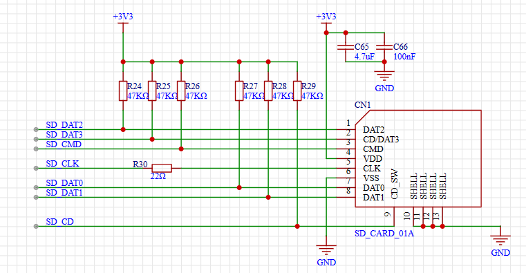
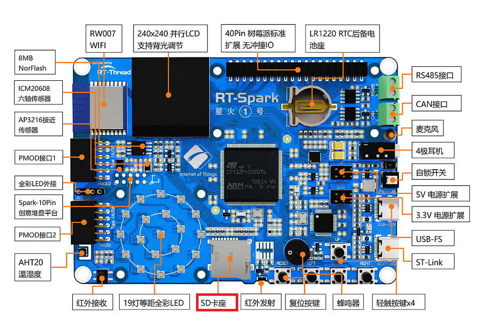

# TF 卡文件系统例程

## 简介

本例程使用开发板上 TF 卡槽中的 TF 卡作为文件系统的存储设备，展示如何在 TF 卡上创建文件系统（格式化卡），并挂载文件系统到 rt-thread 操作系统中。

文件系统挂载成功后，展示如何使用文件系统提供的功能对目录和文件进行操作。

## 硬件说明

本次示例和存储器连接通过 SDIO 接口，使用的是硬件的 SDIO，原理图如下所示：



TF 卡的卡槽在开发板中的位置如下图所示：



## 软件说明

本例程的源码位于 `/projects/04_component_fs_tf_card`。

### 挂载操作代码说明

挂载文件系统的源代码位于 applications/main.c 中。在示例代码中会将块设备 sd0 中的文件系统以 fatfs 文件系统格式挂载到根目录 / 上。

```c
int main(void)
{
    /* 确保块设备注册成功之后再挂载文件系统 */
    rt_thread_delay(1000);

#ifdef BSP_USING_SDCARD_FATFS
    /* 挂载 TF 卡中的文件系统，参数 elm 表示挂载的文件系统类型为 elm-fat 文件系统 */
    if (dfs_mount("sd0", "/", "elm", 0, 0) == 0)
    {
        LOG_I("Filesystem initialized!");
    }
    else
    {
        LOG_E("Failed to initialize filesystem!");
    }
#endif /*BSP_USING_TF_CARD*/
    return 0;
}
```

## 运行

### 编译 & 下载

- RT-Thread Studio：在 RT-Thread Studio 的包管理器中下载 `STM32F407-RT-SPARK` 资源包，然后创建新工程，执行编译。
- MDK：首先双击 mklinks.bat，生成 rt-thread 与 libraries 文件夹链接；再使用 Env 生成 MDK5 工程；最后双击 project.uvprojx 打开 MDK5 工程，执行编译。

编译完成后，将开发板的 ST-Link USB 口与 PC 机连接，然后将固件下载至开发板。

### 运行效果

1. 在 PC 端使用终端工具打开开发板的 ST-Link 提供的虚拟串口，设置 115200 8 1 N 。
2. 向开发板的 TF 卡槽里插入 TF 卡。
3. 按下复位按键重启开发板，如果看到提示 "Failed to initialize filesystem!"，这是因为 TF 卡中还没有创建文件系统。
4. 该步骤可选，如果确定自己的卡是 fat 格式，可以忽略。在 msh 中使用命令 mkfs -t elm sd0 可以在块设备 sd0 中创建 elm-fat 类型的文件系统，即对 TF 卡执行格式化。
    注意：mkfs 操作会清空存储设备中的数据，请谨慎操作。
5. 此时按下复位按键重启开发板，可以看到提示 "Filesystem initialized!"，表明文件系统挂载成功。打印信息如下所示：

```shell
 \ | /
- RT -     Thread Operating System
 / | \     4.1.1 build Jun 13 2023 09:54:41
 2006 - 2022 Copyright by RT-Thread team
msh />[I/SDIO] SD card capacity 1967104 KB.
[I/main] Filesystem initialized!
msh />ls                          # 使用 ls 命令查看文件系统目录信息
Directory /:                      # 可以看到已经存在根目录 /


msh />mkdir rt-thread             # 创建 rt-thread 文件夹
msh />ls                          # 查看目录信息如下
Directory /:
rt-thread <DIR>


msh />echo "hello rt-thread!!!"            # 将字符串输出到标准输出
hello rt-thread!!!
msh />echo "hello rt-thread!!!" hello.txt  # 将字符串出输出到 hello.txt
msh />ls
Directory /:
rt-thread <DIR>
hello.txt 18
msh />

msh />cat hello.txt                     # 查看 hello.txt 文件的内容并输出
hello rt-thread!!!

msh />ls                                # 查看当前目录信息
Directory /:
rt-thread <DIR>
hello.txt 18
msh />rm rt-thread                      # 删除 rt-thread 文件夹
msh />ls
Directory /:
hello.txt 18
msh />rm hello.txt                      # 删除 hello.txt 文件
msh />ls
Directory /:
msh />
```

## 注意事项

挂载文件系统之前一定要确认 TF 卡被格式化为 Fat 文件系统（使用 `mkfs` 格式化），否则会挂载失败。

## 引用参考

- 组件：[虚拟文件系统组件](https://www.rt-thread.org/document/site/#/rt-thread-version/rt-thread-standard/programming-manual/filesystem/filesystem)
