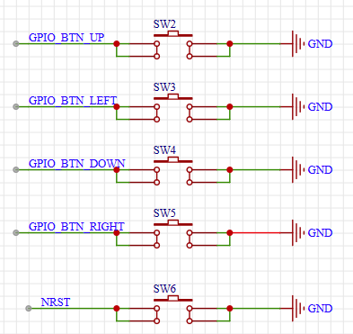
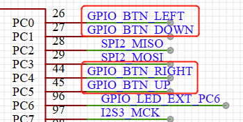

# 低功耗例程

## 简介

随着物联网(IoT)的兴起，产品对功耗的需求越来越强烈。作为数据采集的传感器节点通常需要在电池供电时长期工作，而作为联网的 SoC 也需要有快速的响应功能和较低的功耗。

在产品开发的起始阶段，首先考虑是尽快完成产品的功能开发。在产品功能逐步完善之后，就需要加入电源管理功能。为了适应 IoT 的这种需求，RT-Thread 提供了电源管理框架。电源管理框架的理念是尽量透明，使得产品加入低功耗功能更加轻松。

PM 组件有以下特点：

- PM 组件是基于模式来管理功耗
- PM 组件可以根据模式自动更新设备的频率配置，确保在不同的运行模式都可以正常工作
- PM 组件可以根据模式自动管理设备的挂起和恢复，确保在不同的休眠模式下可以正确的挂起和恢复
- PM 组件支持可选的休眠时间补偿，让依赖 OS Tick 的应用可以透明使用
- PM 组件向上层提供设备接口，如果使用了设备文件系统组件，那么也可以用文件系统接口来访问

本例程演示 RT-Thread 的电源管理组件(Power Management，以下简称 PM 组件)的使用。基于 PM 组件，用户可以很轻松地完成低功耗的开发。

## 硬件说明





如上图所示，例程里将使用 BTN_UP 按键唤醒处于休眠状态的 MCU。BTN_UP 按键被连接到单片机的45引脚(PC5)，该引脚连接外部中断，通过中断唤醒 MCU。

## 软件说明

PM 例程的源代码位于 `/projects/04_component_pm/applications/main.c` 中。

我们使用 BTN_UP 按键来唤醒处于休眠模式的 MCU。一般情况下，在 MCU 处于比较深度的休眠模式，只能通过特定的方式唤醒。MCU 被唤醒之后，会触发相应的中断。以下例程是用 BTN_UP  按键从 `PM_SLEEP_MODE_DEEP` 唤醒 MCU,唤醒之后红色 LED 持续被点亮2秒，期间蓝色 LED 持续闪烁。

例程的入口在 `main()` 函数里。

```C
int main(void)
{
    /* 创建一个线程检测CPU是否还在继续运行 */
    rt_thread_t led_cycle_tid = rt_thread_create("led_cycle",led_cycle,RT_NULL,512,21,10);
    if(led_cycle_tid == RT_NULL)
    {
        rt_kprintf("led_cycle_tid is null\n");
    }
    rt_thread_startup(led_cycle_tid);
    /* 唤醒回调函数初始化 */
    wakeup_init();

    /* 电源管理初始化 */
    pm_mode_init();
    rt_kprintf("pm_mode_init!\n");
    while (1)
    {
        rt_kprintf("wait sem!\n");
        /* 等待唤醒事件 */
        if (rt_event_recv(wakeup_event,
                        WAKEUP_EVENT_BUTTON,
                        RT_EVENT_FLAG_AND | RT_EVENT_FLAG_CLEAR,
                        RT_WAITING_FOREVER, RT_NULL) == RT_EOK)
        {
            led_app();
        }
    }
    return 0;
}
```

`main()` 函数里首先完成初始化工作：包括唤醒事件的初始化、PM 模式的配置、线程的创建；然后在循环里一直等待中断里发来的唤醒事件，如果接收到一次唤醒事件，就执行一次 `led_app()`。

`wakeup_init()` 包括了唤醒事件的初始化和唤醒按键中断回调函数的初始化：

```c
static void wakeup_init(void)
{
    wakeup_event = rt_event_create("wakup", RT_IPC_FLAG_FIFO);
    RT_ASSERT(wakeup_event != RT_NULL);

    bsp_register_wakeup(wakeup_callback);
}
```

`PM_SLEEP_MODE_DEEP` 是 STM32F407 的 SLEEP 模式。我们希望停留在 `PM_SLEEP_MODE_DEEP` 模式，我们首先需要调用一次 rt_pm_request() 来请求该模式。

```C
static void pm_mode_init(void)
{
    /* 上电之后默认高功耗模式，在这里退出高功耗模式 */
    rt_pm_release_all(PM_SLEEP_MODE_NONE);
    rt_pm_request(PM_SLEEP_MODE_DEEP);
}
```

`led_app()` 里我们希望点亮 LED 灯，并延时足够的时间以便我们观察到现象。在延时的时候，CPU 可能处于空闲状态，如果没有任何运行模式被请求，将会进入休眠。我们请求了`PM_SLEEP_MODE_NONE` 模式，即该模式下 CPU 不进行休眠，并在完成 LED 闪烁完成之后释放它，这样就可以让确保请求和释放中间的代码运行在 `PM_SLEEP_MODE_NONE` 模式。

```C
static void led_app(void)
{
    rt_pm_request(PM_SLEEP_MODE_NONE);
    rt_pin_mode(PIN_LED_R, PIN_MODE_OUTPUT);
    rt_pin_write(PIN_LED_R, 0);
    rt_thread_mdelay(2000);
    rt_pin_write(PIN_LED_R, 1);
    rt_pm_release(PM_SLEEP_MODE_NONE);
}
```

`led_cycle()` 里我们希望循环的点亮蓝色 LED ，目的是为了确认在低功耗模式下 CPU 是否停止了运行。

```c
static void led_cycle()
{
    rt_pin_mode(PIN_LED_B, PIN_MODE_OUTPUT);
    while(1)
    {
        rt_pin_write(PIN_LED_B,1);
        rt_thread_mdelay(500);
        rt_pin_write(PIN_LED_B,0);
        rt_thread_mdelay(500);
    }
}
```

## 运行

### 编译 & 下载

- RT-Thread Studio：在 RT-Thread Studio 的包管理器中下载 ` STM32F407-RT-SPARK` 资源包，然后创建新工程，执行编译。
- MDK：首先双击 mklinks.bat，生成 rt-thread 与 libraries 文件夹链接；再使用 Env 生成 MDK5 工程；最后双击 project.uvprojx 打开 MDK5 工程，执行编译。

编译完成后，将开发板的 ST-Link USB 口与 PC 机连接，然后将固件下载至开发板。

### 运行效果

按下复位按键重启开发板，很快就进入休眠模式。我们三次按下 BTN_UP 按键。每次按下按键，MCU 都会被唤醒点亮红色 LED 2秒并且期间蓝色 LED 持续闪烁，随后再次进入休眠。

## 注意事项

在芯片处于休眠模式下，一般是无法连接到仿真接口，所以就无法使用 ST-Link 下载程序。我们可以在芯片处于非休眠模式时下载，具体方式如下：

- 按住复位键，点击下载后，1 秒左右再松开复位键
- 按下 BTN_UP 键，马上点击下载

## 引用参考

- 设备与驱动：[pin 设备](https://www.rt-thread.org/document/site/#/rt-thread-version/rt-thread-standard/programming-manual/device/pin/pin)
- 组件：[电源管理组件](https://www.rt-thread.org/document/site/#/rt-thread-version/rt-thread-standard/programming-manual/pm/pm)
