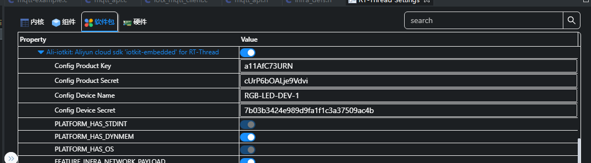

# 阿里云物联网平台接入例程

本例程演示如何使用 RT-Thread 提供的 ali-iotkit 软件包接入阿里云物联网平台，介绍如何通过 MQTT 协议接入阿里云平台。演示使用 mqtt 协议上传和下发数据。

## 简介

**ali-iotkit** 是 RT-Thread 移植的用于连接阿里云 IoT 平台的软件包。基础 SDK 是阿里提供的 [**iotkit-embedded C-SDK**](https://github.com/aliyun/iotkit-embedded)。

**ali-iotkit** 为了方便设备上云封装了丰富的连接协议，如 MQTT、CoAP、HTTP、TLS，并且对硬件平台进行了抽象，使其不受具体的硬件平台限制而更加灵活。

相对传统的云端接入 SDK，RT-Thread 提供的 **ali-iotkit** 具有如下优势：

- 快速接入能力
- 嵌入式设备调优
- 多编译器支持（GCC、IAR、MDK）
- 多连接协议支持（HTTP、MQTT、CoAP）
- 强大而丰富的 RT-Thread 生态支持
- 跨硬件、跨 OS 平台支持
- 设备固件 OTA 升级
- TLS/DTLS 安全连接
- 高可移植的应用端程序
- 高可复用的功能组件

## 硬件说明

ali-iotkit 例程需要依赖 星火 1 号 板卡上的 WiFi 模块完成网络通信，因此请确保硬件平台上的 WiFi 模组可以正常工作。

## 软件说明

ali-iotkit 例程位于 `projects/05_iot_cloud_ali_iotkit` 目录下，重要文件摘要说明如下所示：

| 文件                         | 说明   |
| :-----                       | :-----    |
| applications/main.c     | app 入口 |
| packages/ports | 移植文件 |
| packages/ali-iotkit-v3.0.1   | 阿里云物联网平台接入软件包 |
| packages/ali-iotkit-v3.0.1/samples | 阿里云物联网平台接入示例 |

### 例程使用说明

该 ali-iotkit 演示例程程序代码位于 `/projects/05_iot_cloud_ali_iotkit/packages/ali-iotkit-v3.0.1/samples/mqtt/mqtt-example.c` 文件中，核心代码说明如下：

**1. 设置激活凭证**

使用 Rt-Thread Settings 设置设备激活凭证（从阿里云—— [IoT Studio](https://iot.aliyun.com/products/linkdevelop?spm=5176.8142029.loT.11.a7236d3eYH8ef9) 平台获取），如下图所示：



通过 Rt-Thread Settings 工具完成配置的保存后，工具会将相关的配置项写入到 `05_iot_cloud_ali_iotkit/rtconfig.h` 文件中，用户也可以直接修改 rtconfig.h 文件，如下所示：

```c
/* 使用阿里 LinkDevelop 平台 */
#define PKG_USING_ALI_IOTKIT_IS_LINKDEVELOP
/* 配置产品 ID */
#define PKG_USING_ALI_IOTKIT_PRODUCT_KEY "a1HETlEuvri"
/* 配置设备名字 */
#define PKG_USING_ALI_IOTKIT_DEVICE_NAME "RGB-LED-DEV-1"
/* 配置设备密钥 */
#define PKG_USING_ALI_IOTKIT_DEVICE_SECRET "ZwQwQNXfXVeXF39km0fw6SirQgRIq8aO"
```

**2. 注册 MQTT 事件回调**

注册 mqtt 的事件回调函数，代码如下所示：

```c
mqtt_params.handle_event.h_fp = example_event_handle;
```

**3. MQTT 事件回调**

每当 MQTT 客户端收到服务器发来的事件就会调用 `example_event_handle` 函数，将收到的事件信息交由用户自定义处理，代码如下所示：

```c
static void example_event_handle(void *pcontext, void *pclient, iotx_mqtt_event_msg_pt msg)
{
    EXAMPLE_TRACE("msg->event_type : %d", msg->event_type);
}
```

**4. 启动 MQTT 客户端**

**4.1 初始化 iotkit 连接信息**

使用用户配置的设备激活凭证（PRODUCT_KEY、DEVICE_NAME 和 DEVICE_SECRET）初始化 iotkit 连接信息，代码如下所示：

```c
    HAL_GetProductKey(DEMO_PRODUCT_KEY);
    HAL_GetDeviceName(DEMO_DEVICE_NAME);
    HAL_GetDeviceSecret(DEMO_DEVICE_SECRET);
```

**4.2 配置 MQTT 客户端参数**

初始化 MQTT 客户端所必须的用户名、密码、服务器主机名及端口号等配置，代码如下所示：

```c
    iotx_mqtt_param_t mqtt_params;

    /* 初始化 MQTT 数据结构 */
    iotx_mqtt_param_t       mqtt_params;

    memset(&mqtt_params, 0x0, sizeof(mqtt_params));
    /* Initialize MQTT parameter */
    /*
     * Note:
     *
     * If you did NOT set value for members of mqtt_params, SDK will use their default values
     * If you wish to customize some parameter, just un-comment value assigning expressions below
     *
     **/
    mqtt_params.handle_event.h_fp = example_event_handle;
```

**4.3 创建 MQTT 客户端**

使用 `IOT_MQTT_Construct` 函数构建一个 MQTT 客户端，代码如下所示：

```c
/* 使用指定的 MQTT 参数构建 MQTT 客户端数据结构 */
pclient = IOT_MQTT_Construct(&mqtt_params);
if (NULL == pclient) {
    EXAMPLE_TRACE("MQTT construct failed");
    return -1;
}
```

**4.4 订阅指定的 Topic**

使用 `IOT_MQTT_Subscribe` 函数订阅指定的 Topic，代码如下所示：

```c
res = IOT_MQTT_Subscribe(handle, topic, IOTX_MQTT_QOS0, example_message_arrive, NULL);
if (res < 0) {
    EXAMPLE_TRACE("subscribe failed");
    HAL_Free(topic);
    return -1;
}
```

消息主题为：`/PRODUCT_KEY/DEVICE_NAME/user/get`，用于接受和发布日志消息。

**4.5 循环发布消息并且等待 MQTT 消息通知**

使用 `IOT_MQTT_Yield` 函数接收来自云端的消息。

```c
while (1) {
    if (0 == loop_cnt % 20) {
        example_publish(pclient);
    }

    IOT_MQTT_Yield(pclient, 200);

    loop_cnt += 1;
}
```

**5. 关闭 MQTT 客户端**

关闭 MQTT 客户端需要取消已经存在的订阅，并销毁 MQTT 客户端连接，以释放资源。

**5.1 取消订阅指定的 Topic**

使用 `IOT_MQTT_Unsubscribe` 取消已经存在的订阅。

```c
int IOT_MQTT_Unsubscribe(void *handle, const char *topic_filter);
```

**5.2 销毁 MQTT 客户端**

使用 `IOT_MQTT_Destroy` 销毁已经存在的 MQTT 客户端，以释放资源占用。

```c
int IOT_MQTT_Destroy(void **phandle);
```

**6. 发布测试消息**

**6.1 构建 Alink 协议格式数据**

本例程中构建一个日志消息需要的 Alink 协议格式的数据包，如下所示：

```c
/* 初始化要发送给 Topic 的消息内容 */
const char     *fmt = "/%s/%s/user/get";
char           *topic = NULL;
int             topic_len = 0;
char           *payload = "{\"message\":\"hello!\"}";

topic_len = strlen(fmt) + strlen(DEMO_PRODUCT_KEY) + strlen(DEMO_DEVICE_NAME) + 1;
topic = HAL_Malloc(topic_len);
if (topic == NULL) {
    EXAMPLE_TRACE("memory not enough");
    return -1;
}
memset(topic, 0, topic_len);
HAL_Snprintf(topic, topic_len, fmt, DEMO_PRODUCT_KEY, DEMO_DEVICE_NAME);
```

**6.2 发布消息**

使用 `IOT_MQTT_Publish_Simple` 接口向 MQTT 通道发送 Alink 协议格式的消息。

```c
int res = 0;
res = IOT_MQTT_Publish_Simple(0, topic, IOTX_MQTT_QOS0, payload, strlen(payload));
if (res < 0) {
    EXAMPLE_TRACE("publish failed, res = %d", res);
    HAL_Free(topic);
    return -1;
}
HAL_Free(topic);
return 0;
```

## 运行

### 编译 & 下载

- RT-Thread Studio：在 RT-Thread Studio 的包管理器中下载 `STM32F407-RT-SPARK` 资源包，然后创建新工程，执行编译。
- MDK：首先双击 mklinks.bat，生成 rt-thread 与 libraries 文件夹链接；再使用 Env 生成 MDK5 工程；最后双击 project.uvprojx 打开 MDK5 工程，执行编译。

编译完成后，将开发板的 ST-Link USB 口与 PC 机连接，然后将固件下载至开发板。


程序运行日志如下所示：

```shell
 \ | /
- RT -     Thread Operating System
 / | \     4.1.1 build Jun 27 2023 15:45:16
 2006 - 2022 Copyright by RT-Thread team
lwIP-2.0.3 initialized!
[I/sal.skt] Socket Abstraction Layer initialize success.
/>[E/[RW007]] The wifi Stage 1 status 67452301 e0cdab09 1 1
[I/WLAN.dev] wlan init success
[I/WLAN.lwip] eth device init ok name:w0
[I/WLAN.dev] wlan init success
[I/WLAN.lwip] eth device init ok name:w1

rw007  sn: [rw007c745bb22fc584aa6cecc]
rw007 ver: [RW007_2.1.0-a7a0d089-57]
```

### 连接无线网络

程序运行后会进入 MSH 命令行，等待用户配置设备接入网络。使用 MSH 命令 `wifi join <ssid> <password>` 配置网络（ssid 和 password 分别为设备连接的 WIFI 用户名和密码），如下所示：

```shell
wifi join demo 12345678
[I/WLAN.mgnt] wifi connect success ssid:demo
msh />[I/WLAN.lwip] Got IP address : 192.168.137.45
```

### 运行 mqtt demo

```shell
msh />ali_mqtt_sample
mqtt_example_main|134 :: mqtt example
host name:a11afc73urn.iot-as-mqtt.cn-shanghai.aliyuncs.com

> {
>     "id": "0",
>     "version": "1.0",
>     "params": [
>         {
>             "attrKey": "SYS_LP_SDK_VERSION",
>             "attrValue": "3.0.1",
>             "domain": "SYSTEM"
>         },
>         {
>             "attrKey": "SYS_SDK_LANGUAGE",
>             "attrValue": "C",
>             "domain": "SYSTEM"
>         }
>     ],
>     "method": "thing.deviceinfo.update"
> }


> {
>     "id": "1",
>     "params": {
>         "version": "app-1.0.0-20180101.1000"
>     }
> }


> {
>     "message": "hello!"
> }

example_event_handle|107 :: msg->event_type : 9
example_event_handle|107 :: msg->event_type : 9
example_event_handle|107 :: msg->event_type : 3

< {
<     "message": "hello!"
< }

example_message_arrive|041 :: Message Arrived:
example_message_arrive|042 :: Topic  : /a11AfC73URN/RGB-LED-DEV-1/user/get
example_message_arrive|043 :: Payload: {"message":"hello!"}
example_message_arrive|044 ::
```

如上所示，例程启动，程序周期的向订阅的话题发布消息，由于发布的话题也被自己订阅了，所以发布完消息后自己也接收到了自己发布的消息。

## 注意事项

- 使用前请先连接 wifi。
- 使用前请在 `Rt-Thread Settings` 里配置自己的设备激活凭证（PRODUCT_KEY、DEVICE_NAME 和 DEVICE_SECRET）

## 引用参考

- 文档中心：[RT-Thread 文档中心](https://www.rt-thread.org/document/site/#/)
- ali-iotkit 软件包：[https://github.com/RT-Thread-packages/ali-iotkit](https://github.com/RT-Thread-packages/ali-iotkit)
