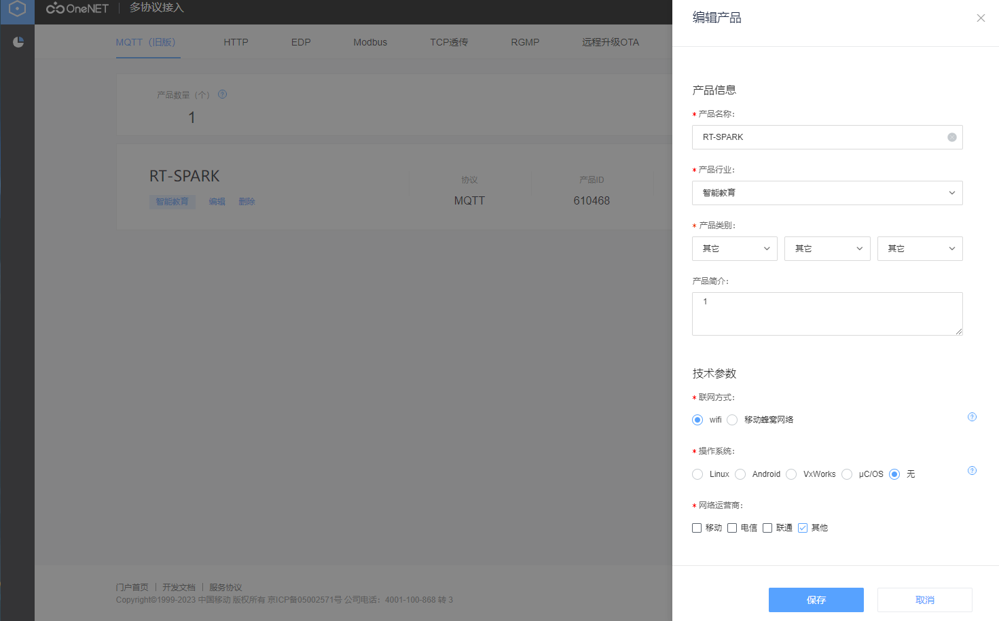
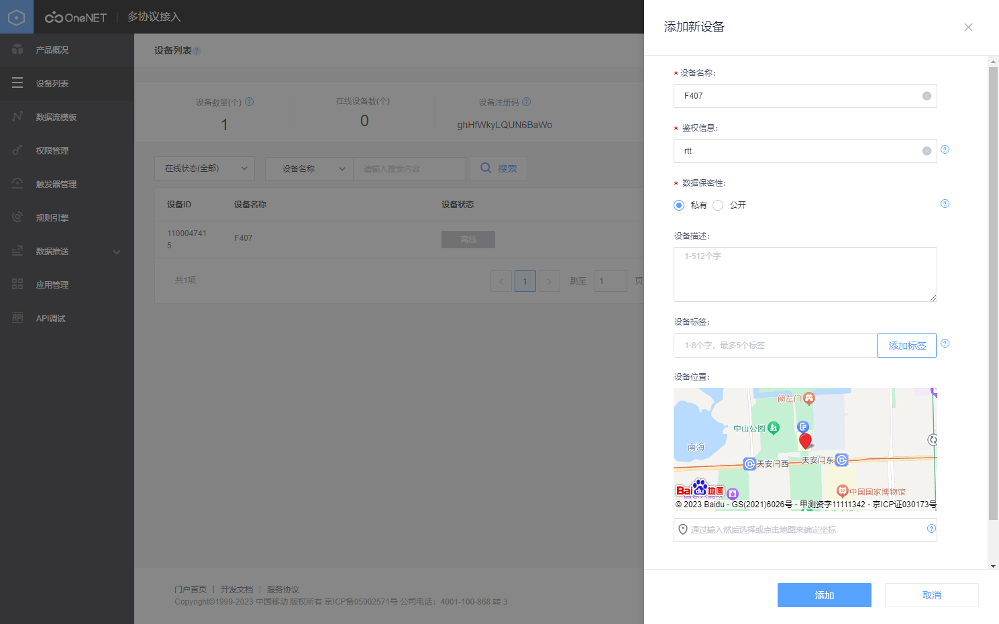
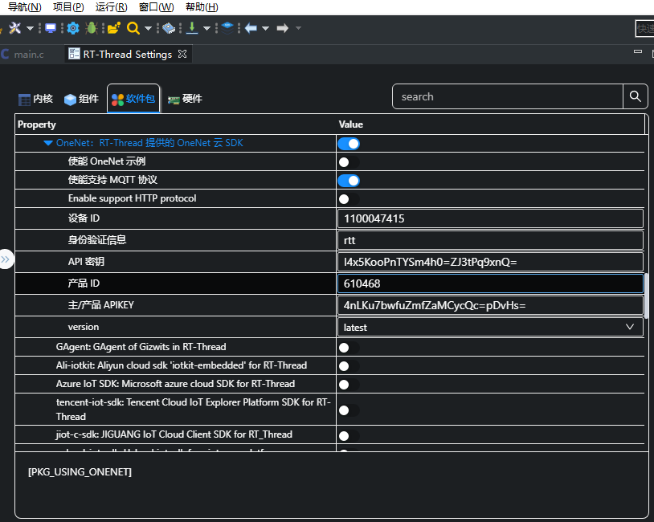
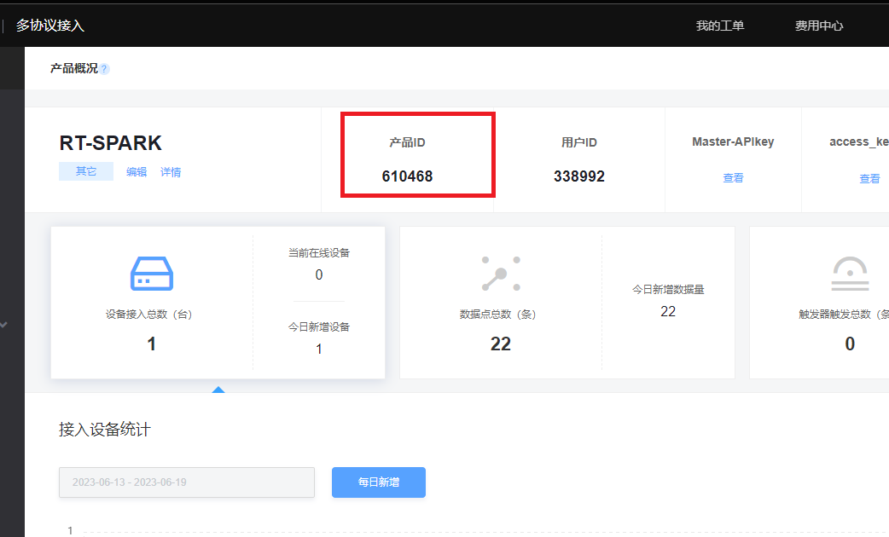
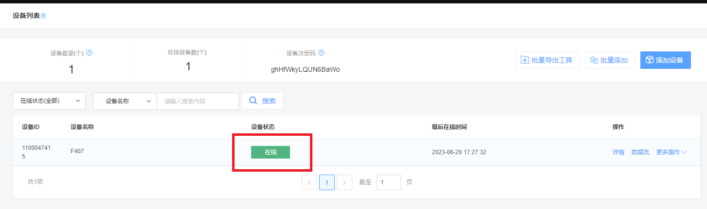

# 中国移动 OneNET 云平台接入例程

本例程演示如何使用 RT-Thread 提供的 onenet 软件包接入中国移动物联网开放平台，介绍如何通过 MQTT 协议接入 OneNET 平台，初次使用 OneNET 平台的用户请先阅读 [《OneNET 文档中心》](https://open.iot.10086.cn/doc/)。

## 简介

OneNET 平台是中国移动基于物联网产业打造的生态平台，具有高并发可用、多协议接入、丰富 API 支持、数据安全存储、快速应用孵化等特点。OneNET 平台可以适配各种网络环境和协议类型，现在支持的协议有 LWM2M（NB-IOT）、EDP、MQTT、HTTP、MODBUS、JT\T808、TCP 透传、RGMP 等。用户可以根据不同的应用场景选择不同的接入协议。

onenet 软件包是 RT-Thread 针对 OneNET 平台做的适配，通过这个软件包可以让设备在 RT-Thread 上非常方便的连接 OneNet 平台，完成数据的发送、接收、设备的注册和控制等功能。

## 硬件说明

onenet 例程需要依赖 星火 1 号 板卡上的 WiFi 模块完成网络通信，因此请确保硬件平台上的 WiFi 模组可以正常工作。

## 准备工作

### 创建产品

onenet 用来管理设备的网址为 [产品管理](https://open.iot.10086.cn/develop/global/product/#/public?protocol=3&amp;other=1) 点击添加产品来添加一个产品

产品配置如图



### 创建设备

点击进入产品，点击设备列表，点击添加设备。设备配置信息如下：



### 代码移植

代码移植主要是为了在设备端配置云端账户信息。

双击 RT-Thread Settings，点击 OneNet 软件包进行配置



设备信息和软件包配置映射如下表

| 软件包配置      | onenet 对应信息 |
| ------------- | ------------- |
| 设备 ID        | 设备 ID        |
| 身份验证信息  | 鉴权信息      |
| API 秘钥       | APIKey        |
| 产品 ID        | 产品 ID        |
| 主/产品 APIKEY | Master-APIkey |

对应信息在 OneNet 中查找




## 软件说明

本例程的源码位于 `/projects/05_iot_cloud_onenet。本例程主要实现了使用 MSH 验证上传和下发功能，程序代码位于 `applications/onenet_sample.c` 文件中。

在 onenet_sample.c 中，主要完成了以下几个任务：

注册周期上传任务到 MSH

```c
static void onenet_upload_entry(void *parameter)
{
    int value = 0;

    while (1)
    {
        value = rand() % 100;

        if (onenet_mqtt_upload_digit("temperature", value) < 0)
        {
            LOG_E("upload has an error, stop uploading");
            break;
        }
        else
        {
            LOG_D("buffer : {\"temperature\":%d}", value);
        }

        rt_thread_delay(rt_tick_from_millisecond(5 * 1000));
    }
}

int onenet_upload_cycle(void)
{
    rt_thread_t tid;

    tid = rt_thread_create("onenet_send",
                           onenet_upload_entry,
                           RT_NULL,
                           2 * 1024,
                           RT_THREAD_PRIORITY_MAX / 3 - 1,
                           5);
    if (tid)
    {
        rt_thread_startup(tid);
    }

    return 0;
}
MSH_CMD_EXPORT(onenet_upload_cycle, send data to OneNET cloud cycle);
```

注册上传数字量函数、上传字符串函数到 MSH

```c
int onenet_publish_digit(int argc, char **argv)
{
    if (argc != 3)
    {
        LOG_E("onenet_publish [datastream_id]  [value]  - mqtt pulish digit data to OneNET.");
        return -1;
    }

    if (onenet_mqtt_upload_digit(argv[1], atoi(argv[2])) < 0)
    {
        LOG_E("upload digit data has an error!\n");
    }

    return 0;
}
MSH_CMD_EXPORT_ALIAS(onenet_publish_digit, onenet_mqtt_publish_digit, send digit data to onenet cloud);

int onenet_publish_string(int argc, char **argv)
{
    if (argc != 3)
    {
        LOG_E("onenet_publish [datastream_id]  [string]  - mqtt pulish string data to OneNET.");
        return -1;
    }

    if (onenet_mqtt_upload_string(argv[1], argv[2]) < 0)
    {
        LOG_E("upload string has an error!\n");
    }

    return 0;
}
MSH_CMD_EXPORT_ALIAS(onenet_publish_string, onenet_mqtt_publish_string, send string data to onenet cloud);

```

以及接受命令控制 LED 函数

```c
/* onenet mqtt command response callback function */
static void onenet_cmd_rsp_cb(uint8_t *recv_data, size_t recv_size, uint8_t **resp_data, size_t *resp_size)
{
    char res_buf[] = { "cmd is received!\n" };

    LOG_D("recv data is %x:%x\n", recv_data[0], recv_data[1]);

    if(recv_data[0] == 0x00)
    {
        rt_pin_write(PIN_LED_B, recv_data[1] > 0 ? PIN_HIGH : PIN_LOW);
        LOG_D("blue light %d", recv_data[1]);
    }else if(recv_data[0] == 0x01)
    {
        rt_pin_write(PIN_LED_R, recv_data[1] > 0 ? PIN_HIGH : PIN_LOW);
        LOG_D("red light %d", recv_data[1]);
    }

    /* user have to malloc memory for response data */
    *resp_data = (uint8_t *) ONENET_MALLOC(strlen(res_buf));

    strncpy((char *)*resp_data, res_buf, strlen(res_buf));

    *resp_size = strlen(res_buf);
}

/* set the onenet mqtt command response callback function */
int onenet_set_cmd_rsp(int argc, char **argv)
{
    rt_pin_mode(PIN_LED_B,PIN_MODE_OUTPUT);
    rt_pin_mode(PIN_LED_R,PIN_MODE_OUTPUT);
    onenet_set_cmd_rsp_cb(onenet_cmd_rsp_cb);
    return 0;
}
MSH_CMD_EXPORT(onenet_set_cmd_rsp, set cmd response function);
```

## 运行

### 编译 & 下载

- RT-Thread Studio：在 RT-Thread Studio 的包管理器中下载 `STM32F407-RT-SPARK` 资源包，然后创建新工程，执行编译。
- MDK：首先双击 mklinks.bat，生成 rt-thread 与 libraries 文件夹链接；再使用 Env 生成 MDK5 工程；最后双击 project.uvprojx 打开 MDK5 工程，执行编译。

编译完成后，将开发板的 ST-Link USB 口与 PC 机连接，然后将固件下载至开发板。

程序运行日志如下所示：

```shell
 \ | /
- RT -     Thread Operating System
 / | \     4.1.1 build Jun 20 2023 17:23:42
 2006 - 2022 Copyright by RT-Thread team
lwIP-2.0.3 initialized!
[I/sal.skt] Socket Abstraction Layer initialize success.
msh />[E/[RW007]] The wifi Stage 1 status 0 0 0 1
[I/WLAN.dev] wlan init success
[I/WLAN.lwip] eth device init ok name:w0
[I/WLAN.dev] wlan init success
[I/WLAN.lwip] eth device init ok name:w1
```

### 连接 wifi

输入自己的 wifi 和密码连接 wifi

```shell
msh />wifi join demo 12345678
[I/WLAN.mgnt] wifi connect success ssid:demo
msh />[I/WLAN.lwip] Got IP address : 192.168.137.118
```

可以看到，wifi 已经连接成功，并且输出了 IP 地址。

### 连接设备

```c
msh />onenet_mqtt_init
[D/onenet.mqtt] Enter mqtt_connect_callback!
[D/mqtt] ipv4 address port: 6002
[D/mqtt] HOST = '183.230.40.39'
[I/onenet.mqtt] RT-Thread OneNET package(V1.0.0) initialize success.
msh />[I/mqtt] MQTT server connect success.
[D/onenet.mqtt] Enter mqtt_online_callback!

```

此时会显示网站会显示设备处于在线状态：



### 数据上传

成功建立连接之后，输入命令 `onenet_upload_cycle`，完成数据发送

```shell
msh />onenet_upload_cycle
[D/onenet.sample] buffer : {"temperature":52}
msh />[D/onenet.sample] buffer : {"temperature":56}
[D/onenet.sample] buffer : {"temperature":56}
[D/onenet.sample] buffer : {"temperature":19}
[D/onenet.sample] buffer : {"temperature":11}
```

打开 OneNET 平台，在**设备列表**页面，选择**数据流展示**，点击展开 temperature 数据流，可以看到刚刚上传的数据信息。


### 命令控制

在**设备列表**界面，选择**下发命令**，点击蓝色的**下发命令**按纽，会弹出一个命令窗口，我们可以下发命令给开发板。我们可以定义一个两个字段的命令 xx xx, 第一个字段代表 led 的索引，第二个字段代表值。比如 00 01 代表红灯灭，00 00 代表红灯亮。我们在 OneNet 界面下发命令，控制 LED。


```shell
[D/onenet.mqtt] topic $creq/7ede0f8b-1f78-58ca-86d3-cc2314915a4e receive a message
[D/onenet.mqtt] message length is 2
```

并且观察到 LED 状态也发生了变化。

## 注意事项

暂无

## 引用参考

- 设备与驱动：[PIN 设备](https://www.rt-thread.org/document/site/#/rt-thread-version/rt-thread-standard/programming-manual/device/pin/pin)
- onenet 软件包：[https://github.com/RT-Thread-packages/onenet](https://github.com/RT-Thread-packages/onenet)
- 文档中心：[RT-Thread 文档中心](https://www.rt-thread.org/document/site/#/)
