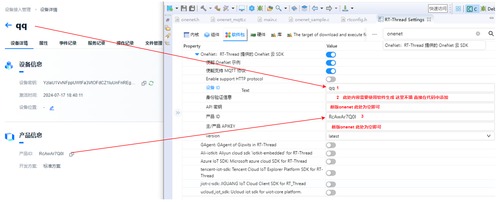
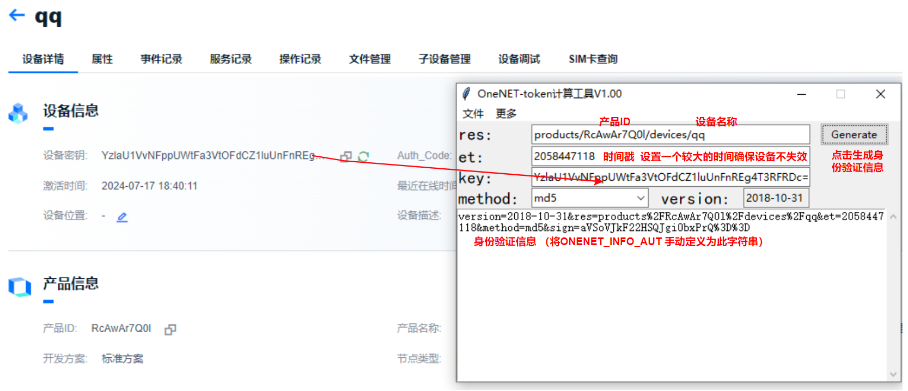
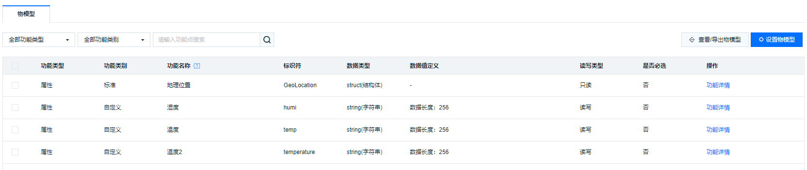
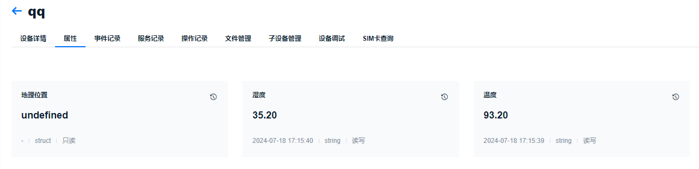
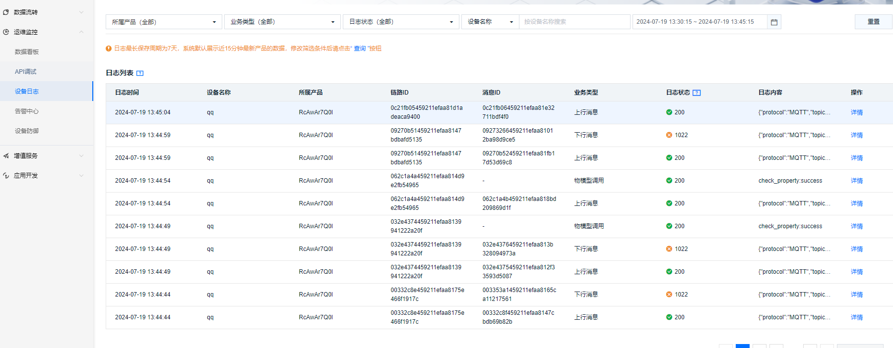

# 新版OneNET 软件包使用指南

## 简介

新版onenet平台对协议做了更新，软件包部分配置方式需要调整，其他与旧版本一致。

## 软件包使用指南

### RT-Studio 配置

使用新版onenet平台仅需要填写设备ID,身份验证信息与产品ID。身份验证信息需要使用软件生成，在下文中进行详细的介绍。



### 身份验证信息生成

身份验证信息生成工具（token）在文件夹tools下，使用方法如下：



### 配置身份验证信息

在生成的rtconfig中手动将`ONENET_INFO_AUTH`修改为上述token工具生成的身份验证信息

```c#
#define ONENET_INFO_AUTH "version=2018-10-31&res=products%2FRcAwAr7Q0l%2Fdevices%2Fqq&et=2058447118&method=md5&sign=aVSoVJkF22HSQJgi0bxPrQ%3D%3D"
```

## 新版Onenet使用指南

使用onenet界面图形化显示数据需要自定义属性，自定义属性如下所示：



上传数据时标识符与数据类型需匹配。

在onenet的设备管理->属性中可以实时查看上传的数据，显示示例：



设备在onenet显示在线即表示设备正常连接，此时可以通过运维监控->设备日志查看设备端上传的信息以及onenet的应答信息，这里对调试程序非常有帮助。



完结！