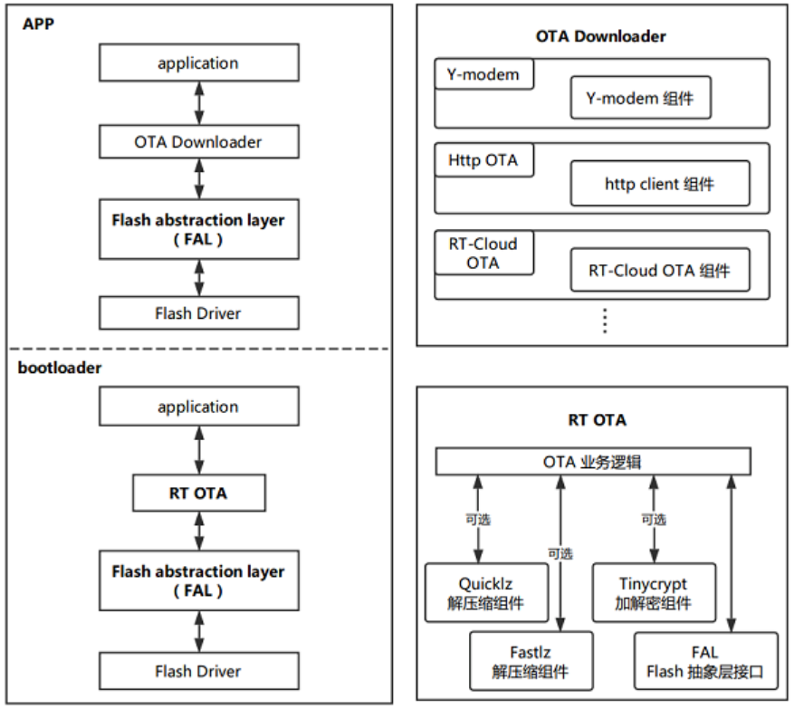
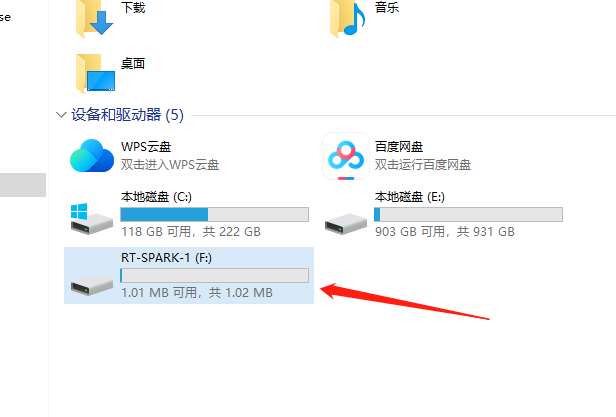
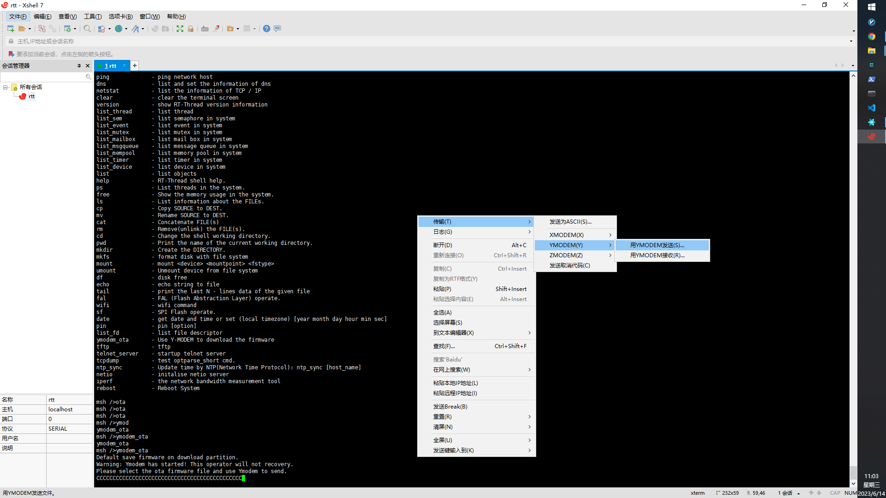
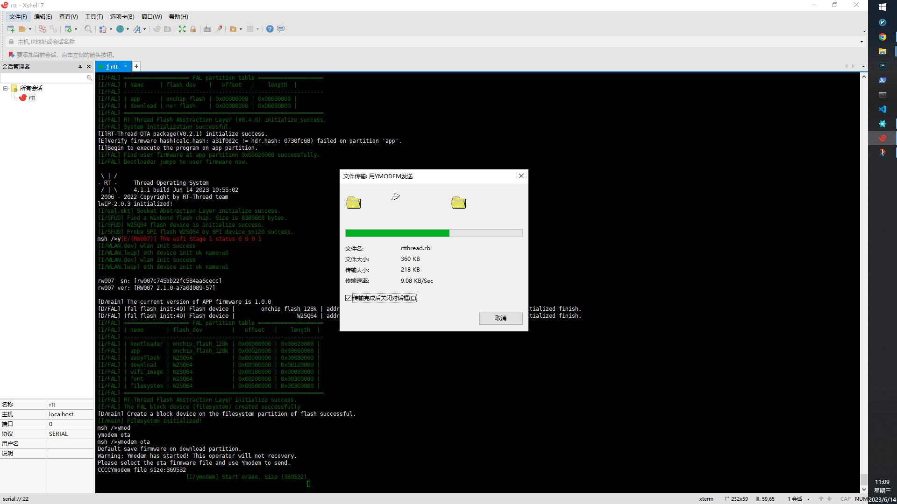
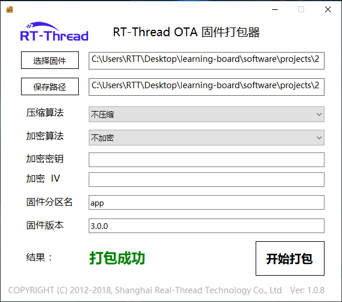
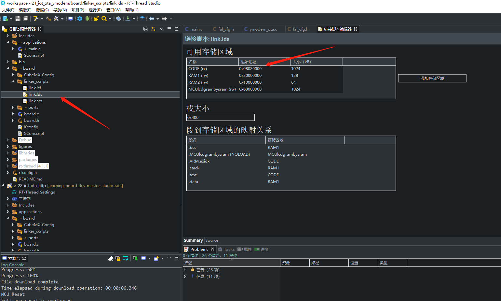

# Ymodem 协议固件升级例程

## 背景知识

### 固件升级简述

固件升级，通常称为 OTA（Over the Air）升级或者 FOTA（Firmware Over-The-Air）升级，即固件通过空中下载进行升级的技术。

### Ymodem 简述

Ymodem 是一种文本传输协议，在 OTA 应用中为空中下载技术提供文件传输的支持。基于 Ymodem 协议的固件升级即为 OTA 固件升级的一个具体应用实例。

### Flash 分区简述

通常嵌入式系统程序是没有文件系统的，而是将 Flash 分成不同的功能区块，从而形成不同的功能分区。

要具备 OTA 固件升级能力，通常需要至少有两个程序运行在设备上。其中负责固件校验升级的程序称之为 bootloader，另一个负责业务逻辑的程序称之为 app。它们负责不同的功能，存储在 Flash 的不同地址范围，从而形成了 bootloader 分区和 app 分区。

但多数情况下嵌入式系统程序是运行在 Flash 中的，下载升级固件的时候不会直接向 app 分区写入新的固件，而是先下载到另外的一个分区暂存，这个分区就是 download 分区，也有称之为 app2 分区，这取决于 bootloader 的升级模式。
bootloader 分区、 app 分区、 download 分区及其他分区一起构成了分区表。分区表标识了该分区的特有属性，通常包含分区名、分区大小、分区的起止地址等。

### bootloader 升级模式

bootloader 的升级模式常见有以下两种：

1. bootloader 分区 + app1 分区 + app2 分区模式

    该模式下， bootloader 启动后，检查 app1 和 app2 分区，哪个固件版本最新就运行哪个分区的固件。当有新版本的升级固件时，固件下载程序会将新的固件下载到另外的一个没有运行的 app 分区，下次启动的时候重新选择执行新版本的固件。

    **优点**：无需固件搬运，启动速度快。

    **缺点**： app1 分区和 app2 分区通常要大小相等，占用 Flash 资源；且 app1 和 app2 分区都只能存放 app 固件，不能存放其他固件（如 WiFi 固件）。

2. bootloader 分区 + app 分区 + download 分区模式

    该模式下， bootloader 启动后，检查 download 分区是否有新版本的固件，如果 download 分区内有新版本固件，则将新版本固件从 download 分区搬运到 app 分区，完成后执行 app 分区内的固件；如果 download 分区内没有新版本的固件，则直接执行 app 分区内的固件。

    当有新版本的升级固件时，固件下载程序会将新的固件下载到 download 分区内，重启后进行升级。

    **优点**： download 分区可以比 app 分区小很多（使用压缩固件），节省 Flash 资源，节省下载流量；download 分区也可以下载其他固件，从而升级其他的固件，如 WiFi 固件、 RomFs。

    **缺点**：需要搬运固件，首次升级启动速度略慢。

RT-Thread OTA 使用的是 bootloader 升级模式 2， bootloader 分区 + app 分区 + download 分区的组合。

### 固件下载器

在嵌入式设备程序中实现的，具有从远端下载升级固件功能的代码块称之为 固件下载器（OTADownloader） 。固件下载器的工作是把新版本的升级固件下载设备的 Flash 中，不同的协议以及不同的 OTA 固件托管平台会有不同的固件下载器，即不同的代码实现。

目前 RT-Thread 已经支持了多种固件下载器，如下所示：

- 基于 Ymodem 协议的 Ymodem OTA 固件下载器（可通过串口等方式升级固件）
- 基于 HTTP 协议的 HTTP OTA 固件下载器（可通过网络方式升级固件）
- 基于特定云平台的 OTA 固件下载器

    1. ali-iotkit 固件下载器（适配阿里云 LinkDevelop 平台和 LinkPlatform 平台的 OTA 功能）
    2. Ayla 云 OTA 固件下载器（适配 Ayla 云平台的 OTA 功能）
    3. 其他第三方 OTA 托管平台（其他平台请联系 RT-Thread 团队）


### RT-Thread OTA 介绍

RT-Thread OTA 是 RT-Thread 开发的跨 OS、跨芯片平台的固件升级技术，轻松实现对设备端固件的管理、升级与维护。

RT-Thread 提供的 OTA 固件升级技术具有以下优势：

- 固件防篡改：自动检测固件签名，保证固件安全可靠
- 固件加密：支持 AES-256 加密算法，提高固件下载、存储安全性
- 固件压缩：高效压缩算法，降低固件大小，减少 Flash 空间占用，节省传输流量，降低下载时间
- 差分升级：根据版本差异生成差分包，进一步节省 Flash 空间，节省传输流量，加快升级速度
- 断电保护：断电后保护，重启后继续升级
- 智能还原：固件损坏时，自动还原至出厂固件，提升可靠性
- 高度可移植：可跨 OS、跨芯片平台、跨 Flash 型号使用
- 多可用的固件下载器：支持多种协议的 OTA 固件托管平台和物联网云平台

RT-Thread OTA 框架图如下所示：



从上面的 OTA 框架图可以发现， Ymodem 在 OTA 流程中充当的是 OTA Downloader（固件下载器）的角色，核心的 OTA 业务逻辑在 RT OTA 中，也就是封装到了 bootloader 固件里。 OTA 业务逻辑与应用程序解耦，极大简化了 OTA 功能增加的难度。

### OTA 升级流程

在嵌入式系统方案里，要完成一次 OTA 固件远端升级，通常需要以下阶段：

1. 准备升级固件（RT-Thread OTA 使用特定的 rbl 格式固件），并上传 OTA 固件到固件托管服务器
2. 设备端使用固件托管服务器对应的**固件下载器**下载 OTA 升级固件
3. 新版本固件下载完成后，在适当的时候重启进入 bootloader
4. bootloader 对 OTA 固件进行校验、解密和搬运（搬运到 app 分区）
5. 升级成功，执行新版本 app 固件

OTA 升级流程如下图所示：


## Ymodem OTA 例程说明

Ymodem OTA 升级是 RT-Thread OTA 支持的固件下载器中的一种。在嵌入式设备中通常用于通过串口（UART）进行文件传输及 IAP 在线升级，是常用固件升级方式。

本例程介绍如何使用 RT-Thread Ymodem OTA 固件下载器下载固件，完成 OTA 升级。

在该例程中用到的 bootloader 程序以 bin 文件的形式提供，只能用在该 STM32F4 设备平台，文件位于 bin/bootloader.bin。

## 硬件说明

本例程使用到的硬件资源如下所示：

- UART1
- 片内 FLASH (1024KBytes)
- 片外 Nor Flash (8MBytes)

本例程中， bootloader 程序和 app 程序存放在 STM32F4 MCU 的内部 FLASH 中， download 下载区域存放在外部扩展的 Nor FLASH 中。

## 分区表

| 名称        | 设备              | 起始地址           | 大小              | 结束地址          | 说明                |
|-------------|------------------|---------------------|-------------------|-------------------|---------------------|
| bootloader  | onchip_flash_128k | 0                   | 128 * 1024        | 0x20000           | 引导加载程序分区     |
| app         | onchip_flash_128k | 128 * 1024          | 384 * 1024        | 0x80000           | 应用程序分区         |
| easyflash   | W25Q64           | 0                   | 512 * 1024        | 0x80000           | Easyflash 分区       |
| download    | W25Q64           | 512 * 1024          | 1024 * 1024       | 0x180000          | 下载分区             |
| wifi_image  | W25Q64           | (512 + 1024) * 1024 | 512 * 1024        | 0x180000          | WiFi 镜像分区       |
| font        | W25Q64           | (512 + 1024 + 512) * 1024 | 3 * 1024 * 1024 | 0x480000          | 字体分区             |
| filesystem  | W25Q64           | (512 + 1024 + 512 + 3 * 1024) * 1024 | 3 * 1024 * 1024 | 0x780000          | 文件系统分区         |

bootloader 程序的分区表定义在 bootloader 程序 中，如果需要修改 bootloader 内置的分区表，则需要修改 bootloader 程序。用户可以使用RT-Thread在线IoT平台中，注册并新增产品，自行定制boot固件，[点此跳转IoT管理平台](https://iot.rt-thread.com)。另外如果有商用需求，请联系 RT-Thread 获取支持。

## 软件说明

本例程的源码位于 `/projects/05_iot_ota_ymodem`。

| 文件路径                            | 说明                                 |
|-----------------------------------|------------------------------------|
| application/main.c                  | app 程序入口 |
| binary/rtboot_f4.bin                  | 需要烧录到 0x08000000 地址的二进制文件完成 |
| binary/app_V1.0.0.rbl                    | 第一个版本的应用程序，代码段被链接到了 0x08020000 处 |
| binary/app_V2.0.0.rbl                    | 第二个版本的应用程序，代码段被链接到了 0x08020000 处 |
| libraries/Board_Drivers/fal              | Flash 抽象层组件（fal）的移植文件        |
| rt-thread/components/fal                      | FAL 组件                           |
| packages/ota_downloader           | 包含 ymodem 和 http 下载功能的 otadownloader 的软件包                         |

Ymodem 固件升级流程如下所示：

1. Ymodem 串口终端使用 ymodem 协议发送升级固件
2. APP 使用 Ymodem 协议下载固件到 download 分区
3. bootloader 对 OTA 升级固件进行校验、解密和搬运（搬运到 app 分区）
4. 程序从 bootloader 跳转到 app 分区执行新的固件

## 运行

### bootloader.bin 烧录

bootloader.bin 的烧录比较方便直接直接将 bootloader.bin 拖入 RT-SPARK 驱动器中即可完成烧录。



### app 版本

此例程默认状态下为 app 版本 1 的状态，可以将此流程直接编译下载。

运行结果如下：

```shell
 __  ___     __   __   __  ___
|__)  |  __ |__) /  \ /  \  |
|  \  |     |__) \__/ \__/  |
2006 - 2019 Copyright by rt-thread team
                0.9.2 build May 23 2023
[D/FAL] (fal_flash_init:63) Flash device |    onchip_flash_16k_part | addr: 0x08000000 | len: 0x00020000 | blk_size: 0x00004000 |initialized finish.
[D/FAL] (fal_flash_init:63) Flash device |             onchip_flash | addr: 0x08020000 | len: 0x000e0000 | blk_size: 0x00020000 |initialized finish.
[D/FAL] (fal_flash_init:63) Flash device |                nor_flash | addr: 0x00000000 | len: 0x00800000 | blk_size: 0x00001000 |initialized finish.
[I/FAL] ==================== FAL partition table ====================
[I/FAL] | name     | flash_dev    |   offset   |    length  |
[I/FAL] -------------------------------------------------------------
[I/FAL] | app      | onchip_flash | 0x00000000 | 0x00080000 |
[I/FAL] | download | nor_flash    | 0x00080000 | 0x00080000 |
[I/FAL] =============================================================
[I/FAL] RT-Thread Flash Abstraction Layer (V0.4.0) initialize success.
[I/FAL] System initialization successful.
[I]RT-Thread OTA package(V0.2.1) initialize success.
[E]Get firmware header occur CRC32(calc.crc: 7b93c5c8 != hdr.info_crc32: ffffffff) error on 'download' partition!
[E]Get OTA download partition firmware header failed!
[E]Verify firmware hash(calc.hash: a31f0d2c != hdr.hash: 0730fc68) failed on partition 'app'.
[I]Begin to execute the program on app partition.
[I/FAL] Find user firmware at app partition 0x08020000 successfully.
[I/FAL] Bootloader jumps to user firmware now.

 \ | /
- RT -     Thread Operating System
 / | \     4.1.1 build Jun 14 2023 10:55:02
 2006 - 2022 Copyright by RT-Thread team
lwIP-2.0.3 initialized!
[I/sal.skt] Socket Abstraction Layer initialize success.
[I/SFUD] Find a Winbond flash chip. Size is 8388608 bytes.
[I/SFUD] W25Q64 flash device is initialize success.
[I/SFUD] Probe SPI flash W25Q64 by SPI device spi20 success.
msh />[E/[RW007]] The wifi Stage 1 status 0 0 0 1
[I/WLAN.dev] wlan init success
[I/WLAN.lwip] eth device init ok name:w0
[I/WLAN.dev] wlan init success
[I/WLAN.lwip] eth device init ok name:w1

rw007  sn: [rw007c745bb22fc584aa6cecc]
rw007 ver: [RW007_2.1.0-a7a0d089-57]

[D/main] The current version of APP firmware is 1.0.0
[D/FAL] (fal_flash_init:49) Flash device |        onchip_flash_128k | addr: 0x08000000 | len: 0x00100000 | blk_size: 0x00020000 |initialized finish.
[D/FAL] (fal_flash_init:49) Flash device |                   W25Q64 | addr: 0x00000000 | len: 0x00800000 | blk_size: 0x00001000 |initialized finish.
[I/FAL] ==================== FAL partition table ====================
[I/FAL] | name       | flash_dev         |   offset   |    length  |
[I/FAL] -------------------------------------------------------------
[I/FAL] | bootloader | onchip_flash_128k | 0x00000000 | 0x00020000 |
[I/FAL] | app        | onchip_flash_128k | 0x00020000 | 0x00060000 |
[I/FAL] | easyflash  | W25Q64            | 0x00000000 | 0x00080000 |
[I/FAL] | download   | W25Q64            | 0x00080000 | 0x00100000 |
[I/FAL] | wifi_image | W25Q64            | 0x00180000 | 0x00080000 |
[I/FAL] | font       | W25Q64            | 0x00200000 | 0x00300000 |
[I/FAL] | filesystem | W25Q64            | 0x00500000 | 0x00300000 |
[I/FAL] =============================================================
[I/FAL] RT-Thread Flash Abstraction Layer initialize success.
[I/FAL] The FAL block device (filesystem) created successfully
[D/main] Create a block device on the filesystem partition of flash successful.
[I/main] Filesystem initialized!

```

可以看出首先程序会进入 reboot 中，然后加载 app 分区的程序执行。并且 app 版本号为 1.0.0

### 升级 app 版本

将 application/main.c 中的代码升级为以下内容：

```c
// #define APP_VERSION "1.0.0"
#define APP_VERSION "2.0.0"
```

编译得到的二进制文件即为升级后的程序。

首先将程序运行在 ota 升级模式使用如下命令：

```shell
msh />ymodem_ota
Default save firmware on download partition.
Warning: Ymodem has started! This operator will not recovery.
Please select the ota firmware file and use Ymodem to send.
CCCCCCCCCC
```

之后将打包好的固件使用 xsheel 的 ymodem 功能发送给应用程序。





上传成功之后重启进入 bootloader，bootloader 会自动将 download 分区下的 app 复制到 app 分区然后跳转运行

```shell
 __  ___     __   __   __  ___
|__)  |  __ |__) /  \ /  \  |
|  \  |     |__) \__/ \__/  |
2006 - 2019 Copyright by rt-thread team
                0.9.2 build May 23 2023
[D/FAL] (fal_flash_init:63) Flash device |    onchip_flash_16k_part | addr: 0x08000000 | len: 0x00020000 | blk_size: 0x00004000 |initialized finish.
[D/FAL] (fal_flash_init:63) Flash device |             onchip_flash | addr: 0x08020000 | len: 0x000e0000 | blk_size: 0x00020000 |initialized finish.
[D/FAL] (fal_flash_init:63) Flash device |                nor_flash | addr: 0x00000000 | len: 0x00800000 | blk_size: 0x00001000 |initialized finish.
[I/FAL] ==================== FAL partition table ====================
[I/FAL] | name     | flash_dev    |   offset   |    length  |
[I/FAL] -------------------------------------------------------------
[I/FAL] | app      | onchip_flash | 0x00000000 | 0x00080000 |
[I/FAL] | download | nor_flash    | 0x00080000 | 0x00080000 |
[I/FAL] =============================================================
[I/FAL] RT-Thread Flash Abstraction Layer (V0.4.0) initialize success.
[I/FAL] System initialization successful.
[I]RT-Thread OTA package(V0.2.1) initialize success.
[I]Verify 'download' partition(fw ver: 2.0.0, timestamp: 1686712307) success.
[I]OTA firmware(app) upgrade(1.0.0->2.0.0) startup.
[I]The partition 'app' is erasing.
[I]The partition 'app' erase success.
[I]OTA Write: [====================================================================================================] 100%
[I]Verify 'app' partition(fw ver: 2.0.0, timestamp: 1686712307) success.
[I/FAL] Find user firmware at app partition 0x08020000 successfully.
[I/FAL] Bootloader jumps to user firmware now.

 \ | /
- RT -     Thread Operating System
 / | \     4.1.1 build Jun 14 2023 11:11:39
 2006 - 2022 Copyright by RT-Thread team
lwIP-2.0.3 initialized!
[I/sal.skt] Socket Abstraction Layer initialize success.
[I/SFUD] Find a Winbond flash chip. Size is 8388608 bytes.
[I/SFUD] W25Q64 flash device is initialize success.
[I/SFUD] Probe SPI flash W25Q64 by SPI device spi20 success.
msh />[E/[RW007]] The wifi Stage 1 status 0 0 0 1
[I/WLAN.dev] wlan init success
[I/WLAN.lwip] eth device init ok name:w0
[I/WLAN.dev] wlan init success
[I/WLAN.lwip] eth device init ok name:w1

rw007  sn: [rw007c745bb22fc584aa6cecc]
rw007 ver: [RW007_2.1.0-a7a0d089-57]

[D/main] The current version of APP firmware is 2.0.0
[D/FAL] (fal_flash_init:49) Flash device |        onchip_flash_128k | addr: 0x08000000 | len: 0x00100000 | blk_size: 0x00020000 |initialized finish.
[D/FAL] (fal_flash_init:49) Flash device |                   W25Q64 | addr: 0x00000000 | len: 0x00800000 | blk_size: 0x00001000 |initialized finish.
[I/FAL] ==================== FAL partition table ====================
[I/FAL] | name       | flash_dev         |   offset   |    length  |
[I/FAL] -------------------------------------------------------------
[I/FAL] | bootloader | onchip_flash_128k | 0x00000000 | 0x00020000 |
[I/FAL] | app        | onchip_flash_128k | 0x00020000 | 0x00060000 |
[I/FAL] | easyflash  | W25Q64            | 0x00000000 | 0x00080000 |
[I/FAL] | download   | W25Q64            | 0x00080000 | 0x00100000 |
[I/FAL] | wifi_image | W25Q64            | 0x00180000 | 0x00080000 |
[I/FAL] | font       | W25Q64            | 0x00200000 | 0x00300000 |
[I/FAL] | filesystem | W25Q64            | 0x00500000 | 0x00300000 |
[I/FAL] =============================================================
[I/FAL] RT-Thread Flash Abstraction Layer initialize success.
[I/FAL] The FAL block device (filesystem) created successfully
[D/main] Create a block device on the filesystem partition of flash successful.
[I/main] Filesystem initialized!

```

可见程序已经从 1.0.0 升级至 2.0.0

### 制作升级固件

以此例程为例子，制作用于 Ymodem 升级演示所用到的 app 固件。

制作工具已经放在 `/tools/ota_packager` 文件夹里里面。制作的目的是将 bin 文件打包成 rbl 文件。

RT-Thread OTA 固件打包器 如下图所示：



用户可以根据需要，选择是否对固件进行加密和压缩，提供多种压缩算法和加密算法支持，基本操作步骤如下：

- 选择待打包的固件（projects/05_iot_ota_ymodem/Debug/rtthread.bin）
- 选择生成固件的位置
- 选择压缩算法（不压缩则留空）
- 选择加密算法（不加密则留空）
- 配置加密密钥（不加密则留空）
- 配置加密 IV （不加密则留空）
- 填写固件名称（对应分区名称，这里为 app）
- 填写固件版本（填写 application/main.c 中的版本号 2.0.0）
- 开始打包

通过以上步骤制作完成的 `rt-thread.rbl` 文件即可用于后续的升级文件。

**Note：**

- **加密密钥** 和 **加密 IV** 必须与 bootloader 程序中的一致，否则无法正确加解密固件

    默认提供的 bootloader.bin 选择不压缩不加密即可。

- 固件打包过程中有 **`固件名称`** 的填写，这里注意需要填入 Flash 分区表中对应分区的名称，不能有误

    如果要升级 **app** 程序，则填写 `app`；如果升级 **WiFi 固件**，则填写 `wifi_image`。

- 使用 **OTA 打包工具**制作升级固件 `rt-thread.rbl`

    正确填写固件名称为 **app**，版本号填写 `main.c` 中定义的版本号 `2.0.0`。

## 注意事项

- 在运行该例程前，请务必先将 bootloader.bin 固件烧录到设备
- 必须使用 .rbl 格式的升级固件
- 打包 OTA 升级固件时，分区名字必须与分区表中的名字相同（升级 app 固件对应 app 分区），参考分区表章节
- 串口终端工具需要支持 Ymodem 协议，并使用确认使用 Ymodem 协议发送固件
- 串口波特率 115200，无奇偶校验，无流控
- app 固件必须从 0x08020000 地址开始链接，否则应用 bootloader 会跳转到 app 失败

app 固件存储在 app 分区内，起始地址为 0x08020000，如果用户需要升级其他 app 程序，请确保编译器从 0x08020000 地址链接 app 固件。

RT-Thread Studio 工程设置如下:



- app 应用重新设置中断向量（使用 bootloader 的时候需要）使用 bootloader 的时候， app 固件从 0x08020000 地址开始链接，因此需要将中断向量重新设置到 0x08020000 地址，程序如下所示：

```c
static int ota_app_vtor_reconfig(void)
{
    #define NVIC_VTOR_MASK 0x3FFFFF80
    #define RT_APP_PART_ADDR 0x08020000
    /* 根据应用设置向量表 */
    SCB->VTOR = RT_APP_PART_ADDR & NVIC_VTOR_MASK;

    return 0;
}
INIT_BOARD_EXPORT(ota_app_vtor_reconfig);
```

## 引用参考

- 文档中心：[RT-Thread 文档中心](https://www.rt-thread.org/document/site/#/)
- ota downloader 软件包：[https://github.com/RT-Thread-packages/ota_downloader](https://github.com/RT-Thread-packages/ota_downloader)
- RT-Thread IoT管理平台: [https://iot.rt-thread.com](https://iot.rt-thread.com)
