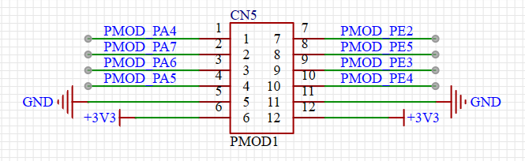
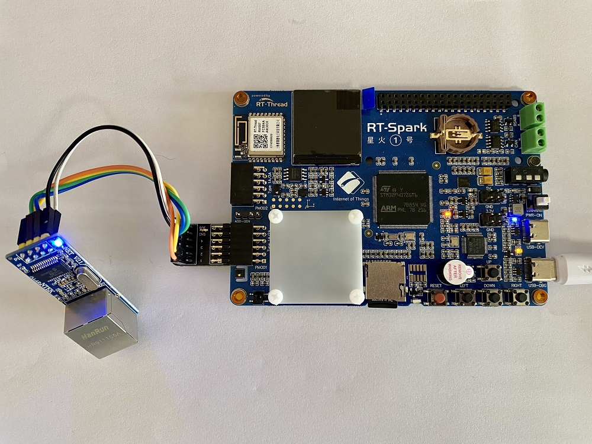

# ENC28J60 以太网模块例程

## 简介

本例程的主要功能是让星火 1 号通过 ENC28J60 连接互联网。

## 硬件说明

ENC28J60 是带 SPI 接口的独立以太网控制器，兼容 IEEE 802.3，集成 MAC 和 10 BASE-T PHY，最高速度可达 10Mb/s。

ENC28J60 是通过板子上的 PMOD 插座连接单片机的，利用 SPI1 和单片机进行通讯。原理图和实物图如下所示：





## 软件说明

本例程的源码位于 `/projects/05_iot_spi_eth_enc28j60`。ENC28J60 初始化的源代码位于 `libraries/Board_Drivers/drv_enc28j60.c` 中。

因为 ENC28J60 是通过 SPI 和单片机进行通讯的，所以需要通过 enc28j60_attach() 函数将 ENC28J60 连接到 SPI 设备上，星火 1 号提供了专门的接口，对应 SPI11 设备。这样，就能利用 RT-Thread 的 SPI 框架和 ENC28J60 进行通讯了。

然后就是将 ENC28J60 的中断处理函数通过 rt_pin_attach_irq() 函数绑定到对应的管脚上去，这里用到的是 **PE2** 号管脚。

最后利用 RT-Thread 的 INIT_COMPONENT_EXPORT 宏定义，将 enc28j60_init() 函数加入开机自动初始化。这样，板子上电后，就会自动执行 ENC28J60 的初始化函数，无需用户手动调用。

```c
#include <drivers/pin.h>
#include <enc28j60.h>
#include "drv_spi.h"
#include "board.h"

#define PIN_NRF_IRQ             GET_PIN(E,2)


int enc28j60_init(void)
{
    __HAL_RCC_GPIOD_CLK_ENABLE();
    rt_hw_spi_device_attach("spi1", "spi11", GPIOA, GPIO_PIN_4);

    /* attach enc28j60 to spi. spi11 cs - PA4 */
    enc28j60_attach("spi11");

    /* init interrupt pin */
    rt_pin_mode(PIN_NRF_IRQ, PIN_MODE_INPUT_PULLUP);
    rt_pin_attach_irq(PIN_NRF_IRQ, PIN_IRQ_MODE_FALLING, (void(*)(void*))enc28j60_isr, RT_NULL);
    rt_pin_irq_enable(PIN_NRF_IRQ, PIN_IRQ_ENABLE);

    return 0;
}
INIT_COMPONENT_EXPORT(enc28j60_init);
```

## 运行

### 编译 & 下载

- RT-Thread Studio：在 RT-Thread Studio 的包管理器中下载 `STM32F407-RT-SPARK` 资源包，然后创建新工程，执行编译。
- MDK：首先双击 mklinks.bat，生成 rt-thread 与 libraries 文件夹链接；再使用 Env 生成 MDK5 工程；最后双击 project.uvprojx 打开 MDK5 工程，执行编译。
编译完成后，将开发板的 ST-Link USB 口与 PC 机连接，然后将固件下载至开发板。

编译完成后，将开发板的 ST-Link USB 口与 PC 机连接，然后将固件下载至开发板。

### 运行效果

按下复位按键重启开发板，可以看到板子会打印出如下信息：

```shell
 \ | /
- RT -     Thread Operating System
 / | \     4.1.1 build Jul  7 2023 14:54:52
 2006 - 2022 Copyright by RT-Thread team
lwIP-2.0.3 initialized!
[I/sal.skt] Socket Abstraction Layer initialize success.
```

在 msh 中输入 ping 命令

```sheel
msh />ping www.rt-thread.org
60 bytes from 112.15.37.103 icmp_seq=0 ttl=55 time=126 ms
60 bytes from 112.15.37.103 icmp_seq=1 ttl=55 time=73 ms
60 bytes from 112.15.37.103 icmp_seq=2 ttl=55 time=38 ms
60 bytes from 112.15.37.103 icmp_seq=3 ttl=55 time=106 ms
```

## 注意事项

`drv_enc28j60.c` 里面并没有真正的初始化代码，只是调用了 RT_Thread 提供的 `enc28j60.c` 文件里的函数来初始化的，想了解 ENC28J60 初始化和中断函数详情的，可以查看 `/rt-thread/components/drivers/spi/enc28j60.c` 文件来学习。

## 引用参考

- 设备与驱动：[PIN 设备](https://www.rt-thread.org/document/site/#/rt-thread-version/rt-thread-standard/programming-manual/device/pin/pin)
- 设备与驱动：[SPI 设备](https://www.rt-thread.org/document/site/#/rt-thread-version/rt-thread-standard/programming-manual/device/spi/spi)
- 文档中心：[RT-Thread 文档中心](https://www.rt-thread.org/document/site/#/)
