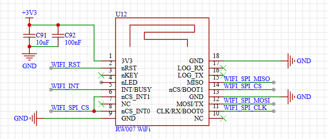
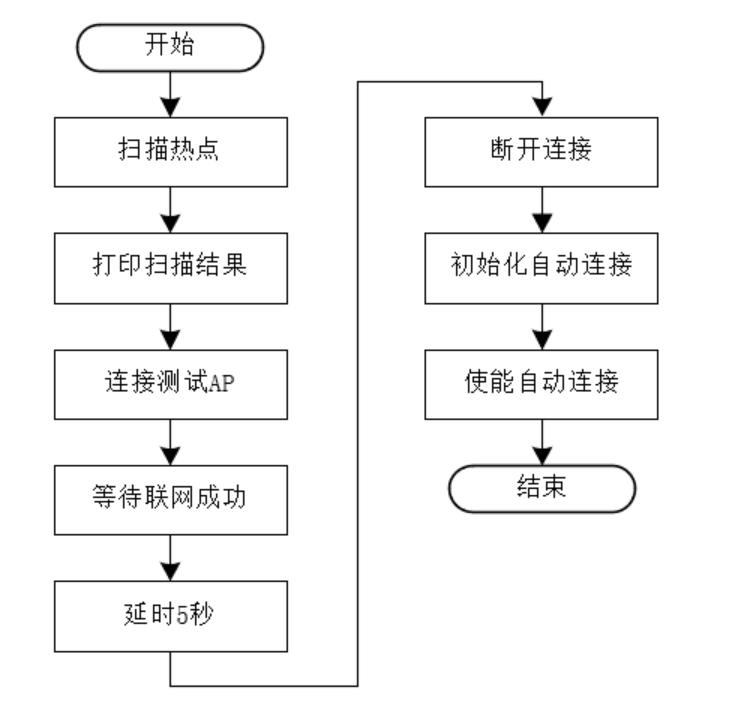

# WiFi 管理例程

## 简介

本例程使用 RT-Thread Wlan Manager 对 WiFi 网络管理，展示 WiFi 热点扫描， Join 网络， WiFi 自动连接以及 WiFi Event 处理等功能。

## 硬件说明



RW007 是由上海睿赛德电子科技有限公司开发的高速 WiFi 模块，使用 SPI 与主机通信 ，支持 IEEE 802.11b/g/n 网络、 WEP/WPA/WPA2 加密方式和 STA 和 AP 模式。

主要特性

- 高性能 MCU
- 使用 SPI 通信方式
- SPI 时钟高达 30Mbps
- SPI 模式下有效以太网带宽高达上传 1MBytes/s，下载 1MBytes/s
- 支持 WiFi+BLE 主从机功能
- BLE 主机功能可同时连接多个 BLE 设备
- WiFi 支持 STA+AP 模式
- 支持微信小程序 BLE 快速配网
- 支持断网快速回连
- 内置 Bootloader，支持 OTA 固件升级、安全固件功能
- 支持批量远程升级，方便运维管理

更多相关信息资料见 RW007 介绍页面 [睿赛德科技推出高速 Wi-Fi 模块 RW007：内置 RT-Thread 物联网操作系统](https://mp.weixin.qq.com/s/HYHoMnOhzad2m6IBS2Z-Qg)

## 软件说明

本例程的源码位于 `/projects/05_iot_wifi_manager`。

该用例的主要流程如下图所示，首先调用 Scan 接口扫描周围环境中的 AP(Access Point ，即无线访问热点) ，并打印扫描结果；然后连接一个测试用的 AP (名字: test_ssid , 密码: 12345678 )，并等待联网成功，打印网络信息；接着在等待 5 秒之后，断开和 AP 的连接；最后，调用接口初始化自动连接的相关配置，开启自动连接功能。在开启自动连接之后， Wlan Manager 会根据存储介质中的历史记录进行 AP 连接。

注意：请在 main.c 根据实际情况修改 WLAN_SSID 和 WLAN_PASSWORD 两个宏（分别定义了 AP 的名字和密码），否则将无法联网成功。



### 热点扫描

初始化信号量，注册回调函数

```c
    /* 执行扫描 */
    rt_sem_init(&scan_done,"scan_done",0,RT_IPC_FLAG_FIFO);
    rt_wlan_register_event_handler(RT_WLAN_EVT_SCAN_REPORT, wlan_scan_report_hander,&i);
    rt_wlan_register_event_handler(RT_WLAN_EVT_SCAN_DONE, wlan_scan_done_hander,RT_NULL);

    if(rt_wlan_scan() == RT_EOK)
    {
        LOG_D("the scan is started...");
    }else
    {
        LOG_E("scan failed");
    }
    /* 等待扫描完毕 */
    rt_sem_take(&scan_done,RT_WAITING_FOREVER);
```

扫描完成回调函数和扫描报道的回调函数

```c
void wlan_scan_report_hander(int event,struct rt_wlan_buff *buff,void *parameter)
{
    struct rt_wlan_info *info = RT_NULL;
    int index = 0;
    RT_ASSERT(event == RT_WLAN_EVT_SCAN_REPORT);
    RT_ASSERT(buff != RT_NULL);
    RT_ASSERT(parameter != RT_NULL);

    info = (struct rt_wlan_info *)buff->data;
    index = *((int *)(parameter));
    print_wlan_information(info,index);
    ++ *((int *)(parameter));
}

void wlan_scan_done_hander(int event,struct rt_wlan_buff *buff,void *parameter)
{
    RT_ASSERT(event == RT_WLAN_EVT_SCAN_DONE);
    rt_sem_release(&scan_done);
}

```

### Join 网络

RT-Thread Wlan Manager 提供极简的接口进行 WiFi 联网操作，仅需要输入 ssid 和 password 即可。另外， Wlan Manager 也提供事件通知机制， RT_WLAN_EVT_READY 事件标志着 WiFi 联网成功，可以使用 Network 进行通信； RT_WLAN_EVT_STA_DISCONNECTED 用于 Network 断开的事件。下面代码片段展示了 WiFi 联网的操作。

```c
    /* 热点连接 */
    LOG_D("start to connect ap ...");
    rt_sem_init(&net_ready, "net_ready", 0, RT_IPC_FLAG_FIFO);

    /* 注册 wlan ready 回调函数 */
    rt_wlan_register_event_handler(RT_WLAN_EVT_READY, wlan_ready_handler, RT_NULL);
    /* 注册 wlan 断开回调函数 */
    rt_wlan_register_event_handler(RT_WLAN_EVT_STA_DISCONNECTED, wlan_station_disconnect_handler, RT_NULL);
    /* 同步连接热点 */
    result = rt_wlan_connect(WLAN_SSID, WLAN_PASSWORD);
    if (result == RT_EOK)
    {
        rt_memset(&info, 0, sizeof(struct rt_wlan_info));
        /* 获取当前连接热点信息 */
        rt_wlan_get_info(&info);
        LOG_D("station information:");
        print_wlan_information(&info,0);
        /* 等待成功获取 IP */
        result = rt_sem_take(&net_ready, NET_READY_TIME_OUT);
        if (result == RT_EOK)
        {
            LOG_D("networking ready!");
            msh_exec("ifconfig", rt_strlen("ifconfig"));
        }
        else
        {
            LOG_D("wait ip got timeout!");
        }
        /* 回收资源 */
        rt_wlan_unregister_event_handler(RT_WLAN_EVT_READY);
        rt_sem_detach(&net_ready);
    }
    else
    {
        LOG_E("The AP(%s) is connect failed!", WLAN_SSID);
    }
```

此处通过 rt_wlan_register_event_handler 接口注册 RT_WLAN_EVT_READY （网络准备就绪）事件，当 WiFi Join AP 成功，且 IP 分配成功，会触发该事件的回调，标志着可以正常使用网络接口进行通信。

### 自动连接

打开自动连接功能后， Wlan Manager 会在 WiFi Join 网络成功后，保存该 AP 的信息至存储介质（默认保存最近 3 次的连接信息）。当系统重启或者网络异常断开后，自动读取介质中的信息，进行 WiFi 联网。下面代码片段展示自动连接功能的使用。

```c
    /* 自动连接 */
    LOG_D("start to autoconnect ...");
    wifi_autoconnect();
```

## Shell 操作 WiFi

wifi 相关的 shell 命令如下：

```shell
wifi                                       ：打印帮助
wifi help                                  ：查看帮助
wifi join SSID [PASSWORD]                  ：连接wifi，SSDI为空，使用配置自动连接
wifi ap   SSID [PASSWORD]                  ：建立热点
wifi scan                                  ：扫描全部热点
wifi disc                                  ：断开连接
wifi ap_stop                               ：停止热点
wifi status                                ：打印wifi状态 sta + ap
wifi smartconfig                           ：启动配网功能
```

### WiFi 扫描

* wifi 扫描命令格式如下

```shell
wifi scan
```

在调试工具中输入该命令，即可进行 wifi 命令扫描，扫描结果如下所示：

```shell
[D/main] start to scan ap ...
[D/main] the scan is started...
             SSID                      MAC            security    rssi chn Mbps
------------------------------- -----------------  -------------- ---- --- ----
demo                            5c:de:34:9b:85:08  WPA2_AES_PSK   -35   11 4294

```

### WiFi 连接

```shell
msh />
msh />wifi join test_ssid 12345678
join ssid:test_ssid
[I/WLAN.mgnt] wifi connect success ssid:test_ssid
msh />[I/WLAN.lwip] Got IP address : 192.168.43.6
```

小技巧：如果已经存储 Join 成功的 AP 历史记录，可直接输入 `wifi join` 进行网络连接， 忽略 'SSID' 和 'PASSWORD'。

### WiFi 断开

```shell
msh />wifi disc
wifi link down
[I/main] disconnect from the network!
[I/WLAN.mgnt] disconnect success!
```

## 运行

### 编译 & 下载

- RT-Thread Studio：在 RT-Thread Studio 的包管理器中下载 `STM32F407-RT-SPARK` 资源包，然后创建新工程，执行编译。
- MDK：首先双击 mklinks.bat，生成 rt-thread 与 libraries 文件夹链接；再使用 Env 生成 MDK5 工程；最后双击 project.uvprojx 打开 MDK5 工程，执行编译。

编译完成后，将开发板的 ST-Link USB 口与 PC 机连接，然后将固件下载至开发板。

### 运行效果

```shell
 \ | /
- RT -     Thread Operating System
 / | \     4.1.1 build Jun  9 2023 18:14:15
 2006 - 2022 Copyright by RT-Thread team
lwIP-2.0.3 initialized!
[I/sal.skt] Socket Abstraction Layer initialize success.
msh >[E/[RW007]] The wifi Stage 1 status 0 0 0 1
[I/WLAN.dev] wlan init success
[I/WLAN.lwip] eth device init ok name:w0
[I/WLAN.dev] wlan init success
[I/WLAN.lwip] eth device init ok name:w1

rw007  sn: [rw007c745bb22fc584aa6cecc]
rw007 ver: [RW007_2.1.0-a7a0d089-57]

[D/main] start to scan ap ...
[D/main] the scan is started...
             SSID                      MAC            security    rssi chn Mbps
------------------------------- -----------------  -------------- ---- --- ----
test_ssid                       5c:de:34:9b:85:08  WPA2_AES_PSK   -37   11 4294

[D/main] start to connect ap ...
[I/main] disconnect from the network!
[I/WLAN.mgnt] wifi connect success ssid:test_ssid
[D/main] station information:
             SSID                      MAC            security    rssi chn Mbps
------------------------------- -----------------  -------------- ---- --- ----
test_ssid                       00:00:00:00:00:00  UNKNOWN        0     -1    0
[I/WLAN.lwip] Got IP address : 192.168.137.187
[D/main] networking ready!
network interface device: w0 (Default)
MTU: 1500
MAC: fc 58 4a a6 ce cc
FLAGS: UP LINK_UP INTERNET_DOWN DHCP_ENABLE ETHARP BROADCAST IGMP
ip address: 192.168.137.187
gw address: 192.168.137.1
net mask  : 255.255.255.0
dns server #0: 192.168.137.1
dns server #1: 0.0.0.0

network interface device: w1
MTU: 1500
MAC: fc 58 4a a6 ce cd
FLAGS: UP LINK_DOWN INTERNET_DOWN DHCP_ENABLE ETHARP BROADCAST IGMP
ip address: 0.0.0.0
gw address: 0.0.0.0
net mask  : 0.0.0.0
dns server #0: 192.168.137.1
dns server #1: 0.0.0.0
[D/main] ready to disconect from ap ...
[I/main] disconnect from the network!
[I/WLAN.mgnt] disconnect success!
[D/main] start to autoconnect ...
[I/main] disconnect from the network!
[I/WLAN.mgnt] wifi connect success ssid:test_ssid
wlan_connect_handler
ssid : test_ssid
[I/WLAN.lwip] Got IP address : 192.168.137.187

```

## 注意事项

执行例程之前，需先设置一个名字为 'test_ssid'，密码为 '12345678' 的 WiFi 热点。

## 引用参考

- 文档中心：[RT-Thread 文档中心](https://www.rt-thread.org/document/site/#/)
- 设备与驱动：[WLAN 设备](https://www.rt-thread.org/document/site/#/rt-thread-version/rt-thread-standard/programming-manual/device/wlan/wlan)
- rw007 软件包 ：[https://github.com/RT-Thread-packages/rw007](https://github.com/RT-Thread-packages/rw007)

