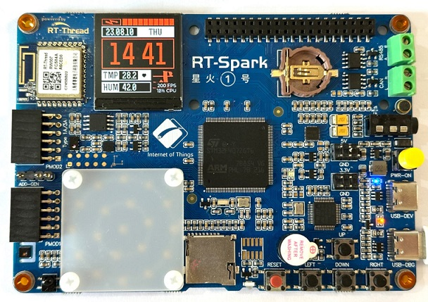

#  出厂综合例程

## 硬件说明

本例程将使用 LCD 显示屏显示 LVGL 的图像。

## 软件说明

本例程的源码位于 `/projects/06_demo_factory`。

本例程是基于 LVGL 的个性表盘显示例程，附带了对整板传感器的自动测试界面。

lvgl 相关代码在 packages/LVGL-v8.3.5 目录，关于更多请参考 [lvgl 开发文档](https://docs.lvgl.io/latest/en/html/index.html)。lvgl 的移植代码在 application/lvgl 目录下面。

## 运行

### 编译 & 下载

- RT-Thread Studio：在 RT-Thread Studio 的包管理器中下载 `STM32F407-RT-SPARK` 资源包，创建新工程，执行编译。
- MDK：首先双击 mklinks.bat，生成 rt-thread 与 libraries 文件夹链接；再使用 Env 生成 MDK5 工程；最后双击 project.uvprojx 打开 MDK5 工程，执行编译。

编译完成后，将开发板的 ST-Link USB 口与 PC 机连接，将固件下载至开发板。

### 运行效果

按下复位键重启开发板，观察 lcd 屏幕上已经开始运行 lvgl 的 demo。

上电运行，屏幕首先会显示表盘主界面， 可以按 `LEFT` 按键执行自动测试。

在除自动测试界面之外，其他界面都是由 `UP` 和 `DOWN` 按键执行增减，`RIGHT` 按键执行下一步，`LEFT` 按键执行返回上一级。

本 demo 自带如下应用展示：

- 系统文件夹展示
- 板载 LED 矩阵手动调光
- 环境检测（环境亮度、温湿度）
- 6 轴传感器数值反馈
- 表盘时间设置

在进入应用后，如果需要退出到菜单页面，部分应用需要按两次 `LEFT` 以退出当前页面。

## 注意事项

暂无

## 引用参考

- 文档中心：[RT-Thread 文档中心](https://www.rt-thread.org/document/site/#/)
- lvgl 软件包：[https://github.com/lvgl/lvgl](https://github.com/lvgl/lvgl)

