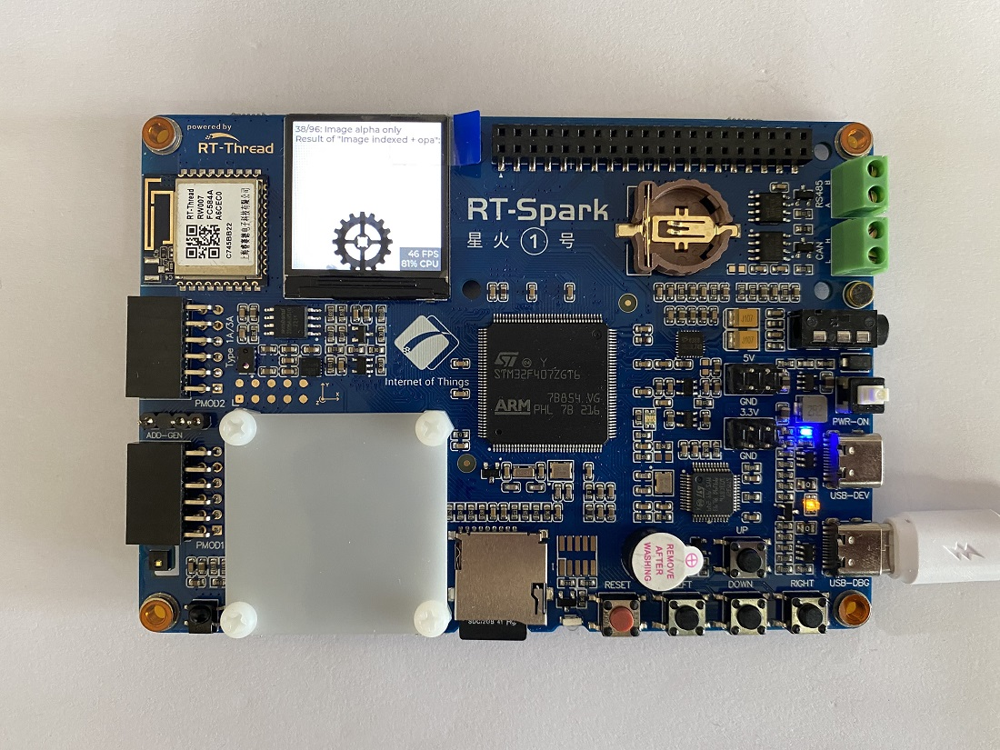

# LVGL 例程

## LVGL 简介

LVGL 全称 Light and Versatile Graphics Library, 是一个自由的，开源的 GUI 库，界面精美，资源消耗小，可移植度高，响应式布局等特点，全库采用纯 c 语言开发。
主要特性如下：

- 具有非常丰富的内置控件，像 buttons, charts, lists, sliders, images 等高级图形效果：动画，反锯齿，透明度，平滑滚动
- 支持多种输入设备，像 touchpad, mouse, keyboard, encoder 等
- 支持多语言的 UTF-8 编码
- 支持多个和多种显示设备，例如同步显示在多个彩色屏或单色屏上
- 完全自定制的图形元素
- 硬件独立于任何微控制器或显示器
- 可以缩小到最小内存 (64 kB Flash, 16 kB RAM)
- 支持操作系统、外部储存和 GPU（非必须）
- 仅仅单个帧缓冲设备就可以呈现高级视觉特效
- 使用 C 编写以获得最大兼容性（兼容 C++）
- 支持 PC 模拟器
- 为加速 GUI 设计，提供教程，案例和主题，支持响应式布局
- 提供了在线和离线文档
- 基于自由和开源的 MIT 协议
- 支持 MicroPython

## 硬件说明

本例程将使用 LCD 显示屏显示 LVGL 的图像。

## 软件说明

本例程的源码位于 `/projects/06_demo_lvgl`。

lvgl 相关代码在 packages/LVGL-v8.3.5 目录，关于更多请参考 [lvgl 开发文档](https://docs.lvgl.io/latest/en/html/index.html)。lvgl 的移植代码在 application/lvgl 目录下面。

首先是 lvgl 显示驱动的移植位于 application/lvgl/lv_port_disp.c

修改屏幕刷新函数：

```c
static void disp_flush(lv_disp_drv_t * disp_drv, const lv_area_t * area, lv_color_t * color_p)
{
    lcd_fill_array(area->x1, area->y1, area->x2, area->y2, color_p);

    lv_disp_flush_ready(disp_drv);
}
```

修改 framebuffer, 大小设置为屏幕尺寸的一半，并且放在 ccm 段。

```c
    /* Example for 1) */
    static lv_disp_draw_buf_t draw_buf_dsc_1;

    /*GCC*/
#if defined ( __GNUC__ )
    static lv_color_t buf_1[MY_DISP_HOR_RES * MY_DISP_HOR_RES / 2] __attribute__((section(".LVGLccm")));                          /*A buffer for 10 rows*/
    /*MDK*/
#elif defined ( __CC_ARM )
    __attribute__((at(0x10000000))) lv_color_t buf_1[LCD_H * LCD_W / 2];
#endif

    lv_disp_draw_buf_init(&draw_buf_dsc_1, buf_1, NULL, MY_DISP_HOR_RES * MY_DISP_HOR_RES / 2);   /*Initialize the display buffer*/

```

其次是触摸函数，位于 application/lvgl/lv_port_indev.c。由于开发板没有触摸组件，所以触摸函数设置为空函数。

```c
void lv_port_indev_init(void)
{

}

```

之后移植一个配置文件 libraries/Board_Drivers/lvgl/lv_conf.h。主要配置了屏幕的尺寸和颜色

```c
#ifndef LV_CONF_H
#define LV_CONF_H

#include <rtconfig.h>

#define LV_COLOR_DEPTH          16
#define LV_USE_PERF_MONITOR     1
#define MY_DISP_HOR_RES          240
#define MY_DISP_VER_RES          240
```

使能 demo，位于 libraries/Board_Drivers/lvgl/demo/lv_demo.c。这里也是 lvgl 用户程序的入口。

```c
void lv_user_gui_init(void)
{
    /* display demo; you may replace with your LVGL application at here */

    extern lv_demo_benchmark();
    lv_demo_benchmark();

}
```

## 运行

### 编译 & 下载

- RT-Thread Studio：在 RT-Thread Studio 的包管理器中下载 `STM32F407-RT-SPARK` 资源包，然后创建新工程，执行编译。
- MDK：首先双击 mklinks.bat，生成 rt-thread 与 libraries 文件夹链接；再使用 Env 生成 MDK5 工程；最后双击 project.uvprojx 打开 MDK5 工程，执行编译。

编译完成后，将开发板的 ST-Link USB 口与 PC 机连接，然后将固件下载至开发板。

### 运行效果

按下复位键重启开发板，观察 lcd 屏幕上已经开始运行 lvgl 的 demo。



## 注意事项

暂无

## 引用参考

- 文档中心：[RT-Thread 文档中心](https://www.rt-thread.org/document/site/#/)
- lvgl 软件包：[https://github.com/lvgl/lvgl](https://github.com/lvgl/lvgl)

