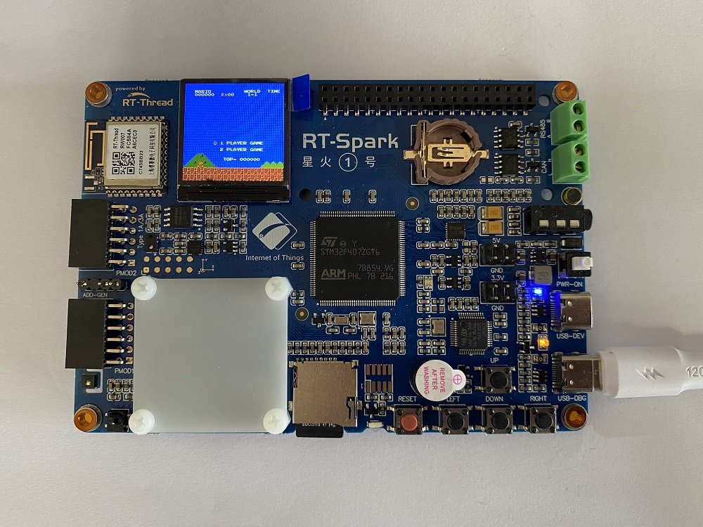

# nes 模拟器实验

## 简介

本例程主要介绍了在星火 1 号开发板上移植 nes 模拟器的方法。

## 硬件说明

本例程使用到了 LCD 显示 nes 模拟器。使用了按键作为 nes 模拟器的输入设备。使用 sd 卡来存储游戏。

## 软件说明

本例程的源码位于 `/projects/06_demo_nes_simulator`。nes 的移植代码主要在 application/nes 文件夹下。

其中 application/nes/port/nes_port.c 为移植的内容

```c
int nes_draw(size_t x1, size_t y1, size_t x2, size_t y2, nes_color_t* color_data){
    
    extern void lcd_fill_array(rt_uint16_t x_start, rt_uint16_t y_start, rt_uint16_t x_end, rt_uint16_t y_end, void *pcolor);
    lcd_fill_array(x1, y1, x2, y2, color_data);
    return 0;
}
```

上面的函数实现了屏幕显示。 

```c
static void update_joypad()
{
    rt_uint32_t key_data = 0;
    static_nes.nes_cpu.joypad.joypad = 0;
    if(rt_event_recv(key_event,TP_UP | TP_DOWN | TP_LEFT | TP_RIGHT | TP_SELECT \
    | TP_START | TP_A | TP_B,RT_EVENT_FLAG_OR | RT_EVENT_FLAG_CLEAR,RT_WAITING_NO,\
    &key_data) == RT_EOK)
    {
        if(key_data&TP_UP)		static_nes.nes_cpu.joypad.U1 = 1;
        else                    static_nes.nes_cpu.joypad.U1 = 0;
        if(key_data&TP_DOWN)	static_nes.nes_cpu.joypad.D1 = 1;
        else                    static_nes.nes_cpu.joypad.D1 = 0;
        if(key_data&TP_LEFT)	static_nes.nes_cpu.joypad.L1 = 1;
        else                    static_nes.nes_cpu.joypad.L1 = 0;
        if(key_data&TP_RIGHT)	static_nes.nes_cpu.joypad.R1 = 1;
        else                    static_nes.nes_cpu.joypad.R1 = 0;
        if(key_data&TP_SELECT)	static_nes.nes_cpu.joypad.SE1 = 1;
        else                    static_nes.nes_cpu.joypad.SE1 = 0;
        if(key_data&TP_START)	static_nes.nes_cpu.joypad.ST1 = 1;
        else                    static_nes.nes_cpu.joypad.ST1 = 0;
        if(key_data&TP_A)		static_nes.nes_cpu.joypad.A1 = 1;
        else                    static_nes.nes_cpu.joypad.A1 = 0;
        if(key_data&TP_B)		static_nes.nes_cpu.joypad.B1 = 1;
        else                    static_nes.nes_cpu.joypad.B1 = 0;
    }
}
```

上面函数实现了接收从按键线程发送过来的按键事件。

application/nes/port/rt_key_scan.c 为按键捕获函数

```c
/* 配置 KEY 输入引脚  */
#define PIN_KEY0        GET_PIN(C, 0)     // PC0:  KEY0         --> KEY
#define PIN_KEY1        GET_PIN(C, 1)      // PC1 :  KEY1         --> KEY
#define PIN_KEY2        GET_PIN(C, 4)      // PC4 :  KEY2         --> KEY
#define PIN_WK_UP       GET_PIN(C, 5)     // PC5:  WK_UP        --> KEY

rt_event_t key_event;

static void key_scan()
{
    uint32_t key_data;
    while(1)
    {
        rt_thread_mdelay(15); //10ms tick wait for input change.
        key_data = 0;
        if (rt_pin_read(PIN_KEY0) == PIN_LOW)
        {

            rt_kprintf("KEY0 pressed!\n");

            key_data |= TP_LEFT;
        }
        if (rt_pin_read(PIN_KEY1) == PIN_LOW)
        {

            rt_kprintf("KEY1 pressed!\n");

            key_data |= TP_START;
        }
        if (rt_pin_read(PIN_KEY2) == PIN_LOW)
        {

            rt_kprintf("KEY2 pressed!\n");

            key_data |= TP_RIGHT;
        }
        if (rt_pin_read(PIN_WK_UP) == PIN_LOW)
        {

            rt_kprintf("WK_UP pressed!\n");

            key_data |= TP_A;
        }
        if(key_data)
        {
            rt_event_send(key_event,key_data);
        }
    }
    
}
void key_scan_init()
{

    rt_pin_mode(PIN_KEY0, PIN_MODE_INPUT_PULLUP);
    rt_pin_mode(PIN_KEY1, PIN_MODE_INPUT_PULLUP);
    rt_pin_mode(PIN_KEY2, PIN_MODE_INPUT_PULLUP);
    rt_pin_mode(PIN_WK_UP, PIN_MODE_INPUT_PULLUP);

    key_event = rt_event_create("key", RT_IPC_FLAG_FIFO);

    rt_thread_t thread = rt_thread_create("key scan",key_scan,RT_NULL,1024,20,1);
    if(thread == RT_NULL) rt_kprintf("key scan thread create failed!\n");
    rt_thread_startup(thread);
}
```

此文件初始化了一个按键扫描线程，一旦捕获到按键按下就会发送按键事件。

```c
#define PIN_LED_R              GET_PIN(F, 12)      // PE7 :  LED_R        --> LED

#include "nes.h"

static void nes_thread_entry(void *parameter)
{
    nes_t* nes = (nes_t*)parameter;
    nes_run(nes);
    nes_unload_file(nes);
}
static int nes_start(int argc, char *argv[]){

    if (argc == 2)
    {
        const char *nes_file_path = argv[1];
        size_t nes_file_path_len = strlen(nes_file_path);
        if (memcmp(nes_file_path+nes_file_path_len-4,".nes",4)==0 || memcmp(nes_file_path+nes_file_path_len-4,".NES",4)==0)
        {
            nes_printf("nes_file_path:%s\n",nes_file_path);
            nes_t* nes = nes_load_file(nes_file_path);
            if (!nes)
            {
                return -1;
            }
            rt_thread_t thread = rt_thread_create("nes", nes_thread_entry, nes, 2048, 20, 10);
            if(thread == RT_NULL)
            {
                rt_kprintf("Can't create nes thread!\n");
                return -1;
            }
            rt_thread_startup(thread);
            return 0;
        }else
        {
            nes_printf("Please enter xxx.nes\n");
            return -1;
        }
    }else
    {
        nes_printf("Please enter the nes file path\n");
        return -1;
    }
}

int main()
{   
    rt_pin_mode(PIN_LED_R,PIN_MODE_OUTPUT);
    while (1)
    {
        rt_pin_write(PIN_LED_R, PIN_LOW);
        rt_thread_mdelay(500);

        rt_pin_write(PIN_LED_R, PIN_HIGH);
        rt_thread_mdelay(500);
    }
    return 0;
}
MSH_CMD_EXPORT(nes_start,nes_start);
```
主函数完成的主要功能为创建游戏机线程函数，并且将函数导入到 msh 命令行。然后周期点亮 led 提示系统运行状态。

## 运行

### 编译 & 下载

- RT-Thread Studio：在 RT-Thread Studio 的包管理器中下载 `STM32F407-RT-SPARK` 资源包，然后创建新工程，执行编译。
- MDK：首先双击 mklinks.bat，生成 rt-thread 与 libraries 文件夹链接；再使用 Env 生成 MDK5 工程；最后双击 project.uvprojx 打开 MDK5 工程，执行编译。

编译完成后，将开发板的 ST-Link USB 口与 PC 机连接，然后将固件下载至开发板。

### 运行效果

首先将  `game` 文件夹下的以 `.nes` 为后缀的游戏拷贝到内存卡。按下复位按键重启开发板，在 msh 中输入启动命令可以观察到游戏已经启动。按下按键，模拟器均有相应反馈。

```sheel
 \ | /
- RT -     Thread Operating System
 / | \     4.1.1 build Jul 19 2023 10:08:16
 2006 - 2022 Copyright by RT-Thread team
[I/sal.skt] Socket Abstraction Layer initialize success.
[I/SDIO] SD card capacity 1967104 KB.
[I/drv.lcd]  LCD ID:81b3
[D/drv.lcd] backlight 80 percent
msh />[I/app.filesystem] SD card mount to '/sdcard'
msh />nes_start sdcard/SuperMary.nes

```



## 注意事项

按键映射关系为 up 为跳跃，down 为开始/暂停，左右为方向。

## 引用参考

- 文档中心：[RT-Thread 文档中心](https://www.rt-thread.org/document/site/#/)
