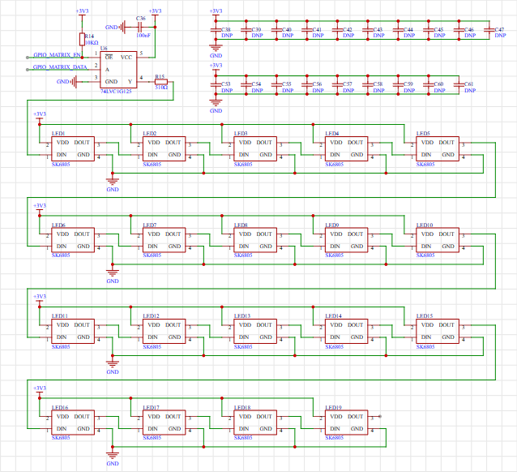
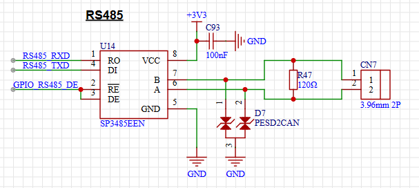
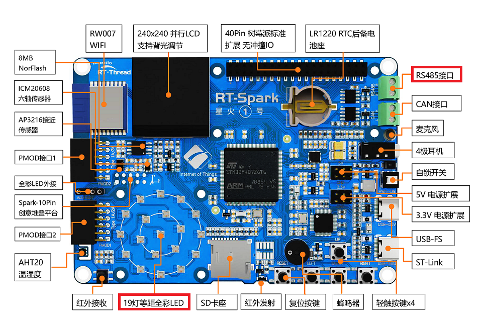
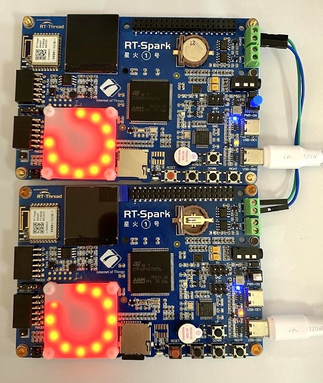

# 板载 LED matrix 和 RS485 驱动例程

## 简介

本例程主要介绍了如何驱动板载 LED 以及如何使用 rs485 同步两块板子的 LED Matrix

## 硬件说明

星火 1 号开发板板载了一块 LED 阵列，共计 19 颗 LED RGB 灯珠。驱动使用的是 PWM 模拟信号来实现的。LED 矩阵使能端口连接在 PF12，LED PWM 信号端口连接在 PA7。星火 1 号开发板还板载了一块 RS-485 电平转换模块，接在芯片的 uart6 上面。

LED 矩阵和 RS485 原理图如下：





LED 矩阵、RS485 接口在开发板上的位置如下：



## 软件说明

本例程的源码位于 `/projects/06_demo_rs485_led_matrix`。

### rs485 驱动代码

rs485 驱动代码在 `libraries/Board_Drivers/rs485/drv_rs485.c` 中：

```c
int rs485_init(void)
{
    /* find uart device */
    rs485_serial = rt_device_find(RS485_UART_DEVICE_NAME);
    if (!rs485_serial)
    {
        rt_kprintf("find %s failed!\n", RS485_UART_DEVICE_NAME);
        return -RT_ERROR;
    }

    rt_device_open(rs485_serial, RT_DEVICE_FLAG_INT_RX);

    /* set receive data callback function */
    rt_device_set_rx_indicate(rs485_serial, rs485_input);

    /* set the send completion callback function */
    rt_device_set_tx_complete(rs485_serial, rs485_output);

    rt_pin_mode(BSP_RS485_RTS_PIN, PIN_MODE_OUTPUT);

    RS485_IN;

    rt_sem_init(&rs485_rx_sem, "rs485_rx_sem", 0, RT_IPC_FLAG_FIFO);
    /* create rs485 receive thread */
    // rt_thread_t thread = rt_thread_create("rs485", rs485_thread_entry, RT_NULL, 1024, 25, 10);
    extern led_matrix_receieve_task(void *parameter);
    rt_thread_t thread = rt_thread_create("rs485", led_matrix_receieve_task, RT_NULL, 1024, 20, 10);

    if (thread != RT_NULL)
    {
        rt_thread_startup(thread);
    }
    else
    {
        return -RT_ERROR;
    }

    return RT_EOK;
}
```

使用串口 6 作为发送设备完成 485 通信。

led_matrix_receieve_task() 为接受的回调函数，收到数据之后会自动进入该回调函数。

### led matrix 驱动程序

led matrix 驱动程序位于 libraries/Board_Drivers/led_matrix/drv_matrix_led.c 中

```c
void Set_LEDColor(uint16_t LedId, RGBColor_TypeDef Color)
{
    RGB_Data[LedId].G = Color.G;
    RGB_Data[LedId].R = Color.R;
    RGB_Data[LedId].B = Color.B;
}
```

使用以上接口即可设置某一个灯珠的颜色。然后调用 RGB_Reflash() 刷新灯珠颜色。

### 4.3.3 主机驱动 LED Matrix

```c
static void led_matrix_flowing_water_entry()
{
    while(1)
    {
        int base_time = 150;
        /* 分别变速转三圈 */
        for(int time = 1; time<=3; time++)
        {
            for(int i=0; i<sizeof(led_matrix)/sizeof(led_matrix[0]);i++)
            {
                led_matrix[i].io_ctl(&led_matrix[i],RED);
                rt_thread_delay(base_time / time);
            }
            for(int i=0; i<sizeof(led_matrix)/sizeof(led_matrix[0]);i++)
            {
                led_matrix[i].io_ctl(&led_matrix[i],GREEN);
                rt_thread_delay(base_time / time);
            }
            for(int i=0; i<sizeof(led_matrix)/sizeof(led_matrix[0]);i++)
            {
                led_matrix[i].io_ctl(&led_matrix[i],BLUE);
                rt_thread_delay(base_time / time);
            }
            for(int i=0; i<sizeof(led_matrix)/sizeof(led_matrix[0]);i++)
            {
                led_matrix[i].io_ctl(&led_matrix[i],WHITE);
                rt_thread_delay(base_time / time);
            }
            for(int i=0; i<sizeof(led_matrix)/sizeof(led_matrix[0]);i++)
            {
                led_matrix[i].io_ctl(&led_matrix[i],DARK);
                rt_thread_delay(base_time / time);
            }
        }

        /* 同步转五圈 */
        int extern_led_index_start;
        for(extern_led_index_start = 0; (extern_led_index_start < sizeof(led_matrix))\
        && (led_matrix[extern_led_index_start].location == INTERNAL); extern_led_index_start++);
        if(extern_led_index_start < sizeof(led_matrix))
        {
            for(int time = 1; time<=3; time++)
            {
                for(int i=0; i<sizeof(led_matrix)/sizeof(led_matrix[0]); i++)
                {
                    if(i < extern_led_index_start)
                    {
                        led_matrix[i].io_ctl(&led_matrix[i],RED);
                    }
                    if(sizeof(led_matrix)-1-i >= extern_led_index_start)
                    {
                        led_matrix[sizeof(led_matrix)/sizeof(led_matrix[0])-1-i].io_ctl(&led_matrix[sizeof(led_matrix)/sizeof(led_matrix[0])-1-i],RED);
                    }
                    rt_thread_delay(base_time / time);
                }
                for(int i=0; i<sizeof(led_matrix)/sizeof(led_matrix[0]); i++)
                {
                    if(i < extern_led_index_start)
                    {
                        led_matrix[i].io_ctl(&led_matrix[i],GREEN);
                    }
                    if(sizeof(led_matrix)-1-i >= extern_led_index_start)
                    {
                        led_matrix[sizeof(led_matrix)/sizeof(led_matrix[0])-1-i].io_ctl(&led_matrix[sizeof(led_matrix)/sizeof(led_matrix[0])-1-i],GREEN);
                    }
                    rt_thread_delay(base_time / time);
                }
                for(int i=0; i<sizeof(led_matrix)/sizeof(led_matrix[0]); i++)
                {
                    if(i < extern_led_index_start)
                    {
                        led_matrix[i].io_ctl(&led_matrix[i],BLUE);
                    }
                    if(sizeof(led_matrix)-1-i >= extern_led_index_start)
                    {
                        led_matrix[sizeof(led_matrix)/sizeof(led_matrix[0])-1-i].io_ctl(&led_matrix[sizeof(led_matrix)/sizeof(led_matrix[0])-1-i],BLUE);
                    }
                    rt_thread_delay(base_time / time);
                }
                for(int i=0; i<sizeof(led_matrix)/sizeof(led_matrix[0]); i++)
                {
                    if(i < extern_led_index_start)
                    {
                        led_matrix[i].io_ctl(&led_matrix[i],WHITE);
                    }
                    if(sizeof(led_matrix)-1-i >= extern_led_index_start)
                    {
                        led_matrix[sizeof(led_matrix)/sizeof(led_matrix[0])-1-i].io_ctl(&led_matrix[sizeof(led_matrix)/sizeof(led_matrix[0])-1-i],WHITE);
                    }
                    rt_thread_delay(base_time / time);
                }
                for(int i=0; i<sizeof(led_matrix)/sizeof(led_matrix[0]); i++)
                {
                    if(i < extern_led_index_start)
                    {
                        led_matrix[i].io_ctl(&led_matrix[i],DARK);
                    }
                    if(sizeof(led_matrix)-1-i >= extern_led_index_start)
                    {
                        led_matrix[sizeof(led_matrix)/sizeof(led_matrix[0])-1-i].io_ctl(&led_matrix[sizeof(led_matrix)/sizeof(led_matrix[0])-1-i],DARK);
                    }
                    rt_thread_delay(base_time / time);
                }
            }
        }

    }
}
```

以上为循环控制 LED 的程序，这里需要说明一下，代码采用了函数指针的写法，将外部 LED 矩阵和内部 LED 矩阵抽象成同一种操作方法，使用起来比较方便。

```c
static void intern_led_control(rt_led_node_t *node, RGBColor_TypeDef color)
{
    Set_LEDColor(node->pin, color);
    RGB_Reflash();
    node->status = color;
}

static void extern_led_control(rt_led_node_t *node, RGBColor_TypeDef color)
{
    rs485_send_buf[0] = 0xA5;
    rs485_send_buf[1] = (node->pin)&0xff;
    *(RGBColor_TypeDef*)(&(rs485_send_buf[2])) = color;
    rs485_send_buf[5] = 0;
    rs485_send_buf[6] = 0;
    rs485_send_buf[7] = 0xA6;
    rs485_send_data(rs485_send_buf, 8);

    node->status = color;
}

```

可以看出，点亮外部 led 矩阵使用 485 发送函数，点亮内部 led 矩阵使用 led 驱动接口。

### 4.3.3 从机驱动 LED Matrix

```c
static rt_led_node_t led_matrix[] = {
    {EXTERN_LED_0, {0, 0, 0}, INTERNAL, RT_NULL},\
    {EXTERN_LED_1, {0, 0, 0}, INTERNAL, RT_NULL},\
    {EXTERN_LED_2, {0, 0, 0}, INTERNAL, RT_NULL},\
    {EXTERN_LED_3, {0, 0, 0}, INTERNAL, RT_NULL},\
    {EXTERN_LED_4, {0, 0, 0}, INTERNAL, RT_NULL},\
    {EXTERN_LED_5, {0, 0, 0}, INTERNAL, RT_NULL},\
    {EXTERN_LED_6, {0, 0, 0}, INTERNAL, RT_NULL},\
    {EXTERN_LED_7, {0, 0, 0}, INTERNAL, RT_NULL},\
    {EXTERN_LED_8, {0, 0, 0}, INTERNAL, RT_NULL},\
    {EXTERN_LED_9, {0, 0, 0}, INTERNAL, RT_NULL},\
    {EXTERN_LED_10, {0, 0, 0}, INTERNAL, RT_NULL},\
    {EXTERN_LED_11, {0, 0, 0}, INTERNAL, RT_NULL},\
    {EXTERN_LED_12, {0, 0, 0}, INTERNAL, RT_NULL},\
    {EXTERN_LED_13, {0, 0, 0}, INTERNAL, RT_NULL},\
    {EXTERN_LED_14, {0, 0, 0}, INTERNAL, RT_NULL},\
    {EXTERN_LED_15, {0, 0, 0}, INTERNAL, RT_NULL},\
    {EXTERN_LED_16, {0, 0, 0}, INTERNAL, RT_NULL},\
    {EXTERN_LED_17, {0, 0, 0}, INTERNAL, RT_NULL},\
    {EXTERN_LED_18, {0, 0, 0}, INTERNAL, RT_NULL},
};

/* 接受缓冲区 */
static rt_uint8_t rs485_receive_buf1[8];
static rt_uint8_t rs485_receive_buf2[8];
static rt_uint8_t *buff = rs485_receive_buf2;
static rt_uint8_t *last_buff = rs485_receive_buf1;

static rt_sem_t rs_485_receive_ready = RT_NULL;

static void intern_led_control(rt_led_node_t *node, RGBColor_TypeDef color)
{
    Set_LEDColor(node->pin, color);
    RGB_Reflash();
    node->status = color;
}

void led_matrix_receieve_task(void *parameter) /* 接收 RS485 发送过来的数据包的任务 */
{
    /* buff 指针，接收采用双 buff */
    static uint8_t index;
    char ch = 0;
    while (1)
    {
        /* A byte of data is read from a rs485_serial port, and if it is not read, it waits for the received semaphore */
        while (rt_device_read(rs485_serial, -1, &ch, 1) != 1)
        {
            rt_sem_take(&rs485_rx_sem, RT_WAITING_FOREVER);
        }
        if(ch == 0xA6)
        {
            buff[index] = ch;
            index = 0;
            if(buff == rs485_receive_buf1)
            {
                buff = rs485_receive_buf2; /* switch buffer pointers */
                last_buff = rs485_receive_buf1;
            }else if(buff == rs485_receive_buf2)
            {
                buff = rs485_receive_buf1; /* switch buffer pointers */
                last_buff = rs485_receive_buf2;
            }
        rt_kprintf("\n receive:");
        if(buff == rs485_receive_buf1)
        {
            rt_kprintf("rs485_receive_buf1:");
        }else if(buff == rs485_receive_buf2)
        {
            rt_kprintf("rs485_receive_buf2:");
        }
        for(int i =0;i<8;i++)
        {
            rt_kprintf("%d:%x",i,buff[i]);
        }
        rt_uint8_t led_no = buff[1];
        rt_kprintf("\nindex:%d",led_no);
        rt_sem_release(rs_485_receive_ready);

        }else
        {
            buff[index++] = ch;
        }


    }
}

void led_matrix_slave_task_entry()
{
    while(1)
    {
        rt_sem_take(rs_485_receive_ready, RT_WAITING_FOREVER);
        rt_uint8_t led_no = last_buff[1];
        if(led_no<0 || led_no>= sizeof(led_matrix)/sizeof(led_matrix[0]))
        {
            continue;
        }
        RGBColor_TypeDef color = *(RGBColor_TypeDef *)(&(last_buff[2]));
        led_matrix[led_no].io_ctl(&led_matrix[led_no],color);
    }
}
```

接受完一帧数据之后会释放信号量通知控制线程控制 led 矩阵。

## 运行

### 编译 & 下载

- RT-Thread Studio：在 RT-Thread Studio 的包管理器中下载 `STM32F407-RT-SPARK` 资源包，然后创建新工程，执行编译。
- MDK：首先双击 mklinks.bat，生成 rt-thread 与 libraries 文件夹链接；再使用 Env 生成 MDK5 工程；最后双击 project.uvprojx 打开 MDK5 工程，执行编译。

编译完成后，将开发板的 ST-Link USB 口与 PC 机连接，然后将固件下载至开发板。

### 运行效果

使用双绞线连接两个开发板，一个运行主机程序一个运行从机程序会看到两个板子上的 LED 矩阵按照预先设定的逻辑闪烁。
主机使用下面的命令启动

```c
led_matrix_flowing_water_example
```

从机使用下面的命令启动

```c
led_matrix_slave_example
```



## 注意事项

在实施中，请先使用双绞线连接开发板。

## 引用参考

- 文档中心：[RT-Thread 文档中心](https://www.rt-thread.org/document/site/#/)
