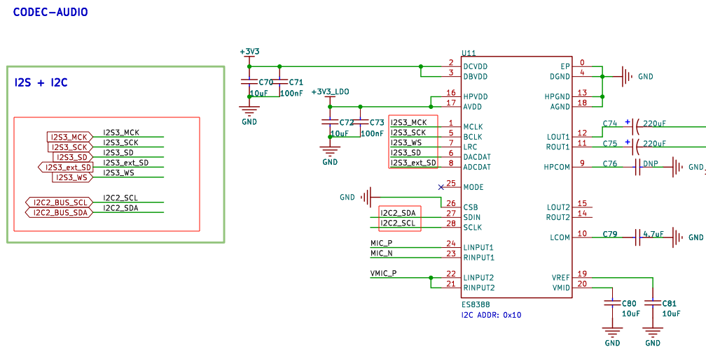

以下是优化后的版本，内容更加简洁、流畅，并增强了部分表达的清晰度：

---

# WAV 播放器例程

## 简介

本例程实现了一个简单的 WAV 播放器，通过 **ES8388 音频编解码器** 从 **SD 卡** 读取 WAV 文件，并通过 **3.5mm 耳机接口**输出音频信号。

## 硬件说明



如上图所示，ES8388 通过 **I2C** 和 **I2S** 接口与单片机连接。

## 软件说明

本例程的源码位于 `/projects/06_demo_wavplayer` 文件夹。

播放器的源代码位于 `applications/wavplay_sample.c` 中，代码中包含详细注释，便于理解各部分功能与实现。

## 运行

### 编译与下载

- **RT-Thread Studio**：在 RT-Thread Studio 的包管理器中下载 `STM32F407-RT-SPARK` 资源包，创建新工程并执行编译。
- **MDK**：首先双击 `mklinks.bat` 生成 rt-thread 与 libraries 文件夹链接；接着使用 Env 生成 MDK5 工程；最后双击 `project.uvprojx` 打开 MDK5 工程并执行编译。

### 运行效果

1. 将准备好的 WAV 格式音频文件放置于 SD 卡根目录。
2. 在 MSH 命令行中输入以下命令启动播放：

```shell
 \ | / 
- RT -     Thread Operating System
 / | \     4.1.1 build Dec  5 2024 14:26:00
 2006 - 2022 Copyright by RT-Thread team
[I/drv.sound] ES8388 init success.
[I/SDIO] SD card capacity 31166976 KB.
found part[0], begin: 4194304, size: 29.736GB
[I/drv.lcd] LCD ID:81b3
[D/drv.lcd] backlight 80 percent
[I/app.filesystem] SD card mount to '/sdcard'
msh /> wavplay_sample /sdcard/test.wav
```

### 注意事项

- SD 卡中的音频文件必须是 WAV 格式，且文件系统格式为 FAT。

## 引用参考

- 文档中心：[RT-Thread 文档中心](https://www.rt-thread.org/document/site/#/)
