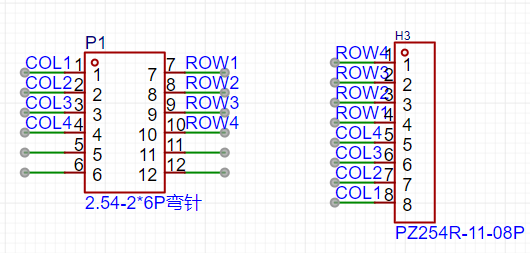
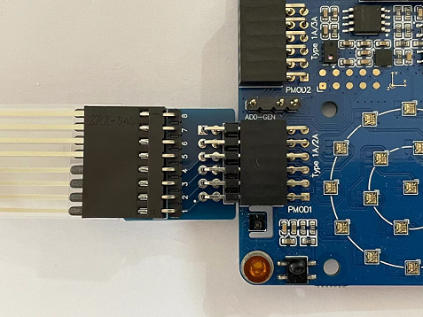

# 按键输入例程

## 简介

本例程主要功能是通过板载的PMOD1接口和转接板，将4*4矩阵按键接入开发板，PMOD2也可以用，但是需要改引脚信息。

## 硬件说明




PMOD1接口 在开发板中的位置如下图所示：




## 软件说明

矩阵按键对应的单片机引脚定义。
```c
#define PIN_COL1        GET_PIN(E,2)      // PE2:  COL1
#define PIN_COL2        GET_PIN(E,5)      // PE5 : COL2
#define PIN_COL3        GET_PIN(E,3)      // PE3 : COL3
#define PIN_COL4        GET_PIN(E,4)      // PE4:  COL4
#define PIN_ROW1        GET_PIN(A,4)      // PA4:  ROW1
#define PIN_ROW2        GET_PIN(A,7)      // PA7 : ROW2
#define PIN_ROW3        GET_PIN(A,6)      // PA6 : ROW3
#define PIN_ROW4        GET_PIN(A,5)      // PA5:  ROW4
```

按键输入的源代码位于 `\projects\07_module_key_matrix/applications/main.c` 中。流程如下，将四个行引脚放到一个数组中，四个列引脚放到另一个数组中，初始化引脚，行引脚设为输出模式，列引脚设为上拉输入模式，用双层for循环先扫描行再扫描列。返回键值，在主函数打印出按键按下对应的数值。

```c
/* 定义列的四个IO在一个数组*/
unsigned int ROW_PINS[ROWS] = {PIN_ROW1, PIN_ROW2, PIN_ROW3, PIN_ROW4};
unsigned int COL_PINS[COLS] = {PIN_COL1, PIN_COL2, PIN_COL3, PIN_COL4};

/* 八个IO口模式设置  */
void key_scan_init()
{
    for (int i = 0; i < ROWS; i++)
    {
        /* 配置行IO为输出模式*/
        rt_pin_mode(ROW_PINS[i], PIN_MODE_OUTPUT);
        /* 初始化行IO为高电平 */
        rt_pin_write(ROW_PINS[i], PIN_HIGH);
    }
    for (int j = 0; j < COLS; j++)
    {
        /* 配置列IO为上拉输入模式*/
        rt_pin_mode(COL_PINS[j], PIN_MODE_INPUT_PULLUP);
    }
}
/* 按键扫描处理函数 */
int key_scan()
{
    /* 依次扫描行的四个IO */
    for (int row = 0 ; row < ROWS ; row++)
    {
        /* 扫描的行置低电平，其余为高电平 */
        rt_pin_write(ROW_PINS[row], PIN_LOW);
        /* 依次扫描列的四个IO */
        for (int COL = 0 ; COL < COLS ; COL++)
        {
            if (rt_pin_read(COL_PINS[COL]) == PIN_LOW)
            {
                rt_thread_mdelay(15);

                while (rt_pin_read(COL_PINS[COL]) == PIN_LOW);
                /* 返回扫描到的键值，键值和按键数值对应如下 */
                /* 1 2 3 A 4 5 6 B 7 8  9  C  *  0  #  D  */
                /* 1 2 3 4 5 6 7 8 9 10 11 12 13 14 15 16 */
                return (row * COLS + COL) + 1;
            }
        }
        /*  扫描的行置高电平  */
        rt_pin_write(ROW_PINS[row], PIN_HIGH);
    }
    return -1;
}
/*  按键处理事件  */
int main(void)
{
    unsigned int count = 1;
    /* 按键初始化 */
    key_scan_init();

    while (count > 0)
    {
        int key = key_scan();
        switch (key)
        {
        case 1:
            LOG_D("1");
            break;
        case 2:
            LOG_D("2");
            break;
        case 3:
            LOG_D("3");
            break;
        case 4:
            LOG_D("A");
            break;
        case 5:
            LOG_D("4");
            break;
        case 6:
            LOG_D("5");
            break;
        case 7:
            LOG_D("6");
            break;
        case 8:
            LOG_D("B");
            break;
        case 9:
            LOG_D("7");
            break;
        case 10:
            LOG_D("8");
            break;
        case 11:
            LOG_D("9");
            break;
        case 12:
            LOG_D("C");
            break;
        case 13:
            LOG_D("*");
            break;
        case 14:
            LOG_D("0");
            break;
        case 15:
            LOG_D("#");
            break;
        case 16:
            LOG_D("D");
            break;
        default:
            break;
        }
        count++;
        rt_thread_mdelay(15);
    }
    return 0;
}
```

## 运行

### 编译 & 下载

- RT-Thread Studio：通过 RT-Thread Studio 导入工程，执行编译。
- MDK：首先双击 mklinks.bat，生成 rt-thread 与 libraries 文件夹链接；再使用 Env 生成 MDK5 工程；最后双击 project.uvprojx 打开 MDK5 工程，执行编译。

编译完成后，将开发板的 ST-Link USB 口与 PC 机连接，然后将固件下载至开发板。
### 运行效果

按下复位按键重启开发板，在当按下按键，则在串口中打印出对应的数值。

此时可以在 PC 端使用终端工具打开开发板的 ST-Link 提供的虚拟串口，设置 115200 8 1 N 。开发板的运行日志信息即可实时输出出来。

```
[D/main] 1
[D/main] 2
[D/main] 3
[D/main] A
[D/main] 4
[D/main] 5
[D/main] 6
[D/main] B
[D/main] 7
[D/main] 8
[D/main] 9
[D/main] D
[D/main] *
[D/main] 0
[D/main] #
[D/main] D
```

## 注意事项

暂无。

## 引用参考

- 设备与驱动：[PIN 设备](https://www.rt-thread.org/document/site/#/rt-thread-version/rt-thread-standard/programming-manual/device/pin/pin)

