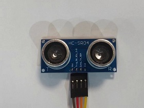
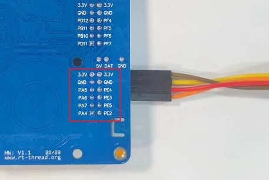

# 超声波测距例程

## 简介

本例程主要功能是外接SR-04超声波模块实现测距功能。

## 硬件说明



通过杜邦线将超声波模块接于PMOD1接口，Trig引脚对应PA5，Echo引脚对应PA6。




## 软件说明

超声波测距例程的示例代码位于 `/projects/07_module_ultrasonic_sr04` 下的 applications/ultrasonic.c 中，主要流程：初始化 GPIO 引脚。通过 MSH 启动测距代码，输入 `ultrasonic run` 启动测距，输入 `ultrasonic pause` 暂停测距。LED闪烁代表处于工作状态。
```c
void HAL_TIM_IC_CaptureCallback(TIM_HandleTypeDef *htim)
{
    if (htim->Instance == TIM3)
    {
        if (TIM3_CH1_Edge == 0) // 打开输入捕获
        {
            TIM3_CH1_Edge++;                                                              // 进入捕获下降沿状态
            __HAL_TIM_SET_CAPTUREPOLARITY(&htim3, TIM_CHANNEL_1, TIM_ICPOLARITY_FALLING); // 设置捕获极性为下降沿
            __HAL_TIM_SET_COUNTER(&htim3, 0);                                             // 设置定时器CNT计数器的值为0
        }
        else // 关闭定时器3
        {
            HAL_TIM_IC_Stop_IT(&htim3, TIM_CHANNEL_1);                                   // 关闭定时器3
            TIM3_CH1_Edge++;                                                             // 进入到主函数状态
            TIM3_CH1_VAL = HAL_TIM_ReadCapturedValue(&htim3, TIM_CHANNEL_1);             // 读取捕获通道的值
            __HAL_TIM_SET_CAPTUREPOLARITY(&htim3, TIM_CHANNEL_1, TIM_ICPOLARITY_RISING); // 设置捕获极性为上降沿
        }
    }
}

void thread_entry(void *parameter)
{
    while (1)
    {
        rt_pin_write(PIN_Trig, PIN_HIGH);
        rt_hw_us_delay(10);
        rt_pin_write(PIN_Trig, PIN_LOW);

        rt_pin_write(PIN_LED_B, PIN_HIGH);
        rt_thread_delay(100);
        rt_pin_write(PIN_LED_B, PIN_LOW);
        rt_thread_delay(100);

        if (TIM3_CH1_Edge == 2)
        {
            TIM3_CH1_Edge = 0; // 复位状态计数值
            time = TIM3_CH1_VAL;
            distance = time * 342.62 / 2 / 10000; // distance=t*c/2 （c为室温在20摄氏度时声速）
            if (distance > 450)
                distance = 450;
            printf("The high leval last %d us    The distance=%.2f cm\r\n", time, distance);
            HAL_TIM_IC_Start_IT(&htim3, TIM_CHANNEL_1); // 打开输入捕获
        }
        else
        {
            rt_kprintf("The ultrasonic module is not connected or connected incorrectly.\r\n");
            rt_thread_delay(5000);
        }
        if (rt_sem_take(ultrasonic_sem, 5) == RT_EOK)
        {
            break;
        }
    }
}
```

## 运行

### 编译 & 下载

- RT-Thread Studio：在 RT-Thread Studio 的包管理器中下载 `STM32F407-RT-SPARK` 资源包，然后创建新工程，执行编译。
- MDK：首先双击 mklinks.bat，生成 rt-thread 与 libraries 文件夹链接；再使用 Env 生成 MDK5 工程；最后双击 project.uvprojx 打开 MDK5 工程，执行编译。

编译完成后，将开发板的 ST-Link USB 口与 PC 机连接，然后将固件下载至开发板。

### 运行效果

输入`ultrasonic run`启动测距，输入`ultrasonic pause`暂停测距。

此时也可以在 PC 端使用终端工具打开开发板的 ST-Link 提供的虚拟串口，设置波率： 115200 ，数据位： 8 ，停止位： 1 无校验 。开发板的运行日志信息即可实时输出来。

```sheel
msh >ultrasonic run  
The high leval last 862 us    The distance=14.77 cm
The high leval last 717 us    The distance=12.28 cm
The high leval last 396 us    The distance=6.78 cm
The high leval last 205 us    The distance=3.51 cm
The high leval last 491 us    The distance=8.41 cm
The high leval last 780 us    The distance=13.36 cm
The high leval last 1017 us    The distance=17.42 cm
The high leval last 1168 us    The distance=20.01 cm
The high leval last 1369 us    The distance=23.45 cm
The high leval last 1744 us    The distance=29.88 cm
The high leval last 2167 us    The distance=37.12 cm
The high leval last 1927 us    The distance=33.01 cm
The high leval last 2050 us    The distance=35.12 cm
The high leval last 2941 us    The distance=50.38 cm
The high leval last 10518 us    The distance=180.18 cm
The high leval last 10540 us    The distance=180.56 cm
The high leval last 10540 us    The distance=180.56 cm
The high leval last 10540 us    The distance=180.56 cm
The high leval last 10516 us    The distance=180.15 cm
The high leval last 10513 us    The distance=180.10 cm
The high leval last 10513 us    The distance=180.10 cm
The high leval last 10512 us    The distance=180.08 cm
```
## 引用参考

- 设备与驱动：[PIN 设备](https://www.rt-thread.org/document/site/#/rt-thread-version/rt-thread-standard/programming-manual/device/pin/pin)

