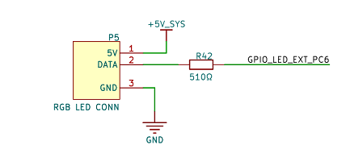
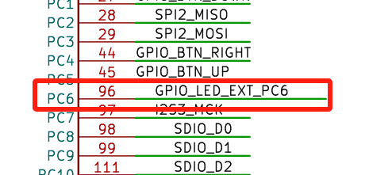
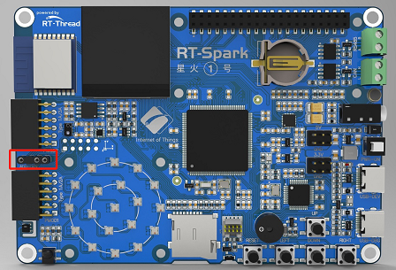

# ws2812 led 灯带例程

## 简介

本例程主要功能是通过 pwm 信号，驱动 ws2812 led 灯带，形成彩虹渐变效果。

## 硬件说明





如上图所示，外部灯带 ws2812 对应数据的驱动引脚为 PC6，对应 TIM3 的通道 1，可以使用定时器 3 产生 pwm 信号来驱动 led 灯带。

灯带接口在开发板中的位置如下图所示：



## 软件说明

灯带例程的示例代码位于 `/projects/07_module_ws2812_led` 下的 applications/main.c 中，主要流程：初始化 neo_pixel 库，然后调用接口生成彩虹序列，然后调用显示接口，显示出来。通过调整代码中宏的数值，可以改变例程的行为，比如通过修改 LED_BRIGHTNESS 值，可以调低 LED 灯带的亮度。

```c
#define LED_NUMS   (19 + 30) /* LED 的数目 */
#define LED_BRIGHTNESS 128   /* LED 的亮度 */
#define LED_REPS       1     /* LED 颜色的周期数 */
#define LED_SATURATION 255   /* LED 的饱和度 */

int main(void)
{
    neo_pixel_ops_t *neo_ops;
    uint16_t hue = 0; /* 第一个灯珠的颜色 */

    /* 初始化 neo_pixel 库 */
    neo_pixel_init(&neo_ops, LED_NUMS);

    while (1)
    {
        /* 生成彩虹序列 */
        neo_ops->tool->rainbow(hue, LED_REPS, LED_SATURATION, LED_BRIGHTNESS, RT_TRUE);
        /* 刷新周期 10ms */
        rt_thread_mdelay(10);
        /* 显示 */
        neo_ops->show();
        hue += 100;
    }
    return 0;
}
```

 neo_pixel 库是一个十分强大的 LED 驱动库，具有丰富的接口，具体的功能可以通过源码查看。

## 运行

### 编译 & 下载

- RT-Thread Studio：在 RT-Thread Studio 的包管理器中下载 `STM32F407-RT-SPARK` 资源包，然后创建新工程，执行编译。
- MDK：首先双击 mklinks.bat，生成 rt-thread 与 libraries 文件夹链接；再使用 Env 生成 MDK5 工程；最后双击 project.uvprojx 打开 MDK5 工程，执行编译。

编译完成后，将开发板的 ST-Link USB 口与 PC 机连接，然后将固件下载至开发板。

### 运行效果

将灯带插入到对应的接口，按下复位按键重启开发板，观察板载 RGB 灯矩阵和外部灯带，可以看到灯带按照彩虹的样式渐变。

## 引用参考

- 无
